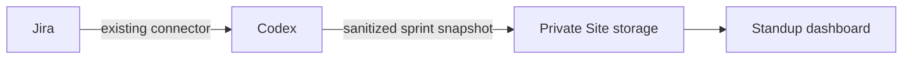

# Codex Conversations - 2026-07-27

## Capture Summary

Source type: mixed capture / Codex conversation export.

This file is a daily inbox landing capture for Codex conversations. It preserves filtered user/assistant transcript text from local Codex session JSONL files. Tool calls, tool outputs, system prompts, developer prompts, and reasoning records are intentionally excluded from the transcript sections below.

Facts:
- Capture date: `2026-07-27`
- Generated from local session directory: `/Users/qn5792/.codex/sessions/2026/07/27`
- Sessions found: 16

Inferences:
- These are the Codex sessions stored locally under the date directory. They may not include conversations that were not synced or not present on this machine.

## Preliminary Ingest Notes

- Review for actions, decisions, open questions, durable project context, and names/acronyms needing confirmation.
- Do not treat this preliminary capture as canonical action tracking until an ingest pass updates `actions.md`.
- Suggested post-ingest destination for this evidence file: `sources/codex-conversations/2026-07-27-codex-conversations.md` or another appropriate source folder.

## Thread Index

| Thread | Session | Started | Updated | Messages | CWD | Raw File |
| --- | --- | --- | --- | ---: | --- | --- |
| Verify interconnector Grafana link | `019fa124-e16f-75a2-9255-7fe78459592a` | `2026-07-27T01:16:16.626Z` | `2026-07-27T01:19:12.89581Z` | 2 user / 2 assistant | `/Users/qn5792/repos/smp` | `/Users/qn5792/.codex/sessions/2026/07/27/rollout-2026-07-27T09-16-16-019fa124-e16f-75a2-9255-7fe78459592a.jsonl` |
| Fix OCCTO historical capacity | `019fa13d-53a1-7bf3-8944-5eab53c246da` | `2026-07-27T01:42:58.721Z` | `2026-07-27T01:43:05.257939Z` | 4 user / 29 assistant | `/Users/qn5792/repos/smp` | `/Users/qn5792/.codex/sessions/2026/07/27/rollout-2026-07-27T09-42-58-019fa13d-53a1-7bf3-8944-5eab53c246da.jsonl` |
| Finalize and merge PR 4 | `019fa14c-b029-7fb1-8504-7a640c432081` | `2026-07-27T01:59:45.449Z` | `2026-07-27T01:59:53.891574Z` | 2 user / 12 assistant | `/Users/qn5792/repos/walnut-migration` | `/Users/qn5792/.codex/sessions/2026/07/27/rollout-2026-07-27T09-59-45-019fa14c-b029-7fb1-8504-7a640c432081.jsonl` |
| Assess GitHub Actions CI setup | `019fa188-98d2-7bc2-91ef-e8cccb5177ab` | `2026-07-27T03:05:11.635Z` | `2026-07-27T03:05:19.138656Z` | 2 user / 15 assistant | `/Users/qn5792/repos/walnut-migration` | `/Users/qn5792/.codex/sessions/2026/07/27/rollout-2026-07-27T11-05-11-019fa188-98d2-7bc2-91ef-e8cccb5177ab.jsonl` |
| Verify and set infra default branch | `019fa1c3-174c-7942-9f52-b145e3d35daf` | `2026-07-27T04:09:05.100Z` | `2026-07-27T04:09:11.939685Z` | 4 user / 39 assistant | `/Users/qn5792/repos/walnut-migration` | `/Users/qn5792/.codex/sessions/2026/07/27/rollout-2026-07-27T12-09-05-019fa1c3-174c-7942-9f52-b145e3d35daf.jsonl` |
| Document SFF backfill recipe | `019fa215-d99f-7aa1-8833-d983fa1623b2` | `2026-07-27T05:39:28.799Z` | `2026-07-27T05:39:37.715594Z` | 3 user / 8 assistant | `/Users/qn5792/repos/walnut-migration` | `/Users/qn5792/.codex/sessions/2026/07/27/rollout-2026-07-27T13-39-28-019fa215-d99f-7aa1-8833-d983fa1623b2.jsonl` |
| Fix SCR-1171 audit memory use | `019fa23e-b3e0-7290-8866-fdd94ebb782c` | `2026-07-27T06:24:06.112Z` | `2026-07-27T06:24:15.534312Z` | 4 user / 12 assistant | `/Users/qn5792/repos/smp` | `/Users/qn5792/.codex/sessions/2026/07/27/rollout-2026-07-27T14-24-06-019fa23e-b3e0-7290-8866-fdd94ebb782c.jsonl` |
| ingest pls | `019fa254-eff8-7fc3-85d4-b92c3db688bc` | `2026-07-27T06:48:23.394Z` | `2026-07-27T06:48:41.980741Z` | 5 user / 14 assistant | `/Users/qn5792/baraluga-mind` | `/Users/qn5792/.codex/sessions/2026/07/27/rollout-2026-07-27T14-48-23-019fa254-eff8-7fc3-85d4-b92c3db688bc.jsonl` |
| Check browser tabs | `019fa265-bf82-70e1-b619-ccd07f9c9ec1` | `2026-07-27T07:06:45.074Z` | `2026-07-27T07:07:00.806665Z` | 4 user / 7 assistant | `/Users/qn5792/baraluga-mind` | `/Users/qn5792/.codex/sessions/2026/07/27/rollout-2026-07-27T15-06-45-019fa265-bf82-70e1-b619-ccd07f9c9ec1.jsonl` |
| Draft GitHub CLI auth reminder | `019fa2fc-aecb-7601-ab4d-063a93d69b38` | `2026-07-27T09:51:36.764Z` | `2026-07-27T09:52:29.39604Z` | 5 user / 6 assistant | `/Users/qn5792/baraluga-mind` | `/Users/qn5792/.codex/sessions/2026/07/27/rollout-2026-07-27T17-51-36-019fa2fc-aecb-7601-ab4d-063a93d69b38.jsonl` |
| Add hair to the guy | `019fa309-b297-7523-bc82-d66348e88c55` | `2026-07-27T10:05:49.591Z` | `2026-07-27T10:06:29.921476Z` | 2 user / 3 assistant | `/Users/qn5792/Documents/Codex/2026-07-27/upda` | `/Users/qn5792/.codex/sessions/2026/07/27/rollout-2026-07-27T18-05-49-019fa309-b297-7523-bc82-d66348e88c55.jsonl` |
| Check JIRA access | `019fa38f-d231-75d3-a599-80e3e7ccd823` | `2026-07-27T12:32:19.505Z` | `2026-07-27T12:32:27.367068Z` | 3 user / 5 assistant | `/Users/qn5792/repos/smp` | `/Users/qn5792/.codex/sessions/2026/07/27/rollout-2026-07-27T20-32-19-019fa38f-d231-75d3-a599-80e3e7ccd823.jsonl` |
| Assess PAT standup dashboard | `019fa3d1-1697-7f80-9f5c-507ef5b2397a` | `2026-07-27T13:43:36.855Z` | `2026-07-27T13:45:28.851863Z` | 6 user / 14 assistant | `/Users/qn5792/repos/smp` | `/Users/qn5792/.codex/sessions/2026/07/27/rollout-2026-07-27T21-43-36-019fa3d1-1697-7f80-9f5c-507ef5b2397a.jsonl` |
| Daily Granola Meeting Notes Capture | `019fa417-6eb3-70a2-a5a6-8494c01e2bb9` | `2026-07-27T15:00:27.010Z` | `2026-07-27T15:00:28.883917Z` | 2 user / 12 assistant | `/Users/qn5792/baraluga-mind` | `/Users/qn5792/.codex/sessions/2026/07/27/rollout-2026-07-27T23-00-27-019fa417-6eb3-70a2-a5a6-8494c01e2bb9.jsonl` |
| Daily GitHub Copilot Conversation Capture | `019fa417-6eba-7541-a998-2799d3e330f7` | `2026-07-27T15:00:27.020Z` | `2026-07-27T15:00:30.531471Z` | 2 user / 6 assistant | `/Users/qn5792/baraluga-mind` | `/Users/qn5792/.codex/sessions/2026/07/27/rollout-2026-07-27T23-00-27-019fa417-6eba-7541-a998-2799d3e330f7.jsonl` |
| Daily Codex Conversation Capture | `019fa418-ce37-7c02-8458-11301cb337f3` | `2026-07-27T15:01:56.985Z` | `2026-07-27T15:01:58.733978Z` | 2 user / 2 assistant | `/Users/qn5792/baraluga-mind` | `/Users/qn5792/.codex/sessions/2026/07/27/rollout-2026-07-27T23-01-56-019fa418-ce37-7c02-8458-11301cb337f3.jsonl` |

## Transcript

## Verify interconnector Grafana link

- Session: `019fa124-e16f-75a2-9255-7fe78459592a`
- Started: `2026-07-27T01:16:16.626Z`
- Updated: `2026-07-27T01:19:12.89581Z`
- CWD: `/Users/qn5792/repos/smp`
- Raw File: `/Users/qn5792/.codex/sessions/2026/07/27/rollout-2026-07-27T09-16-16-019fa124-e16f-75a2-9255-7fe78459592a.jsonl`

### User - 2026-07-27T01:19:08.756Z

<recommended_plugins>
Here is a list of plugins that are available but not installed.

- Box (box@openai-curated-remote)
- Figma (figma@openai-curated-remote)
- Google Calendar (google-calendar@openai-curated-remote)
- Google Drive (google-drive@openai-curated-remote)
- Notion (notion@openai-curated-remote)
- Outlook Calendar (outlook-calendar@openai-curated-remote)
- Outlook Email (outlook-email@openai-curated-remote)
- SharePoint (sharepoint@openai-curated-remote)
- Slack (slack@openai-curated-remote)
- Teams (teams@openai-curated-remote)
</recommended_plugins>
# AGENTS.md instructions for /Users/qn5792/repos/smp

<INSTRUCTIONS>
# AGENTS.md

This file provides guidance to AI coding agents working under `/Users/qn5792/repos/smp`.

## Overview

`/smp` is a parent directory, not a monorepo. It contains separate repositories for the **SMP (Scraper Management Platform)** and adjacent APAC scraper work. Read the repo-local `AGENTS.md` before changing files inside any child repo.

## Current Repos

| Repo | Purpose | Tooling |
|---|---|---|
| `scraper-scripts` | Raw standalone scraper scripts and behavioral references before Airflow adaptation | Python 3.13, `uv` |
| `smp-india` | India-owned Airflow DAGs split from the former `scraper-dags` repo | Python 3.13, Airflow 3.x, `uv` |
| `smp-japan` | Japan-owned Airflow DAGs split from the former `scraper-dags` repo | Python 3.13, Airflow 3.x, `uv` |
| `smp-tool` | Airflow Docker image, Helm values, Kubernetes scripts, Okta auth, Minikube/EKS setup | Python 3.12, `uv`, Helm, Kubernetes |
| `smp-dashboard` | Grafana dashboards and `cdh-dataset-manager` for CommonDataHub datasets | Python 3.11, `uv` |
| `apac-tsdb-scraper` | Poetry/solaris-sfw TSDB scrapers deployed through the older Lambda/tag flow | Python 3.12, Poetry |

Legacy names still appear in older docs and code comments:

- `scraper-dags` is now split into `smp-india` and `smp-japan`.
- `scraper-tool` is now `smp-tool`.
- `scraper-dashboard` is now `smp-dashboard`.

## End-to-End SMP Flow

```text
scraper-scripts  ->  smp-india / smp-japan  ->  smp-tool  ->  smp-dashboard
(reference impl)     (Airflow DAGs)             (runtime)     (CDH + Grafana)
```

Use `scraper-scripts` as the behavioral source when porting or validating a DAG. Region-specific DAG implementation now belongs in either `smp-india` or `smp-japan`; shared Airflow/platform behavior should come from `smp-common` or `smp-tool`, not be copied between region repos.

## Shared Rules

- Do not commit credentials, tokens, kubeconfigs, generated local secrets, or one-off path rewrites.
- Private dependencies come from ENGIE Artifactory. Prefer fixing local credentials over changing package indexes.
- Keep region boundaries explicit: India DAG code in `smp-india`, Japan DAG code in `smp-japan`.
- For Airflow DAGs, keep heavy imports out of module scope because Airflow parses DAG files frequently.
- For dashboard work, verify the upstream parquet/S3/CDH shape before changing Grafana JSON or dataset definitions.
- For infra changes, call out whether the change affects image build, Helm values, auth, DAG sync, runtime secrets, or Kubernetes namespaces.

## Cross-Repo Workflow: Porting A Script To A DAG

1. Run and observe the source script in `scraper-scripts`; capture inputs, outputs, credentials, file names, date logic, and failure behavior.
2. Choose the DAG repo by market ownership: `smp-india` or `smp-japan`.
3. Check whether an existing DAG for the same source should be extended before creating a new DAG.
4. Implement under `dags/src/`, keeping task runtime scraper modules under `dags/src/scripts/`.
5. Validate locally with `ruff`, `pytest`, and, when practical, `airflow dags test`.
6. Coordinate deployment through the appropriate branch/environment and `smp-tool` git-sync/Helm configuration.
7. Update `smp-dashboard` only after the DAG output is stable and visible where CDH/Grafana expects it.

## Branch And Environment Notes

- GitHub repos commonly use `main`; some DAG deployment flows still reference `dev`, `qa`, `master`, or region-specific branches.
- `smp-tool` has region-aware config under `config/japan/<env>/` and `config/india/<env>/`.
- Airflow namespaces are region-specific in current scripts, for example `smp-dev`, `smp-qa`, `smp-prod`, `smp-india-dev`, `smp-india-qa`, and `smp-india-prod`.
- Treat any old `scraper-dags`/ADO git-sync reference as potentially stale and verify against current `smp-tool` config before editing deployment behavior.

</INSTRUCTIONS>
<environment_context>
  <cwd>/Users/qn5792/repos/smp</cwd>
  <shell>zsh</shell>
  <current_date>2026-07-27</current_date>
  <timezone>Asia/Manila</timezone>
  <filesystem><workspace_roots><root>/Users/qn5792/repos/smp</root><root>/Users/qn5792/.codex/visualizations/2026/07/27/019fa124-e16f-75a2-9255-7fe78459592a</root></workspace_roots><permission_profile type="disabled"><file_system type="unrestricted" /></permission_profile></filesystem>
</environment_context>

### User - 2026-07-27T01:19:08.802Z

From Hiromi:
Good morning - May I pls check if this link is still working ? I would like to access the interconnector Grafana with lookback function. Thank you 

Reply... 
- <placeholder of live link>
- Apologies if the previous link suddenly stopped working! Next time it happens, you can try to look in the Dashboards directory <placeholder of screenshot>

### Assistant - 2026-07-27T01:19:17.544Z

I’m using the Brian voice skill to make the reply sound natural and like you, while keeping placeholders for the live link and screenshot.

### Assistant - 2026-07-27T01:19:30.157Z

Good morning Hiromi — here’s the live link:  
<live link>

Apologies if the previous link suddenly stopped working! If it happens again, you can find the Interconnector dashboard in the **Dashboards** directory here:  
<screenshot>

## Fix OCCTO historical capacity

- Session: `019fa13d-53a1-7bf3-8944-5eab53c246da`
- Started: `2026-07-27T01:42:58.721Z`
- Updated: `2026-07-27T01:43:05.257939Z`
- CWD: `/Users/qn5792/repos/smp`
- Raw File: `/Users/qn5792/.codex/sessions/2026/07/27/rollout-2026-07-27T09-42-58-019fa13d-53a1-7bf3-8944-5eab53c246da.jsonl`

### User - 2026-07-27T01:43:02.475Z

<recommended_plugins>
Here is a list of plugins that are available but not installed.

- Box (box@openai-curated-remote)
- Figma (figma@openai-curated-remote)
- Google Calendar (google-calendar@openai-curated-remote)
- Google Drive (google-drive@openai-curated-remote)
- Notion (notion@openai-curated-remote)
- Outlook Calendar (outlook-calendar@openai-curated-remote)
- Outlook Email (outlook-email@openai-curated-remote)
- SharePoint (sharepoint@openai-curated-remote)
- Slack (slack@openai-curated-remote)
- Teams (teams@openai-curated-remote)
</recommended_plugins>
# AGENTS.md instructions for /Users/qn5792/repos/smp

<INSTRUCTIONS>
# AGENTS.md

This file provides guidance to AI coding agents working under `/Users/qn5792/repos/smp`.

## Overview

`/smp` is a parent directory, not a monorepo. It contains separate repositories for the **SMP (Scraper Management Platform)** and adjacent APAC scraper work. Read the repo-local `AGENTS.md` before changing files inside any child repo.

## Current Repos

| Repo | Purpose | Tooling |
|---|---|---|
| `scraper-scripts` | Raw standalone scraper scripts and behavioral references before Airflow adaptation | Python 3.13, `uv` |
| `smp-india` | India-owned Airflow DAGs split from the former `scraper-dags` repo | Python 3.13, Airflow 3.x, `uv` |
| `smp-japan` | Japan-owned Airflow DAGs split from the former `scraper-dags` repo | Python 3.13, Airflow 3.x, `uv` |
| `smp-tool` | Airflow Docker image, Helm values, Kubernetes scripts, Okta auth, Minikube/EKS setup | Python 3.12, `uv`, Helm, Kubernetes |
| `smp-dashboard` | Grafana dashboards and `cdh-dataset-manager` for CommonDataHub datasets | Python 3.11, `uv` |
| `apac-tsdb-scraper` | Poetry/solaris-sfw TSDB scrapers deployed through the older Lambda/tag flow | Python 3.12, Poetry |

Legacy names still appear in older docs and code comments:

- `scraper-dags` is now split into `smp-india` and `smp-japan`.
- `scraper-tool` is now `smp-tool`.
- `scraper-dashboard` is now `smp-dashboard`.

## End-to-End SMP Flow

```text
scraper-scripts  ->  smp-india / smp-japan  ->  smp-tool  ->  smp-dashboard
(reference impl)     (Airflow DAGs)             (runtime)     (CDH + Grafana)
```

Use `scraper-scripts` as the behavioral source when porting or validating a DAG. Region-specific DAG implementation now belongs in either `smp-india` or `smp-japan`; shared Airflow/platform behavior should come from `smp-common` or `smp-tool`, not be copied between region repos.

## Shared Rules

- Do not commit credentials, tokens, kubeconfigs, generated local secrets, or one-off path rewrites.
- Private dependencies come from ENGIE Artifactory. Prefer fixing local credentials over changing package indexes.
- Keep region boundaries explicit: India DAG code in `smp-india`, Japan DAG code in `smp-japan`.
- For Airflow DAGs, keep heavy imports out of module scope because Airflow parses DAG files frequently.
- For dashboard work, verify the upstream parquet/S3/CDH shape before changing Grafana JSON or dataset definitions.
- For infra changes, call out whether the change affects image build, Helm values, auth, DAG sync, runtime secrets, or Kubernetes namespaces.

## Cross-Repo Workflow: Porting A Script To A DAG

1. Run and observe the source script in `scraper-scripts`; capture inputs, outputs, credentials, file names, date logic, and failure behavior.
2. Choose the DAG repo by market ownership: `smp-india` or `smp-japan`.
3. Check whether an existing DAG for the same source should be extended before creating a new DAG.
4. Implement under `dags/src/`, keeping task runtime scraper modules under `dags/src/scripts/`.
5. Validate locally with `ruff`, `pytest`, and, when practical, `airflow dags test`.
6. Coordinate deployment through the appropriate branch/environment and `smp-tool` git-sync/Helm configuration.
7. Update `smp-dashboard` only after the DAG output is stable and visible where CDH/Grafana expects it.

## Branch And Environment Notes

- GitHub repos commonly use `main`; some DAG deployment flows still reference `dev`, `qa`, `master`, or region-specific branches.
- `smp-tool` has region-aware config under `config/japan/<env>/` and `config/india/<env>/`.
- Airflow namespaces are region-specific in current scripts, for example `smp-dev`, `smp-qa`, `smp-prod`, `smp-india-dev`, `smp-india-qa`, and `smp-india-prod`.
- Treat any old `scraper-dags`/ADO git-sync reference as potentially stale and verify against current `smp-tool` config before editing deployment behavior.

</INSTRUCTIONS>
<environment_context>
  <cwd>/Users/qn5792/repos/smp</cwd>
  <shell>zsh</shell>
  <current_date>2026-07-27</current_date>
  <timezone>Asia/Manila</timezone>
  <filesystem><workspace_roots><root>/Users/qn5792/repos/smp</root><root>/Users/qn5792/.codex/visualizations/2026/07/27/019fa13d-53a1-7bf3-8944-5eab53c246da</root></workspace_roots><permission_profile type="disabled"><file_system type="unrestricted" /></permission_profile></filesystem>
</environment_context>

### User - 2026-07-27T01:43:02.496Z

<codex_delegation>
  <source_thread_id>019f8c66-8c08-7850-bbaf-a815efd68b3d</source_thread_id>
  <input>Delegation ID: IC-1206-1207-0727A

Work sequentially on the two OCCTO Operating Capacity points in `/Users/qn5792/repos/smp`, primarily `/Users/qn5792/repos/smp/smp-japan`. This is one task because point 2 depends on point 1 being corrected and deployed.

Origin callback target:
- threadId: `019f8c66-8c08-7850-bbaf-a815efd68b3d`
- hostId: `local`

Read `/Users/qn5792/repos/smp/AGENTS.md` and the repo-local `AGENTS.md` completely before acting. Preserve unrelated user changes and inspect git state first.

Point 1 — SCR-1206 bug fix (must be first):
- Fix completed-day capacity ingestion so it retains OCCTO `運用容量` as `operating_capacity_mw`, rather than writing it as null when a date becomes historical.
- Confirm the exact affected code and full data path. Known likely root: `dags/src/scripts/japan_interconnector_history_backfill/core.py::parse_capacity_daily_csv` excludes `運用容量` and constructs `CapacityRecord(... operating_capacity_mw=None ...)`; `japan_occto_capacity_completed_day_dag.py` uses that extractor. Reconciliation prioritizes immutable daily over weekly/monthly/yearly, causing the operating-capacity line’s historical start to move forward.
- Add focused regression tests covering valid positive/negative values, required/malformed `運用容量`, downstream parquet/record output, and proof that Available Capacity behavior/values are unchanged. Run proportional focused and broader tests plus lint.
- Work from the correct `dev` branch, commit and push the SCR-1206 fix with disciplined commit hygiene, then promote to QA only after evidence is green. Do not touch production.
- Validate the QA behavior as far as available access permits.

Point 2 — SCR-1207 historical repair (only after point 1 is safely in QA):
- Repair already affected historical Operating Capacity in QA using the existing bounded manual history-backfill path, rather than changing past `As of` snapshots. `Latest` and future snapshots should regain historical operating capacity; old stored snapshots remain immutable.
- Existing plan to inspect/update if useful: `/Users/qn5792/repos/smp/implementation-plans/SCR-1207-operating-capacity-backfill.md`.
- Determine the exact affected range from evidence: earliest supported effective date through the day immediately before continuous good operating-capacity coverage.
- Use capacity-only, bounded chunks and dry-run/preflight first. Preserve Available Capacity value-for-value and collect row counts/sample comparisons/reconciliation evidence. Execute the QA backfill only when the range and preflight are safe and unambiguous. Do not run any production backfill or production promotion.
- If Airflow/UI credentials, an environmental choice, additional authority, or any user action is required, immediately call `send_message_to_thread` to the origin with status `needs_input` and the exact question. Keep ordinary progress inside this worker task.

Terminal callback requirement:
- When the work reaches a terminal state, call `send_message_to_thread` exactly once on origin thread `019f8c66-8c08-7850-bbaf-a815efd68b3d` with hostId `local`.
- The message must be concise and self-contained and include: delegation ID `IC-1206-1207-0727A`; one status from `completed`, `blocked`, or `failed`; what changed; commits/branches/artifact paths and validation evidence; what happened with QA promotion/backfill; and the recommended next action.
- Send `needs_input` earlier only if required as described above. Do not send routine progress to the origin.</input>
</codex_delegation>

### Assistant - 2026-07-27T01:43:08.921Z

I’ll handle SCR-1206 first through QA validation, then use that evidence to bound and preflight SCR-1207. I’m using the commit-hygiene skill because this task explicitly requires commits and pushes; I’ll inspect both repository guidance and the current worktree before touching files.

### Assistant - 2026-07-27T01:43:33.333Z

The worktree is clean, but it starts on `qa`. Both `dev` and `qa` already contain earlier SCR-1206 schema/reconciliation work; I’m switching to the required `dev` branch and tracing the completed-day extractor against those deployed changes before editing.

### Assistant - 2026-07-27T01:44:52.441Z

The traced path confirms the bug exactly: the completed-day DAG calls the history-backfill CSV extractor, which required `空容量` but not `運用容量`, then explicitly wrote `operating_capacity_mw=None`; the immutable daily source subsequently outranked weekly/monthly/yearly reconciliation inputs. I’ve corrected that parser and added regression coverage through normalized JSON and parquet output, including unchanged Available Capacity values.

### Assistant - 2026-07-27T01:45:22.749Z

The focused suite passes: 25 tests green with explicit coverage of positive/negative values, missing header, blank/malformed data, and JSON/parquet persistence. I’m now running the broader OCCTO suites, DAG structure tests, full lint, and documentation checks in parallel; the first focused run’s only failure was the repository-wide coverage threshold when selecting one file, so the authoritative focused rerun used the repo-documented `--no-cov`.

### Assistant - 2026-07-27T01:45:54.245Z

The commit hook reformatted one test file, so the commit correctly stopped before recording anything. I’m reviewing the hook change and rerunning the focused test/lint gate before retrying the same single-purpose commit.

### Assistant - 2026-07-27T01:46:53.740Z

SCR-1206 is now committed and pushed to `dev` as `6189a8e`; the pre-push gate also passed the repository’s full pytest hook. With dev green, I’m checking the exact promotion helper and branch divergence before performing the authorized `dev → qa` promotion.

### Assistant - 2026-07-27T01:48:07.554Z

The QA promotion is pushed as merge commit `c536414`, and its pre-push full pytest gate passed. For QA deployment and backfill evidence, I’m using the in-app browser skill because this may depend on an existing signed-in Airflow session; I’ll first inspect access and deployment state without triggering any run.

### Assistant - 2026-07-27T01:49:08.895Z

QA promotion is complete, but environment access is now the blocker for SCR-1207: the configured kube context is only local `kind-kind`, AWS CLI is unavailable, and the QA Airflow hostname does not resolve from this machine (the expected URL is confirmed by repo config). Per the delegation contract, I’m notifying the origin task now with the exact access needed; I’ll continue any local preflight work that does not require QA data.

### Assistant - 2026-07-27T01:50:48.357Z

A local source preflight succeeded against OCCTO for the earliest expected date, 2019-04-01: revised D data returned all 672 expected rows and the corrected parser produced populated operating-capacity JSON/parquet. I’m packaging a compact comparison and checksums as local evidence; this confirms source availability and parser behavior, but it does not substitute for the still-blocked QA range query or QA dry run.

### Assistant - 2026-07-27T01:52:51.367Z

Local evidence is complete and checksummed: all 672 dashboard rows for 2019-04-01 match raw OCCTO → normalized JSON → parquet for both Available and Operating Capacity, with zero nulls. Because the QA range boundary, overlap targets, and effective-data comparisons cannot be established without QA access, executing any backfill would violate the required safety gates; I’m closing this worker as blocked after reporting the complete handoff to the origin task.

### Assistant - 2026-07-27T01:53:29.861Z

SCR-1206 is fixed and promoted to QA:

- Dev commit: `6189a8e`
- QA promotion: `c536414`
- All focused, broader, lint, documentation, and pre-push checks passed.
- No production action taken.

SCR-1207 is blocked pending ENGIE VPN plus signed-in QA Airflow or Japan QA EKS access. No backfill was executed because the exact affected boundary and cleanup targets could not be verified safely.

Local OCCTO preflight evidence is available in [summary.json](/Users/qn5792/repos/smp/implementation-plans/evidence/SCR-1207-local-preflight-2026-07-27/summary.json) and [comparison.csv](/Users/qn5792/repos/smp/implementation-plans/evidence/SCR-1207-local-preflight-2026-07-27/raw-normalized-parquet-comparison.csv). All 672 sampled-day records matched raw → JSON → parquet with zero capacity nulls.

The required blocked handoff was sent to the origin task.

### User - 2026-07-27T01:57:42.026Z

<codex_delegation>
  <source_thread_id>019f8c66-8c08-7850-bbaf-a815efd68b3d</source_thread_id>
  <input>User clarification for delegation IC-1206-1207-0727A: continue SCR-1207. All backfills must be implemented as a one-off Airflow DAG committed and deployed into each respective environment, consistent with the existing Japan interconnector backfills. Do not treat lack of direct QA kube/Airflow access as a blocker to implementing the DAG. Use explicit commit scope `scr-1207` for every SCR-1207 commit.

Please inspect the existing interconnector one-off/manual backfill DAG patterns and the current `/Users/qn5792/repos/smp/implementation-plans/SCR-1207-operating-capacity-backfill.md`, then implement the safest bounded capacity-only historical repair workflow. It must support environment-side preflight/dry-run and explicit execution, preserve Available Capacity, avoid rewriting historical As-of snapshots, defer publication until the intended source batches are complete, and expose sufficient reconciliation/evidence in Airflow logs. Add proportionate tests/docs, run validation, commit and push to `dev` with scope `scr-1207`, and promote to QA only if consistent with the established branch flow and green checks. No production action.

If an exact affected date boundary cannot be known at implementation time, make it an explicit required DAG parameter with safe validation rather than hard-coding or blocking implementation. Keep ordinary progress in your task. When this resumed work reaches a terminal state, send one concise callback to origin thread `019f8c66-8c08-7850-bbaf-a815efd68b3d`, hostId `local`, labeled delegation `IC-1206-1207-0727A / SCR-1207 follow-up`, with status completed/blocked/failed, commits, files, tests, deployment status, and exact Airflow run instructions or remaining input needed.</input>
</codex_delegation>

### Assistant - 2026-07-27T01:57:50.665Z

I’ll continue SCR-1207 as an implementation task: a dedicated one-off Airflow DAG with an explicit affected-range boundary, environment-side preflight and guarded execution, source-batch publication deferral, and evidence logging. I’m reusing the commit-hygiene skill because every SCR-1207 commit must use the explicit `scr-1207` scope, and I’ll preserve the clean `dev` branch workflow through QA only after green checks.

### Assistant - 2026-07-27T02:02:02.996Z

The existing generic manual DAG is not safe enough for this repair by itself: its dry-run does not reveal overlap keys, and a partial-year publication needs to preserve the complete `_publication.json` snapshot. I’m implementing the one-off workflow as four explicit phases—`source-preflight`, `source-upload`, `publish-preflight`, and `publish`—with approval tokens binding each execute run to the exact preceding evidence, rollback copies before source deletion, and a partial publication path that retains untouched years in the global manifest.

### Assistant - 2026-07-27T02:09:02.166Z

The core guardrails are now in place and the first focused suite is green. I also tightened two failure modes found during review: approval tokens now ignore extraction timestamps while still binding source value fingerprints, and rollback copies are excluded from future overlap scans; source replacement will automatically restore those copies if an upload fails. Next I’m documenting the exact four-run pattern and adding tests for token/rollback behavior.

### Assistant - 2026-07-27T02:11:14.400Z

The focused safety suite now covers 34 cases, including whole-file overlap rejection, D/D+1/D+2 source fingerprints, Available Capacity immutability, rollback restoration after failed source upload, complete-manifest partial publication, and restoration if manifest publication fails. I’m running a live one-day OCCTO source preflight through the new three-horizon code path before the broader repository gates.

### Assistant - 2026-07-27T02:12:15.725Z

The live one-day integration preflight passed through all three horizons: 2,016 rows total, seven interconnectors, both directions, 48 intervals, and zero Available/Operating nulls. The broader OCCTO/history/DAG suite is also green at 159 tests, with full lint, formatting, and documentation checks passing. I’m at the commit review gate now, then I’ll push `dev` and promote only this green change to QA.

### Assistant - 2026-07-27T02:13:12.473Z

The full pre-push pytest hook passed, but GitHub rejected the push because `origin/dev` advanced concurrently. I’m inspecting that remote commit now; I’ll merge it non-destructively into local `dev` if it is unrelated and clean, then rerun the push gate.

### Assistant - 2026-07-27T02:15:14.656Z

SCR-1207 is now pushed to `dev` and promoted to `qa`; both pushes passed the repository’s full pytest pre-push hook. No production branch or runtime was touched. I’m doing the final branch-state check and preparing the exact Airflow phase instructions for the origin callback.

### Assistant - 2026-07-27T02:15:54.991Z

SCR-1207 implementation is complete and promoted to QA.

- Feature commit: `36e52b1`
- Dev integration: `981d733`
- QA promotion: `c07540a`
- No production action
- Worktree clean on `dev`

The dedicated DAG supports token-bound source preflight/upload and publication preflight/publish, rollback copies, Available Capacity invariance checks, complete-manifest partial publication, and read-back verification.

Key files:

- [DAG](/Users/qn5792/repos/smp/smp-japan/dags/src/japan/japan_occto_operating_capacity_backfill_dag.py)
- [Workflow implementation](/Users/qn5792/repos/smp/smp-japan/dags/src/scripts/occto_capacity/operating_capacity_backfill.py)
- [QA runbook](/Users/qn5792/repos/smp/smp-japan/docs/occto-operating-capacity-backfill.md)
- [Updated plan](/Users/qn5792/repos/smp/implementation-plans/SCR-1207-operating-capacity-backfill.md)

Validation passed: 34 focused tests, 159 broader tests, full lint/format/docs, both full pre-push pytest hooks, and a live three-horizon preflight with 2,016 rows and zero capacity nulls.

The required terminal callback was sent to the origin task. The remaining operational step is to determine the inclusive QA repair boundary and run the four documented Airflow phases.

### User - 2026-07-27T07:29:25.446Z

<codex_delegation>
  <source_thread_id>019f8c66-8c08-7850-bbaf-a815efd68b3d</source_thread_id>
  <input>SCR-1207 urgent follow-up from the user. Patch the existing one-off backfill workflow today so the authorized operator can repair the complete QA range `2019-01-01` through `2026-07-25` in one Airflow DAG run if technically reasonable. The current ~93 batches × preflight/upload manual workflow is operationally unacceptable. The user explicitly does not want separate dry-run/preflight runs because they add manual ceremony without useful learning.

Required outcome:
- Add a single operator-facing full execution mode/config to `japan_occto_operating_capacity_backfill_dag` that internally plans and processes the full range in safe bounded/object-aligned chunks (≤31 days or the existing immutable-object boundaries), then reconciles and publishes only after all source chunks succeed.
- Preserve substantive automatic safeguards inside the run: strict raw/source validation, complete-file overlap handling, per-object rollback copies, automatic restoration/atomic behavior on failure as practical, 672 effective rows/date, revised daily D selection, zero repaired Operating nulls, Available Capacity value-for-value unchanged, no outside-range changes, affected-year-only publication, complete-manifest preservation, and read-back checksum verification.
- No separate approval-token or dry-run step should be required for this full execution mode. Fail closed automatically on any invariant.
- Handle the already uploaded `2019-01-01`–`2019-01-30` batch idempotently; do not require rollback or manual cleanup just because it was completed under the old workflow.
- Keep existing granular phases if useful for diagnostics/rollback, but the documented happy path must be one Airflow run.
- Consider runtime/memory/API load and implement internal bounded processing with reasonable controlled concurrency or sequential batching; do not load the entire multi-year raw dataset into memory at once.
- Update tests and the runbook with the exact single-run QA JSON for the known range.
- Use explicit commit scope `scr-1207` for all commits. Work through `dev`, run proportional focused/broader tests and lint, push, then promote to QA with green checks. No production action.

Keep ordinary progress in your task. When terminal, send one concise callback to origin thread `019f8c66-8c08-7850-bbaf-a815efd68b3d`, hostId `local`, labeled `IC-1206-1207-0727A / SCR-1207 single-run patch`, with status completed/blocked/failed, commits, files, validation, QA promotion, and the exact Airflow config plus expected evidence. If a truly unavoidable design choice or new authority is required, send `needs_input` with the exact question immediately.</input>
</codex_delegation>

### Assistant - 2026-07-27T07:30:46.319Z

I’ll replace the happy path with a single `full-execute` phase that performs sequential, internally bounded source repair followed by reconciliation and publication in the same task. I’m using the commit-hygiene skill again because this urgent patch must be committed with the explicit `scr-1207` scope; first I’m checking the current branch and rereading the commit rules before changing the deployed workflow.

### Assistant - 2026-07-27T07:36:35.097Z

The single-run path is implemented with sequential object-aligned planning, automatic cross-batch rollback, and idempotent detection for the already completed January 2019 batch. It scans existing objects only once, frees inventory and per-batch raw artifacts as it progresses, and publishes only after all 5,570,208 source rows have passed validation. I’m now exercising the planner/idempotency/rollback tests and then a live source slice.

### Assistant - 2026-07-27T07:39:17.828Z

The single-run implementation and its core validation are in place. I’m doing the final safety review now, then I’ll commit, push through `dev`, and promote only the green result to QA.

### Assistant - 2026-07-27T07:40:00.616Z

The final review found one test-gap worth closing: the rollback primitive was tested, but the full-run failure path did not prove it invokes cross-batch rollback. I’m adding that orchestration assertion and removing a duplicated unreachable guard line before the last validation pass.

### Assistant - 2026-07-27T07:40:59.015Z

Focused tests are green at 41 passing. The repository-wide lint command surfaced 63 pre-existing violations in archived code outside this change, so I’m using the repository’s proportional active-file lint scope and recording that distinction; the broader functional suite is running next.

### Assistant - 2026-07-27T07:41:36.342Z

The active code lint, docs contracts, focused tests, and broader OCCTO/backfill suite are all green (41 focused; 166 broader). The one-run path now also proves that a reconciliation-stage failure rolls back all completed source batches before surfacing the failure.

### Assistant - 2026-07-27T07:42:35.946Z

The implementation commit is now on `origin/dev` as `b949974`; the full pre-push test hook passed. I’m promoting that exact green state into QA next, without touching production.

### Assistant - 2026-07-27T07:43:33.285Z

QA now points at promotion commit `94c3b59`; both local pre-push gates passed. GitHub CI for that exact QA SHA is still running, so I’m holding the handoff until the environment branch check reaches a terminal green state.

### Assistant - 2026-07-27T07:45:19.891Z

QA CI is fully green for `94c3b59`—lint, docs, and the complete test job all passed. The code is deployed through the QA branch; the remaining action is the authorized operator triggering the documented single Airflow run with the exact range.

### Assistant - 2026-07-27T07:45:48.258Z

Implemented and deployed the SCR-1207 single-run workflow to QA.

- Dev commit: `b949974`
- QA promotion: `94c3b59`
- QA CI: green—lint, docs, and full tests
- Validation: 41 focused tests, 166 broader tests
- Runbook: [occto-operating-capacity-backfill.md](/Users/qn5792/repos/smp/smp-japan/docs/occto-operating-capacity-backfill.md)
- No production action taken
- QA backfill has not been triggered; the authorized operator’s exact JSON is documented in the runbook.

The required terminal callback was sent to the origin task.

## Finalize and merge PR 4

- Session: `019fa14c-b029-7fb1-8504-7a640c432081`
- Started: `2026-07-27T01:59:45.449Z`
- Updated: `2026-07-27T01:59:53.891574Z`
- CWD: `/Users/qn5792/repos/walnut-migration`
- Raw File: `/Users/qn5792/.codex/sessions/2026/07/27/rollout-2026-07-27T09-59-45-019fa14c-b029-7fb1-8504-7a640c432081.jsonl`

### User - 2026-07-27T01:59:48.982Z

<recommended_plugins>
Here is a list of plugins that are available but not installed.

- Box (box@openai-curated-remote)
- Figma (figma@openai-curated-remote)
- Google Calendar (google-calendar@openai-curated-remote)
- Google Drive (google-drive@openai-curated-remote)
- Notion (notion@openai-curated-remote)
- Outlook Calendar (outlook-calendar@openai-curated-remote)
- Outlook Email (outlook-email@openai-curated-remote)
- SharePoint (sharepoint@openai-curated-remote)
- Slack (slack@openai-curated-remote)
- Teams (teams@openai-curated-remote)
</recommended_plugins>
<environment_context>
  <cwd>/Users/qn5792/repos/walnut-migration</cwd>
  <shell>zsh</shell>
  <current_date>2026-07-27</current_date>
  <timezone>Asia/Manila</timezone>
  <filesystem><workspace_roots><root>/Users/qn5792/repos/walnut-migration</root><root>/Users/qn5792/.codex/visualizations/2026/07/27/019fa14c-b029-7fb1-8504-7a640c432081</root></workspace_roots><permission_profile type="disabled"><file_system type="unrestricted" /></permission_profile></filesystem>
</environment_context>

### User - 2026-07-27T01:59:49.005Z

<codex_delegation>
  <source_thread_id>019f929a-2e1f-7ea3-a6cc-3e4f8b58f477</source_thread_id>
  <input>Delegation ID: DECLIC-HANDOFF-5G8
Origin task: threadId 019f929a-2e1f-7ea3-a6cc-3e4f8b58f477, hostId local.

Take over qrm-dms/declic-backend PR #4, perform the bounded final source-grounded cleanup, push the corrections to its existing head, then merge PR #4 into default branch `dev`. After merge, perform a read-only P1 readiness audit and report exactly what Walnut can safely configure versus what still requires DeCliC/platform owner decisions. Do not create or mutate GitHub environments, variables, secrets, protection rules, AWS resources, roles, or cloud state in this task.

User authorization:
- Explicitly authorized taking over and merging PR #4.
- Asked whether P1 can also be done. Answer through evidence: P1 is currently only partially actionable unless the audit proves all custody/protection/collision decisions already exist. Do not infer authorization to populate environments with uncertain values.

Live target:
- PR #4: https://github.com/qrm-dms/declic-backend/pull/4
- base `dev`
- head `copilot/azure-gh-migration-reqs`
- current head `0389f4cb07ae92bd74f062cae2af08d1dbd18c00`
- current base/source `1b066d059ec2d19adb72836da06b6abc2bb01d34`
- only PR file `.github/azure-to-github-transfer-manifest.md`
- PRs #1/#2/#3 are superseded experiments but are OUT OF SCOPE: do not mutate/close/merge them.

Required PR #4 corrections, independently re-verified against immutable git evidence:
1. `dev-ext`/account `590183780632` in `declic-infra/infrastructure/envs/declic-env.sh` is defined but no active checked-in branch-to-stage mapping produces `STAGE=dev-ext`; classify it `DEFINED_UNCONSUMED`, not an active platform requirement. Remove account 590183780632 from required P2 active-account inputs while preserving it in the appendix for owner review.
2. P1 must not say `READY_FOR_WALNUT` with no prerequisite. Mark it partial/review-gated: owner must approve secret-vs-variable custody, environment reviewers/protection/branch policies, and any root-vs-embedded-estate value collisions before population. Walnut may know the environment names and draft placeholders, but this task must not create them.
3. Narrow P3 using runtime evidence. Existing successful GitHub CI/Artifactory resolution already proves the ordinary pyproject SFF dependencies where exact evidence exists; classify those TARGET_EXISTING/proven instead of missing. Keep active deploy-only package gaps `user==5.0.1` and `notification-microservice&gt;=4.2.0` as explicit Artifactory availability/authenticated-read requirements. Azure fallback is forbidden. Unreferenced `user==6.1.2` remains orphan evidence and must not block anything.
4. Keep the correct active embedded CDK pin `2.174.0` distinct from unreferenced root pin `2.1126.0`.
5. Preserve observed backend direct service-connection grouping and embedded bootstrap-service-connection -&gt; STS assume-role topology without inventing final IAM cardinality.
6. Layer 1 must be genuinely concise: &lt;=250 words and only actual enabling resources/actions. Existing CI is TARGET_EXISTING. Workflow/job/deployment design remains the P5 project-owner handoff.
7. Correct exact citation ranges (root `.azure/env.sh` is 362 lines at the source commit and embedded env file 309 lines; verify all citations rather than relying on these hints). Correct closing target/base/source/head metadata: inspected immutable source/base commit is distinct from the PR head manifest commit after the correction. Resolve via git/gh; do not claim the generated branch head equals the base/source commit after pushing.
8. Preserve prominent `DRAFT — migration-team review required`, inspected surfaces, honest non-certification, five-package structure, collapsible appendix, and safety boundary.
9. Do not newly copy secret/sensitive values into the manifest. Prefer names/references; retain already checked-in nonsecret identifiers only where needed for audit.
10. Ensure the PR body accurately summarizes the corrected manifest and removes false claims. Updating PR #4 body is authorized as part of takeover.

Validation and merge:
- Use gh + git for live reads. Clone/use a clean checkout for changes; preserve unrelated work.
- Mechanically verify exact literals, active call/reference chains, citations, word budget, Markdown/diff, and PR base/head status.
- Commit corrections on the existing PR head with a scope-free Conventional Commit subject (`type: description`, never `type(scope): description`).
- Push and verify the exact remote PR head.
- Observe applicable PR checks. If docs-only paths produce no checks, state that truthfully; do not fabricate CI proof.
- Merge PR #4 only after the corrected remote content is re-reviewed and mergeable. Prefer the repository’s allowed clean one-commit strategy; if choosing squash, use a scope-free Conventional Commit merge subject. Do not delete branches unless required by normal merge mechanics. Do not merge/close PRs #1/#2/#3.
- Verify default `dev` contains the final manifest and record merge commit/PR state.

Post-merge P1 read-only readiness audit:
- Inspect live repo environments, variables, secret *names/availability metadata only*, environment protection/reviewer/branch policies, and applicable organization-provided names if readable. Never retrieve secret values.
- Produce a concise environment-by-stage readiness matrix covering root and embedded estates, active vs DEFINED_UNCONSUMED stages, same-name value collisions/differences, likely non-secret placeholders, values needing custody classification, and protection/reviewer decisions.
- Do not create/mutate anything.
- Answer explicitly: what Walnut can do immediately; what exact decisions/inputs remain; whether P1 can be fully executed now. If not, provide the smallest owner questionnaire/checklist needed to unblock it.
- Do not add another repo file merely for the P1 audit unless essential to correct the merged manifest; prefer callback evidence.

Safety:
- No AWS/cloud auth or mutation; no GitHub env/secret/variable/protection mutation; no deployment/workflow activation; no Azure deletion; no package publication/release/tag; no sff-actions or qrm-dms/.github changes; no application behavior/version changes; no unrelated PR/repo changes.

At terminal state, call send_message_to_thread exactly once on origin threadId 019f929a-2e1f-7ea3-a6cc-3e4f8b58f477 with hostId local. Include delegation ID DECLIC-HANDOFF-5G8, completed/blocked/failed, PR correction commits, merge commit/link/state, validation/check evidence, final manifest link, P1 readiness verdict and exact missing owner inputs, safety/cleanliness, and recommended next action. If new authority/input is required before merge, immediately send needs_input with the exact question. Keep ordinary progress in the worker task and send exactly one terminal callback.</input>
</codex_delegation>

### Assistant - 2026-07-27T01:59:53.701Z

I’m taking over the live PR in a clean checkout. I’ll use the GitHub workflow guidance for PR inspection/merge and the commit-hygiene guidance for the correction commit, then do the P1 audit strictly read-only.

### Assistant - 2026-07-27T02:00:20.273Z

The live PR matches the delegated base/head and has no reported checks. I’m now verifying repository-specific instructions and every cited source range before editing; the PR currently remains a draft.

### Assistant - 2026-07-27T02:01:47.009Z

The immutable source confirms the key cleanup points: `dev-ext` exists only as a case arm and no checked-in branch mapping emits it; active embedded CDK is `2.174.0`; root `2.1126.0` and `user==6.1.2` are unreferenced. A successful CI run on the inspected source commit also proves the ordinary `pyproject.toml` SFF dependencies resolve through the existing Artifactory setup.

### Assistant - 2026-07-27T02:04:28.917Z

The corrected manifest is committed and pushed to the existing PR head as `a2253ed8d2d06324b6d070a78a56ae4716eacafa`. Local mechanical validation passed, including a 208-word Layer 1, corrected source ranges, single-file scope, balanced appendix sections, and a clean staged diff. Next I’m aligning the PR body and reviewing the exact remote content/check state before merge.

### Assistant - 2026-07-27T02:05:19.171Z

Remote verification matches exactly: PR head `a2253ed8…`, blob SHA and file SHA-256 both match the reviewed local manifest. The PR is mergeable, `dev` is unprotected, and the corrected head currently reports no checks; the earlier draft-head CI event was `action_required` with zero jobs. I’m moving the draft to ready-for-review as required for merge, then I’ll re-check for any newly applicable run.

### Assistant - 2026-07-27T02:06:03.904Z

PR #4 is merged into `dev` via squash as `5d5cf5b64b9cfee5a9a4ad072b46efa1d07a10c1`; the head branch was not deleted. I’m now doing the authorized read-only P1 audit: repository/environment configuration, names-only secret metadata, variables, environment protections, branch policies, and readable organization-provided names.

### Assistant - 2026-07-27T02:07:39.577Z

The live P1 audit is decisive: only an unrelated empty `copilot` environment exists; there are no repository variables or repository secret names, no `dev` protection/rulesets, and no stage environments. Organization-level metadata is not readable with this account, although the workflow and prior successful run prove the three Artifactory inputs were available to CI at the inspected source commit. Root/embedded collisions are concentrated in bucket names for non-prod, stage endpoint/domain/scope values, and prod scope values.

### Assistant - 2026-07-27T02:07:52.592Z

A post-merge CI run is now executing on merge commit `5d5cf5b6…`; this is the first actual hosted validation for the corrected content. I’m monitoring it to terminal state before reporting. PRs #1–#3 remain open and untouched, and the clean checkout contains only the temporary PR-body helper outside Git tracking.

### Assistant - 2026-07-27T02:09:01.018Z

The merge run has passed the migration contract, Python/tool setup, corporate CA install, and Artifactory-read configuration. It is still in the full tox phase; no failure has appeared.

### Assistant - 2026-07-27T02:10:09.138Z

Tox is still running at roughly four minutes, consistent with the prior successful run’s duration. The upstream Artifactory step remains green, which also confirms the organization-provided configuration is currently usable even though its metadata is not listable by this account.

### Assistant - 2026-07-27T02:11:18.369Z

Post-merge CI is fully green: migration contract, Artifactory-backed dependency resolution, tox (format/lint/type/tests/coverage/generators), and all three Lambda image builds passed in run `30231341264`. I’m finalizing the concise stage matrix and terminal handoff now.

### Assistant - 2026-07-27T02:12:45.125Z

PR #4 is corrected and merged into `dev`.

- Correction commit: `a2253ed8d2d06324b6d070a78a56ae4716eacafa`
- Merge commit: [`5d5cf5b6`](https://github.com/qrm-dms/declic-backend/commit/5d5cf5b64b9cfee5a9a4ad072b46efa1d07a10c1)
- [Merged PR #4](https://github.com/qrm-dms/declic-backend/pull/4)
- [Final manifest](https://github.com/qrm-dms/declic-backend/blob/dev/.github/azure-to-github-transfer-manifest.md)
- [Post-merge CI](https://github.com/qrm-dms/declic-backend/actions/runs/30231341264): passed migration validation, Artifactory reads, tox checks/tests, and all three image builds.

P1 verdict: partially actionable, not ready for live population.

| Stage | Estate coverage | Unresolved same-name differences |
|---|---|---|
| dev | Root + embedded | `DATA_BUCKET_NAME`, `SLS_BUCKET_NAME` |
| qa / uat | Root + embedded | `DATA_BUCKET_NAME`, `NOTIF_S3_BUCKET_NAME`, `SLS_BUCKET_NAME` |
| preprd | Root + embedded | None found |
| stage | Root + embedded | API/domain/origin/gateway/scope values |
| prd | Root only | Owner must confirm intended estate |
| prod | Root + embedded | `REQUIRED_SCOPES` |
| dev-ext | `DEFINED_UNCONSUMED` | Excluded from active P1/P2 requirements |

Live GitHub evidence:

- Only the unrelated empty `copilot` environment exists.
- No repository variables or repository secret names exist.
- No stage environments, environment protections, reviewers, deployment branch policies, `dev` protection, or repository rulesets exist.
- Organization-level variable/secret metadata was inaccessible with current permissions. Successful CI nevertheless proves the existing Artifactory inputs remain usable.

Walnut can safely draft environment names, placeholders, and the collision-resolution inventory. Live configuration still requires owners to approve:

1. Environment and estate mapping.
2. Resolution for each collision above.
3. Secret-versus-variable custody.
4. Reviewers, wait timers, branch/tag policies, and protection rules.
5. Organization-level Artifactory custody/access.

No prohibited GitHub, AWS, Azure, package, workflow, or application state was changed. PRs #1–#3 remain untouched. The required terminal callback was sent exactly once.

## Assess GitHub Actions CI setup

- Session: `019fa188-98d2-7bc2-91ef-e8cccb5177ab`
- Started: `2026-07-27T03:05:11.635Z`
- Updated: `2026-07-27T03:05:19.138656Z`
- CWD: `/Users/qn5792/repos/walnut-migration`
- Raw File: `/Users/qn5792/.codex/sessions/2026/07/27/rollout-2026-07-27T11-05-11-019fa188-98d2-7bc2-91ef-e8cccb5177ab.jsonl`

### User - 2026-07-27T03:05:15.549Z

<recommended_plugins>
Here is a list of plugins that are available but not installed.

- Box (box@openai-curated-remote)
- Figma (figma@openai-curated-remote)
- Google Calendar (google-calendar@openai-curated-remote)
- Google Drive (google-drive@openai-curated-remote)
- Notion (notion@openai-curated-remote)
- Outlook Calendar (outlook-calendar@openai-curated-remote)
- Outlook Email (outlook-email@openai-curated-remote)
- SharePoint (sharepoint@openai-curated-remote)
- Slack (slack@openai-curated-remote)
- Teams (teams@openai-curated-remote)
</recommended_plugins>
<environment_context>
  <cwd>/Users/qn5792/repos/walnut-migration</cwd>
  <shell>zsh</shell>
  <current_date>2026-07-27</current_date>
  <timezone>Asia/Manila</timezone>
  <filesystem><workspace_roots><root>/Users/qn5792/repos/walnut-migration</root><root>/Users/qn5792/.codex/visualizations/2026/07/27/019fa188-98d2-7bc2-91ef-e8cccb5177ab</root></workspace_roots><permission_profile type="disabled"><file_system type="unrestricted" /></permission_profile></filesystem>
</environment_context>

### User - 2026-07-27T03:05:15.571Z

<codex_delegation>
  <source_thread_id>019f929a-2e1f-7ea3-a6cc-3e4f8b58f477</source_thread_id>
  <input>Delegation ID: DECLIC-CI-2R7
Origin task: threadId 019f929a-2e1f-7ea3-a6cc-3e4f8b58f477, hostId local.

Assess and, where safely evidenced, establish GitHub Actions CI for the two newly migrated qrm-dms project repositories `qrm-dms/declic-app` and `qrm-dms/declic-infra`. CI only. Continuous delivery/deployment is explicitly parked. Use this as a real storefront-fit assessment for qrm-dms/sff-actions, but do not force shared abstractions or modify the provider unless a separate reviewed task is clearly justified.

User intent and standing context:
- qrm-dms organization is authoritative for Walnut migration context. For org-wide/live reads use `gh` + `git`; clone a repository before changing it.
- DeCliC backend is parked. Do not modify `qrm-dms/declic-backend`, its PRs #1-#4, environments/settings, or deployment handoff.
- No Azure fallback. If a dependency is expected in Artifactory but missing, identify the exact package/version and stop that affected runtime path rather than silently using Azure Artifacts. Do not publish packages in this task without new authority.
- Human SFF Actions storefront is the north star: select the smallest honest released contract, compose focused actions for local orchestration, and use a reusable workflow only when the complete whole-job profile genuinely matches. Preserve repository-specific behavior. Do not create an agent/detector/generator.
- Scope-free Conventional Commit subjects only (`type: description`, never `type(scope): description`).

Stage A — read-only assessment first for both repos:
1. Resolve exact live repository status: visibility/archive/default branch/default SHA, current GitHub workflows, Azure pipelines/templates/scripts, open PRs/branches, recent activity, package/toolchain metadata, repository instructions, and current Actions settings/resources readable without values. Detect active/conflicting human work and do not overwrite it.
2. Reconstruct an exact Azure behavior matrix separately for CI and CD:
   - triggers/branches/PR/schedule/manual behavior
   - runners/OS/tool versions/package managers/lockfiles/caches
   - private registry/feed/CA setup
   - formatting/lint/type/tests/coverage/build outputs/artifacts/retention
   - environment variables and test-only dummy cloud context
   - deployment/auth/cloud mutation steps, service connections, secure files, variable groups, external assets
   - current source ownership overlap, especially whether `declic-infra` duplicates or supersedes the embedded `declic-infra/` tree in declic-backend.
3. Draw a hard boundary: GitHub CI may test, lint, type-check, build/package, perform credential-free synth/static validation, and upload non-deployment proof artifacts. It must not authenticate to AWS/Azure, assume roles, push images, upload to S3/ECR, deploy Serverless/CDK, mutate infrastructure, publish packages, release, or activate CD.
4. Inspect live qrm-dms/sff-actions main, protected `v1`, README/storefront, focused actions, reusable workflows, recipes, validators, and interfaces using gh+git. Produce a per-repo fit matrix:
   - exact released interface or recipe that honestly fits
   - local behavior that must remain local
   - interfaces considered and rejected with reason
   - genuine storefront friction/missing primitive, if any
   - whether any gap is only one project-specific example versus a repeated runtime-proven boundary.
5. Assess before editing. If CI parity for a repo depends on unavailable secrets/assets, a missing Artifactory package, unclear generated sources, or conflicting active work, keep that repo read-only and report the precise blocker. Continue safely on the other repo if independent.

Stage B — implement CI only when Stage A proves an honest path:
For `declic-app` (likely frontend/Angular, but do not assume; prove from files):
- Reproduce current Azure CI behavior using the repository’s actual Node/package-manager/lockfile/toolchain contract.
- Use exact maintained/pinned GitHub actions and existing SFF interfaces only where they fit.
- Include deterministic dependency install, formatting/lint/type/unit tests/coverage/build and appropriate artifact proof only if Azure/current repo evidence requires them.
- Preserve relevant active branch/PR triggers without copying CD-only triggers blindly.
- Private npm/package access must use approved existing GitHub/Artifactory configuration; no Azure feed fallback and no secret values in YAML.
- No S3/CDN/container/deployment steps.

For `declic-infra` (prove actual toolchain):
- Establish credential-free CI: static checks/tests plus offline or credential-free CDK synth/manifest/assertions only where source evidence and dependencies permit.
- Keep AWS identities/accounts/roles/environment deployment logic out of CI; use no `id-token: write` and no cloud credentials.
- If synth inherently performs AWS lookups or needs project-owned runtime inputs, do not fabricate substitutes that could misrepresent deployability. Run the strongest truthful credential-free checks and document the exact remaining project-owner boundary.
- Private Python/Node packages must resolve through approved Artifactory/GitHub plumbing only. Verify exact internal packages such as `user` or common stacks if present rather than assuming availability.
- No CDK deploy, Serverless deploy, notification deploy, Lambda layer publication, cloud lookup with credentials, or deployment artifacts intended for activation.

Implementation quality:
- Prefer one clear local CI workflow per repo unless source evidence strongly supports a different shape.
- Least permissions (`contents: read`), credential persistence disabled, scoped concurrency, sensible timeouts, immutable or approved protected shared references, exact tool pins where policy requires, and no publisher/release/deploy triggers.
- Use qrm-dms/sff-actions validation/storefront contracts if applicable. If existing migration validator semantics do not fit a non-publishing app/infra repo, do not synthesize fake `dist/` or artifacts solely to appease it; document the mismatch.
- Do not change application behavior, dependency versions/locks, package versions, build semantics, or Azure/CD files merely to make CI green unless a narrowly necessary CI correctness change is proven and separately explained.
- Keep Azure pipelines and all CD helpers intact because Azure remains deployment owner.
- Run proportionate local validation, commit/push to intended default branches only if no conflicting branch/PR policy requires a PR, and verify ordinary hosted GitHub CI to terminal success. Do not dispatch deployments or publisher/release workflows.
- If default-branch direct pushes are consistent with these newly migrated repos and no protection/conflict exists, they are authorized for bounded CI work; otherwise create a draft PR and report it rather than bypassing governance.

SFF Actions catalog assessment outcome:
- Do not modify qrm-dms/sff-actions or move protected v1 in this task by default.
- If both repos prove the same missing focused boundary, document an extraction candidate with exact inputs/outputs/ownership and runtime evidence, but leave implementation for a separate provider task.
- If the catalog already covers them, state exactly how it simplified each workflow.
- If neither fits due project-specific toolchains, state that clearly; local YAML is acceptable and not a storefront failure.

Final evidence required:
- Exact per-repo Azure CI-vs-CD matrix and storefront selection/rejections.
- Files changed, commits/PRs, hosted CI links and outcomes, artifact/test/build evidence.
- Explicit confirmation CD/Azure ownership remains untouched.
- Exact remaining blockers or owner inputs.
- Clean/synchronized worktrees and safety audit.
- Recommended next action, likely handover/steady-state CI or a separately scoped catalog primitive only if genuinely proven.

At terminal state, call `send_message_to_thread` exactly once on origin threadId 019f929a-2e1f-7ea3-a6cc-3e4f8b58f477 with hostId local. Send a concise self-contained result containing delegation ID DECLIC-CI-2R7, status completed/blocked/failed, both repo results, exact commits/PRs/CI links, storefront assessment, blockers, safety/cleanliness, and recommended next action. If new user authority/input is required, immediately send `needs_input` with the exact question. Keep ordinary progress in the worker task and send exactly one terminal callback.</input>
</codex_delegation>

### Assistant - 2026-07-27T03:05:22.915Z

I’m using the GitHub workflow skill because this task hinges on live repository state, branch governance, Actions runs, and safe publication. I’ll begin with the required read-only assessment of both repositories and the SFF Actions catalog before deciding whether either repository is safe to edit.

### Assistant - 2026-07-27T03:05:45.885Z

The live state confirms both targets are fresh private migrations: `declic-app` defaults to `dev`, while `declic-infra` defaults to `main`. I’m cloning those exact authoritative repositories now and will compare their source pipelines with live branch, PR, protection, and Actions configuration before touching files.

### Assistant - 2026-07-27T03:08:14.703Z

The assessment has already found a hard asymmetry: `declic-infra/main` contains only a 2024 starter “Hello, world” pipeline, while the real CDK source and deployment pipeline live on environment branches such as `dev`. That makes the infra default/source ownership boundary unsafe to guess. I’m continuing read-only there while proving the frontend’s public-only lockfile and executable quality gates locally.

### Assistant - 2026-07-27T03:16:05.566Z

Frontend evidence is now clear: the lockfile resolves exclusively from public npm; lint and the Angular `dev` build pass without credentials. Two inherited baseline gates are not clean: Prettier reports 80 existing files, and `npm audit` reports 30 vulnerabilities (including one production high-severity chain). I’ll keep formatting out because Azure never runs it, preserve the audit as visible non-blocking evidence, and avoid dependency/format churn outside this CI task.

### Assistant - 2026-07-27T03:22:24.541Z

The full frontend baseline completed successfully: all 706 Jest suites passed, with global coverage at 98.87% statements, 94.03% branches, 97.51% functions, and 98.93% lines. The workflow keeps that full-suite threshold and adds a credential-free branch-matched Angular build plus seven-day CI proof artifact.

### Assistant - 2026-07-27T03:22:54.630Z

The frontend CI commit is now on the authorized unprotected default branch `dev` at `e44959e24`. No application, lockfile, Azure pipeline, deployment helper, repository setting, or SFF provider file changed. I’m watching the ordinary hosted GitHub run to terminal status and will fix forward only if the new CI itself is at fault.

### Assistant - 2026-07-27T03:24:12.839Z

Hosted CI is progressing normally on GitHub’s Ubuntu 22.04 runner; checkout and Node 22 setup are complete, and the deterministic `npm ci` is still running. The expected long pole after that is the repository’s 706-suite Jest run.

### Assistant - 2026-07-27T03:27:06.632Z

The hosted run has passed dependency installation, the visible audit report, and lint. It is now in the full unit-test/coverage phase; no credentials, environments, OIDC, cloud authentication, or deployment steps are present in the job.

### Assistant - 2026-07-27T03:29:22.468Z

The long test phase remains healthy and within the 30-minute bound; its duration matches the local baseline because the repository’s existing `--detect-open-handles` contract serializes the 706 suites. I’m preserving that repository-specific behavior rather than weakening the test command for speed.

### Assistant - 2026-07-27T03:31:36.222Z

No new intervention is needed: hosted checkout, Node setup, deterministic install, audit reporting, and lint are complete; only tests, credential-free build, and proof upload remain. The infra repository remains deliberately untouched because its authoritative default branch/source contract is unresolved and its exact private pins are not the versions proven in Artifactory.

### Assistant - 2026-07-27T03:34:28.083Z

Hosted tests are at roughly the same elapsed time as the successful local run and remain under the configured timeout. I’m continuing to terminal completion so the handoff includes an actual hosted outcome and artifact evidence, not just a pushed workflow.

### Assistant - 2026-07-27T03:37:17.126Z

The hosted runner is slower than the local Mac but still making expected progress with no reported failure. The job has 16 minutes of timeout headroom; I’m retaining the existing diagnostic test mode because changing it would alter the repository’s established test semantics.

### Assistant - 2026-07-27T03:39:32.919Z

CI remains in the same long-running Jest step at 16 minutes, with no failure signal. If it reaches the timeout, I’ll treat runtime sizing as a CI correctness issue and adjust the job bound—not the test coverage or diagnostic command—then verify a fix-forward run.

### Assistant - 2026-07-27T03:42:09.686Z

Hosted CI finished successfully in 18m49s. It passed the full test/coverage gate, credential-free Angular build, and proof upload; the only annotation is the intentionally non-blocking inherited audit debt. I’m collecting exact run/artifact evidence and performing the final synchronization and safety audit now.

### Assistant - 2026-07-27T03:43:54.875Z

Completed the CI assessment. Frontend CI is live and green; infra remains safely read-only with precise blockers.

## Repository outcomes

| Repository | Result |
|---|---|
| `qrm-dms/declic-app` | CI committed directly to unprotected default branch `dev` at [`e44959e24`](https://github.com/qrm-dms/declic-app/commit/e44959e2463758124247a4bcf4555b6295cafee7). [Hosted CI succeeded](https://github.com/qrm-dms/declic-app/actions/runs/30234466846). |
| `qrm-dms/declic-infra` | No changes. Default `main` contains only a 2024 starter echo pipeline, while current CDK sources live on divergent environment branches. A truthful default-branch CI contract could not be established safely. |

Both are private, unarchived, have no open PRs or branch protection, and use read-only default Actions token permissions. No repository Actions secrets, variables, environments, or existing workflows were present before this work.

## Azure CI/CD matrix

### `declic-app`

| Concern | CI behavior | CD behavior |
|---|---|---|
| Triggers | Azure pushes on `dev`, `qa`, `uat`, `stage`, `prod`, `preprd`, `prd`, feature, bugfix, and hotfix patterns. No explicit PR or schedule configuration. Manual execution exposes test/build/deploy/coverage parameters. | Deployment defaults on for manual and matching environment-branch runs. |
| Runtime | Ubuntu 22.04, Node 22.x, npm and `package-lock.json`; cache keyed by lockfile. | Same job/runtime. |
| Registry | Azure authenticates `.npmrc` against `SFF/sff-frontend`, but the current lock resolves exclusively from public npm and has no `@eyes`/`@oculus` dependency. | AWS CodeArtifact login exists only in legacy deployment helpers. |
| Checks | Deterministic install, blocking `npm audit`, environment build, full tests on environment branches, changed tests elsewhere. Despite its parameter name, Azure does not run lint. Coverage publication is optional. | None. |
| Outputs | Coverage remains job-local unless explicitly published; no retained application artifact. | Sentry release/source-map upload, S3 copy/sync with deletion, and CloudFront invalidation. |
| Credentials | Azure feed authentication and `Library-Declic-New` variable group. | AWS service connections selected by environment plus Sentry token. |

GitHub CI now runs deterministic installation, visible audit reporting, non-mutating lint, 680 Jest suites with coverage, branch-matched credential-free Angular compilation, and a seven-day proof artifact. The audit is intentionally non-blocking because the unchanged lock currently reports 30 vulnerabilities; fixing dependencies was outside this CI-only authority.

### `declic-infra`

| Concern | CI behavior | CD behavior |
|---|---|---|
| Default `main` | Ubuntu latest; two echo commands only. No project source or real validation. | None. |
| Active environment branches | Ubuntu 24.04, Python 3.13, Node 22.x, Azure Pip authentication, unpinned `uv>=0.7.1`. No lint, static checks, unit-test gate, coverage, cache, synth-only job, or retained proof artifact. | Entire meaningful pipeline is deployment: build `user` Lambda layer, install CDK CLI `2.1126.0`, source environment inputs, `cdk deploy '*'`, install notification service, and `sls deploy`. |
| Private packages | `common-stacks==8.4.6`, `user==7.1.3`, and notification service `4.3.1` through Azure feed plumbing. | Same packages directly support deployment assembly. |
| Cloud boundary | No credential-free synth contract exists. | AWS service connections, account/environment variables, CDK deployment, Serverless deployment, and Lambda layer construction. |

Infra blockers:

- Artifactory evidence proves `common-stacks==8.4.8` and `user==8.0.2`, not the exact Azure pins `common-stacks==8.4.6` and `user==7.1.3`.
- CDK imports instantiate boto3 clients and perform VPC, hosted-zone, certificate, prefix-list, and related live AWS lookups.
- The source requires numerous project-owned environment inputs.
- The separate infra repository’s environment branches are newer and divergent from the embedded `declic-backend/declic-infra` tree, but its default branch does not designate that source as authoritative.

## SFF Actions fit

- `declic-app`: no released SFF interface fits an npm/Nx Angular application. Local YAML using pinned standard actions is the honest storefront choice.
- `declic-infra`: a future resolved workflow could compose `install-engie-ca@v1` and `configure-artifactory-python@v1` for private reads. The reusable Python package workflow and migration validator were rejected because this is non-tox, non-publishable infrastructure with no project source on the default branch.
- No repeated runtime-proven missing primitive was found. `qrm-dms/sff-actions`, `main`, and protected `v1` were untouched.

## Evidence and safety

Changed files:

- [ci.yml](/Users/qn5792/repos/walnut-migration/declic-app/.github/workflows/ci.yml)
- [.gitignore](/Users/qn5792/repos/walnut-migration/declic-app/.gitignore)

Hosted results:

- 680 suites passed
- 3,834 tests passed; 2 skipped
- Coverage: 98.87% statements, 94.03% branches, 97.51% functions, 98.93% lines
- Credential-free Angular build succeeded
- [32.1 MB CI proof artifact](https://github.com/qrm-dms/declic-app/actions/runs/30234466846/artifacts/8641402492), retained until August 3, 2026

No OIDC, cloud credentials, AWS/Azure authentication, image push, S3/ECR mutation, CDK/Serverless deployment, publishing, or release path was added. Azure pipelines, CD helpers, backend work, and repository settings remain untouched. `declic-app`, `declic-infra`, and `sff-actions` are clean and synchronized.

Recommended next action: hand over frontend CI, open a separate dependency-remediation task, and obtain an owner decision on the canonical infra branch/tree and Artifactory-compatible pins before attempting infra CI.

## Verify and set infra default branch

- Session: `019fa1c3-174c-7942-9f52-b145e3d35daf`
- Started: `2026-07-27T04:09:05.100Z`
- Updated: `2026-07-27T04:09:11.939685Z`
- CWD: `/Users/qn5792/repos/walnut-migration`
- Raw File: `/Users/qn5792/.codex/sessions/2026/07/27/rollout-2026-07-27T12-09-05-019fa1c3-174c-7942-9f52-b145e3d35daf.jsonl`

### User - 2026-07-27T04:09:09.830Z

<recommended_plugins>
Here is a list of plugins that are available but not installed.

- Box (box@openai-curated-remote)
- Figma (figma@openai-curated-remote)
- Google Calendar (google-calendar@openai-curated-remote)
- Google Drive (google-drive@openai-curated-remote)
- Notion (notion@openai-curated-remote)
- Outlook Calendar (outlook-calendar@openai-curated-remote)
- Outlook Email (outlook-email@openai-curated-remote)
- SharePoint (sharepoint@openai-curated-remote)
- Slack (slack@openai-curated-remote)
- Teams (teams@openai-curated-remote)
</recommended_plugins>
<environment_context>
  <cwd>/Users/qn5792/repos/walnut-migration</cwd>
  <shell>zsh</shell>
  <current_date>2026-07-27</current_date>
  <timezone>Asia/Manila</timezone>
  <filesystem><workspace_roots><root>/Users/qn5792/repos/walnut-migration</root><root>/Users/qn5792/.codex/visualizations/2026/07/27/019fa1c3-174c-7942-9f52-b145e3d35daf</root></workspace_roots><permission_profile type="disabled"><file_system type="unrestricted" /></permission_profile></filesystem>
</environment_context>

### User - 2026-07-27T04:09:09.872Z

<codex_delegation>
  <source_thread_id>019f929a-2e1f-7ea3-a6cc-3e4f8b58f477</source_thread_id>
  <input>Delegation ID: DECLIC-BRANCH-DEV-4K9
Origin callback target: threadId `019f929a-2e1f-7ea3-a6cc-3e4f8b58f477`, hostId `slingshot:env_e_6a0bfb355410832e97bca7eeac5418f6`.

Verify the user's operational knowledge that `dev` is the latest/canonical development branch for both `qrm-dms/declic-infra` and `qrm-dms/declic-backend`, then—only if live git/history evidence supports it—change the GitHub default branch of `qrm-dms/declic-infra` from `main` to `dev`. The user explicitly authorizes that repository-setting mutation. Reassess whether using `dev` as the authoritative infra branch unblocks truthful CI for declic-infra and whether it changes any conclusion, workflow, handoff, dependency requirement, or source-ownership assumption already established for declic-backend. CI/CD boundary: CI may be established on infra `dev` if the source and dependencies now make a complete credential-free path safe; CD remains parked. Do not modify declic-backend unless new user authority is obtained; report corrections required there instead.

Standing operating rules:
- qrm-dms live organization state is authoritative. Use `gh` plus remote git/history for org-wide/live reads. Clone/fetch before making repository file changes. Read all applicable AGENTS.md/instructions completely.
- Preserve concurrent work and inspect open PRs, branch protection/rulesets, Actions defaults, workflow registrations, commit ancestry, branch recency, merge topology, and Azure branch triggers before changing the default.
- Confirm both branch semantics from evidence, not naming alone: compare `main`, `dev`, environment branches and any embedded `declic-infra/` tree inside declic-backend; identify which source is newer, divergent, or authoritative and cite exact SHAs/dates/ancestry.
- If `declic-infra:dev` is clearly canonical/latest, change only its GitHub default branch setting to `dev`, then verify repository metadata, clone HEAD, Actions/default-branch behavior, open PR bases where relevant, and any branch-protection/ruleset implications. Do not delete or rewrite `main`, environment branches, or Azure files.
- If evidence contradicts or leaves canonical ownership genuinely ambiguous, do not mutate the default; send `needs_input` with the exact conflict/question.
- Reassess CI after the default switch. Map Azure CI versus CD on authoritative `dev`. Attempt a bounded credential-free GitHub CI only if it can truthfully run without AWS authentication/lookups/deployment and without fabricating behavior. Use the smallest honest sff-actions storefront primitives only where contracts fit; local YAML is acceptable. Keep least permissions and no `id-token: write`.
- Validate exact internal dependency pins and Artifactory availability/readability, especially `common-stacks==8.4.6` and `user==7.1.3`. Azure fallback is forbidden. Do not silently upgrade pins, change locks/application behavior, or publish/backfill packages in this task. If old versions are absent, document whether exact historical source commits exist and the precise separately authorized backfill path; do not publish.
- For declic-backend, verify its default `dev` remains correct and determine whether recognizing separate declic-infra `dev` as canonical changes: existing GitHub CI at commit/history, embedded-infra ownership interpretation, merged transfer manifest, parked deployment boundary, or dependency/runway requirements. Read-only unless a correction needs separate authority.
- Frontend context: optionally verify `declic-app` current default/branch transition only as a compact sanity check; do not edit it.
- No CD/OIDC/cloud auth or mutation, deployment, package publication, release, tag, Azure deletion/fallback, secrets/variables/environments/protection mutation beyond the explicitly authorized declic-infra default-branch setting, sff-actions/v1 changes, or unrelated work.
- If infra CI becomes safely implementable: make independently meaningful changes, use scope-free Conventional Commit subjects only (`type: description`, never `type(scope): description`), push authoritative `dev`, and watch ordinary hosted CI to terminal completion. If not, make no workflow commit and report the exact blocker.
- Finish all touched clones clean/synchronized. Report exact before/after default branch metadata, SHAs/evidence, CI outcome or blocker, dependency findings, backend impact, safety audit, and recommended next action.

Callback contract:
- Keep ordinary progress in this worker task.
- If new user input/authority is required, call `send_message_to_thread` immediately on the origin with delegation ID `DECLIC-BRANCH-DEV-4K9`, status `needs_input`, and the exact question.
- At terminal state, call `send_message_to_thread` exactly once on the origin thread/host above. Send a concise self-contained message containing the delegation ID; status `completed`, `blocked`, or `failed`; branch evidence and mutation result; exact repo SHAs/links; infra CI result/blocker; Artifactory dependency evidence; backend implications; safety/cleanliness; and recommended next action.</input>
</codex_delegation>

### Assistant - 2026-07-27T04:09:14.959Z

I’m using the GitHub workflow guidance for this live organization audit. I’ll first establish branch ancestry, repository rules, workflows, and dependency evidence; the only authorized mutation is the `declic-infra` default branch if that evidence is unambiguous.

### Assistant - 2026-07-27T04:09:51.977Z

The initial live metadata matches the user’s operational claim at the repository-setting level: backend already defaults to `dev`, while infra still defaults to `main`. I’m now testing the stronger claim—actual source authority—against commit topology and the Azure/workflow contents before touching the setting.

### Assistant - 2026-07-27T04:11:20.173Z

The branch semantics are now unambiguous. Infra `main` (`c40b217`, 2024-01-25) is the root ancestor of infra `dev` (`b6b92b6`, 2026-07-21), with `dev` 982 commits ahead and zero behind. The backend’s embedded infra tree is older and materially divergent (last changed 2026-06-26; different tree), while standalone infra contains the later DSQL/CDH work and the current exact pins. I’m applying the authorized default-branch-only setting change now.

### Assistant - 2026-07-27T04:11:48.237Z

The default switch is verified end to end: GitHub metadata and remote clone `HEAD` now resolve to infra `dev` at `b6b92b606d0591d201bf04239922e75e21220308`; there are no open infra PRs, rulesets, branch protections, or registered workflows whose base/behavior was displaced.

I’m using the commit-hygiene guidance for the possible infra CI commit, and the storefront’s repository instructions to ensure any shared action is used only within its actual contract.

### Assistant - 2026-07-27T04:12:43.029Z

The dependency picture is now source-grounded: `common-stacks==8.4.6` corresponds to release commit `dc7bb772…` (2026-06-10), and `user==7.1.3` to `eae9a604…` (2026-03-05). A safe CI boundary exists without AWS: authenticate only to Artifactory for reads, install those exact authoritative pins, assert installed metadata, and compile all checked-in Python. It will not synthesize CDK, query AWS, deploy, request OIDC, or carry `id-token` permission.

### Assistant - 2026-07-27T04:13:17.387Z

The CI commit is locally validated and intentionally narrow: one scope-free Conventional Commit, read-only permissions, exact dependency assertions, and Python compilation only. I’m pushing it to the authoritative infra `dev` and will watch the ordinary hosted run to terminal completion; a successful run will also be the missing authenticated Artifactory read proof.

### Assistant - 2026-07-27T04:13:47.424Z

The hosted run reached Artifactory successfully but failed during exact dependency installation. I’m using the GitHub CI diagnostic guidance to inspect the failing command and will fix forward only if the failure is a workflow defect rather than missing historical artifacts.

### Assistant - 2026-07-27T04:14:12.755Z

The failure is a real dependency blocker, not a workflow defect: authenticated Artifactory resolution reports no `user==7.1.3`. Because the standing rule forbids silently changing the pin or leaving a knowingly incomplete CI, I’m removing the workflow with a normal forward revert. No package will be backfilled or published.

### Assistant - 2026-07-27T04:15:59.990Z

The terminal callback endpoint rejected the supplied host identifier before delivering anything. I’m retrying against the origin task ID directly so the required completion report is actually delivered once.

### Assistant - 2026-07-27T04:16:21.997Z

Completed and reported to the origin task.

- `declic-infra` default branch changed from `main` to canonical `dev`.
- Current remote HEAD: [`fe4a836`](https://github.com/qrm-dms/declic-infra/commit/fe4a83639c225bb3f28e94266d91c02295ed8329).
- Credential-free CI remains parked because Artifactory lacks exact `user==7.1.3`; the experimental workflow was reverted.
- CD remains parked.
- `declic-backend` remains unchanged; its embedded infra should be reclassified as historical under separate authority.
- All touched worktrees are clean and synchronized.

### User - 2026-07-27T04:36:07.414Z

<codex_delegation>
  <source_thread_id>019f929a-2e1f-7ea3-a6cc-3e4f8b58f477</source_thread_id>
  <input>Follow-up delegation ID: DECLIC-USER-BACKFILL-6M2
Origin callback target remains threadId `019f929a-2e1f-7ea3-a6cc-3e4f8b58f477`, hostId `slingshot:env_e_6a0bfb355410832e97bca7eeac5418f6`.

Proceed from your completed DECLIC-BRANCH-DEV-4K9 evidence with explicit user authority to attempt the exact historical DEV Artifactory backfill of `user==7.1.3` using the already established qrm-dms/sff-ms-user tested-artifact publication/release machinery, then retry truthful credential-free CI for qrm-dms/declic-infra. CD remains parked.

First, record/verify—do not redundantly mutate—that both project defaults are `dev`: `qrm-dms/declic-infra` was changed to dev by the prior task and `qrm-dms/declic-backend` was already dev. Verify live remote HEAD/default metadata before and after. Do not change backend’s default or code merely to create activity.

Historical package safety contract:
- Target only distribution/version `user==7.1.3`, sourced from the exact historical release commit already identified as `eae9a60469ef39f56e092022a8a26bd1189f94ed`. Reverify its declared distribution name, source version, tree, build backend, tests, Python/toolchain requirements, dependencies and changelog evidence.
- Use the existing tested-artifact publishing contract as the north star: successful CI on the exact maintenance ref/source plus pipeline-only plumbing, one validated wheel+sdist artifact, manual dry run proving absence/non-overwrite, then actual DEV upload only if the dry run is clean, followed by authenticated no-cache Artifactory-only readback verifying installed metadata exactly `user==7.1.3`.
- The user explicitly authorizes the actual DEV Artifactory publication of this one exact historical version if all gates pass. No PROD/public/Azure publication, no Azure fallback, no other package/version, no retagging latest code as 7.1.3, and no rebuilding inside the publisher.
- Do not rewrite the historical commit. Establish a clearly named temporary or maintenance ref from the exact historical source and port only the minimum modern CI/publisher plumbing and trust configuration necessary to produce/test that historical artifact. Keep source/package behavior/version unchanged. If current shared interfaces cannot truthfully support a non-default maintenance ref, stop and report rather than weakening provenance or inventing a bypass.
- Avoid creating a misleading permanent release tag unless the existing release contract specifically requires one and immutable tag semantics are fully proven; prefer the established manual exact-ref tested-artifact publisher. Do not create a GitHub release.
- Run the historical test suite and proportional distribution validation. Record artifact IDs, archive/file SHA-256 values, exact CI/publisher/readback runs and immutable ref/commit. Use scope-free Conventional Commit subjects only, never `type(scope):`.

After successful exact publication:
1. In `qrm-dms/declic-infra`, reverify authoritative default `dev`, concurrent work, and exact pins.
2. Independently prove whether `common-stacks==8.4.6` resolves from DEV Artifactory. Do not claim the prior combined failure proved it. If absent, do not publish it in this follow-up: send `needs_input` requesting explicit authority for that separate package/version backfill, with evidence. If present, continue.
3. Restore the smallest honest credential-free GitHub CI on infra dev: read-only permissions, no id-token, no AWS credentials/lookups/synth/deploy, approved ENGIE CA and Artifactory-only reads, exact pin installation/metadata assertions, and the strongest truthful static/compile/test checks supported by the authoritative dev tree. Use released sff-actions focused primitives only where they fit; local orchestration is fine. Keep all Azure/CD files untouched.
4. Push scope-free commits to dev and watch ordinary hosted CI to terminal success. Do not fabricate green evidence or silently upgrade pins.

Backend impact:
- Keep qrm-dms/declic-backend code/workflows/default branch unchanged.
- If, and only if, the prior source evidence makes the merged `.github/azure-to-github-transfer-manifest.md` materially incorrect, make the narrow documentation-only ownership correction previously identified: embedded `declic-infra/` is historical/non-authoritative; remove its infra-owned AWS/CDK/environment/package requirements from backend migration-team packages and hand them to standalone qrm-dms/declic-infra. Preserve backend-owned deployment requirements and exact source citations. Use a separately reviewable scope-free docs commit on backend dev and run applicable CI. Do not alter deployment behavior, close PRs #1/#2/#3, or change Azure files.

Safety and finish:
- No CD/OIDC/cloud authentication or mutation, deploy, AWS lookup, Azure fallback/deletion, dependency upgrades, application behavior/version changes, secrets/variables/environments/protection mutation, sff-actions/v1 movement, PROD publication, tag/release unless strictly required and proven as above, or unrelated work.
- Inspect/read applicable AGENTS.md fully, use gh+git for live/org reads, clone/fetch before edits, preserve concurrent changes, and leave touched worktrees clean/synchronized.
- If new authority/input is required, immediately call `send_message_to_thread` on the origin with delegation ID `DECLIC-USER-BACKFILL-6M2`, status `needs_input`, and the exact question.
- At terminal state, call `send_message_to_thread` exactly once on the origin. Include delegation ID/status; confirmation both defaults are dev; historical source/ref and commits; CI/artifact hashes; dry-run/actual DEV publication/readback evidence; infra CI result or exact blocker; common-stacks 8.4.6 independent finding; any backend manifest correction; safety/cleanliness; and recommended next action.</input>
</codex_delegation>

### Assistant - 2026-07-27T04:36:16.613Z

I’m using the GitHub and commit-hygiene workflows again, plus the existing `sff-actions` tested-artifact contract as the publication boundary. I’ll first prove that the historical `user` source and the current publisher can support an exact maintenance ref without weakening provenance; publication will occur only after CI, artifact validation, and a clean dry run.

### Assistant - 2026-07-27T04:37:17.894Z

Both project defaults are live `dev` and unchanged. The existing publisher does support the required maintenance-ref provenance: its manual workflow accepts a commit/ref and publishes only a successful push `ci.yml` artifact for that exact commit, without rebuilding. The historical branch therefore needs only CI/trust plumbing; the default-branch publisher can consume its tested artifact directly.

### Assistant - 2026-07-27T04:37:57.005Z

The historical contract is coherent: distribution `user`, dynamic version `7.1.3`, setuptools backend, Python 3.13, tox format/lint/pytest with 80% coverage, and changelog entry for the certificate-chain update. I’m creating `maintenance/user-7.1.3-artifactory-backfill` directly from `eae9a604…`; the only changes will be GitHub CI plus removal of the Azure-only uv index and tox credential passthrough/check-mode plumbing.

### Assistant - 2026-07-27T04:38:38.304Z

The local migration contract exposed two required pieces of modern plumbing: the maintenance CI must retain the normal default-branch/PR declaration, and the tested-artifact manual publisher file must exist in the maintenance tree. I’m adding those exact interfaces; the maintenance push trigger remains explicit, and the publisher still resolves only a successful push artifact for the selected commit.

### Assistant - 2026-07-27T04:39:02.691Z

The immutable maintenance head is `afd75edb…`, whose sole parent is the historical release `eae9a604…`; application source remains unchanged. The branch is pushed, and I’m watching its ordinary push CI before inspecting or dispatching any publisher.

### Assistant - 2026-07-27T04:40:03.061Z

The maintenance contract validator passed, but the historical tox suite failed before artifact creation. I’m inspecting whether this is a trust/tooling compatibility issue that can be fixed with pipeline-only plumbing; I will not alter historical application code or dependencies to force a green run.

### Assistant - 2026-07-27T04:40:22.411Z

The failure is confined to a newly introduced format-check policy: all 69 historical tests passed at 85.14% coverage, Ruff lint passed, and mypy passed. Three historical files are not formatted under today’s Ruff, so enforcing current formatting would require changing package source. I’m removing that non-historical gate and running the original lint/test environments explicitly; the artifact will remain built from unchanged historical application files.

### Assistant - 2026-07-27T04:42:35.755Z

Historical CI is green on `914bc919…`: migration contract, Ruff lint, mypy, 69 tests with 85.14% coverage, Lambda Python 3.13 parity, and wheel/sdist build all passed. I’m now recording the immutable artifact ID and both file hashes, then I’ll dispatch the existing manual publisher in dry-run mode against this exact commit.

### Assistant - 2026-07-27T04:43:23.799Z

The dry run succeeded against DEV Artifactory using artifact `8642201141`; it validated the wheel and sdist and skipped upload/readback as designed. I’m checking the dry-run log for the explicit non-overwrite result, then I’ll invoke the same publisher with `dry_run=false` for the authorized single-version upload.

### Assistant - 2026-07-27T04:44:44.921Z

The authorized DEV upload succeeded and the publisher’s Artifactory-only, no-cache readback verified installed metadata `user==7.1.3`. I’m moving to authoritative infra `dev` now. Its CI will first read `common-stacks==8.4.6` alone into an isolated target, then do the same for `user==7.1.3`, before resolving the complete pinned infra environment and compiling the source—no AWS variables, OIDC, lookups, synth, or deploy.

### Assistant - 2026-07-27T04:45:51.745Z

Infra CI is pushed at `6b9360e1…` with one focused commit. The workflow contains no AWS credentials or `id-token`; its first hosted gate is the independent `common-stacks==8.4.6` Artifactory read. I’m watching that run now.

### Assistant - 2026-07-27T04:46:18.334Z

The independent gate found a second genuine blocker: DEV Artifactory has no `common-stacks==8.4.6`. I’m sending the required authority request now with the exact source commit and hosted failure evidence. I will not publish it or weaken the infra pin without that authorization.

### Assistant - 2026-07-27T04:46:55.682Z

Infra is back to a clean, synchronized tree with the failed workflow removed; the failure remains preserved in Actions history as evidence. While the separate `common-stacks` authority is pending, I’m applying the already-authorized backend documentation-only ownership correction because the merged manifest materially treats the stale embedded infra snapshot as active backend migration scope.

### Assistant - 2026-07-27T04:48:40.492Z

The backend correction is pushed as docs-only commit `e687ad84…`; PRs #1–#3 remain open and untouched, and deployment behavior/Azure files are unchanged. I’m watching the existing backend CI to terminal completion while the separate `common-stacks` authorization remains pending.

### Assistant - 2026-07-27T04:49:54.376Z

Backend’s migration-contract job is green; the full existing tox/image-build job is still running normally. No new authority response has arrived yet for `common-stacks==8.4.6`.

### Assistant - 2026-07-27T04:52:13.947Z

The backend test job is still inside the repository’s full tox/generator phase, with no failure reported. The task remains safely paused at the separate Artifactory authorization boundary; CD is untouched.

### Assistant - 2026-07-27T04:57:20.273Z

The authorized `user==7.1.3` DEV publication and backend ownership correction are complete. I’m checking the origin task once more for the requested `common-stacks==8.4.6` authority before deciding whether this worker can continue.

### Assistant - 2026-07-27T04:57:37.714Z

`user==7.1.3` was safely published and verified in DEV Artifactory. The backend ownership manifest correction also passed CI.

Infra CI remains blocked because `common-stacks==8.4.6` is independently confirmed absent. I’ve requested explicit authority from the origin task to backfill that exact historical version. No unauthorized publication, pin change, CD, or cloud action occurred. All worktrees are clean and synchronized.

### User - 2026-07-27T05:11:13.529Z

<codex_delegation>
  <source_thread_id>019f929a-2e1f-7ea3-a6cc-3e4f8b58f477</source_thread_id>
  <input>User answer for delegation DECLIC-USER-BACKFILL-6M2: YES, explicit authority granted.

Proceed with the separate historical DEV Artifactory backfill of exactly `common-stacks==8.4.6` from exact source commit `dc7bb7729713b3e8ecbe6ca82633896d4024e6ba`, using the same safety contract: immutable historical source plus pipeline-only maintenance plumbing; complete truthful CI/tests/build; one validated wheel+sdist tested artifact; manual dry run proving absence/non-overwrite; actual DEV-only upload; authenticated no-cache Artifactory-only readback verifying exact installed metadata. No PROD/public/Azure publication, no Azure fallback, no source/version/dependency changes, no latest-code relabeling, and no rebuild in the publisher.

After successful backfill, continue the already authorized plan: rerun/restore the smallest honest credential-free `qrm-dms/declic-infra` CI on authoritative default `dev`, prove both exact pins resolve from Artifactory, watch hosted CI to terminal success, and perform only the narrow backend transfer-manifest ownership correction if your prior exact evidence proves it materially necessary. Both `declic-infra` and `declic-backend` must remain defaulted to `dev`; do not redundantly mutate those settings. CD stays parked.

At terminal state, send exactly one self-contained completion callback to the origin under delegation ID DECLIC-USER-BACKFILL-6M2 with all package artifact hashes/runs, publication/readback proof, infra CI evidence, any backend docs correction, branch-default confirmation, safety/cleanliness, and next action.</input>
</codex_delegation>

### Assistant - 2026-07-27T05:11:18.516Z

Authority received. I’m resuming from the exact `common-stacks` historical commit, first revalidating the repository instructions and current tested-artifact interface before creating any maintenance plumbing or publication run.

### Assistant - 2026-07-27T05:12:12.059Z

The exact release commit is still immutable and traceable on `master`; its declared package is `common-stacks`, version `8.4.6`, Python 3.13/setuptools, with the historical tox test contract. I’m isolating only the later GitHub pipeline/trust changes so none of the intervening package fixes or formatting changes enter the artifact.

### Assistant - 2026-07-27T05:14:20.207Z

The maintenance ref is now pushed at `f36616b`, with the exact historical source and tests trees byte-for-byte unchanged from `dc7bb77`. The only commit is GitHub CI/publisher plumbing plus Artifactory trust routing; I’m watching its hosted tests and artifact build before any dry run.

### Assistant - 2026-07-27T05:17:04.813Z

The first hosted run failed closed for a useful provenance reason: lint/type checking passed, but three synth-style tests spawned `uv` against the historical embedded Azure-only source mapping, so `loglib` could not resolve. I’m fixing this only through the supported `UV_NO_SOURCES` CI trust override; the packaged historical `lambda_authorizer/pyproject.toml` remains untouched.

### Assistant - 2026-07-27T05:20:30.487Z

The trust override worked: all 34 historical tests now pass, as do Ruff and mypy, and the wheel/sdist build completed. The run only failed because I had added a coverage-artifact upload that the historical tox contract never produces; I’m removing that non-historical artifact requirement and leaving the test contract itself unchanged.

### Assistant - 2026-07-27T05:24:06.335Z

Hosted CI is green at `99e3c53`: migration contract, Ruff, mypy, all 34 tests, build, and one wheel+sdist artifact. Both archives identify exactly `common-stacks==8.4.6`; I’m now dispatching the required non-overwrite dry run against that exact tested commit.

### Assistant - 2026-07-27T05:25:01.916Z

The dry run succeeded against the DEV index: it resolved CI run `30239486712`, verified artifact ID `8642765102` and its digest, validated both archives and an ephemeral install, then confirmed both files were uploadable without overwriting an existing version. The explicitly authorized DEV-only upload is now running from that same artifact.

### Assistant - 2026-07-27T05:26:38.184Z

The actual run failed safely before uploading: Artifactory’s package check URL timed out after three retries, so the publisher never reached either file upload or readback. I’m re-running the non-overwrite dry check first to reconfirm absence and connectivity before retrying the authorized upload.

### Assistant - 2026-07-27T05:28:17.234Z

`common-stacks==8.4.6` is now uploaded and independently read back from DEV Artifactory with `--no-cache --no-deps`, exact metadata confirmed. I’m re-establishing the previously reviewed infra workflow on clean, authoritative `dev`; its scope remains package proof, full pinned resolution, Python compilation, and shell syntax only—no AWS/OIDC/synth/deploy.

### Assistant - 2026-07-27T05:30:15.722Z

Infra CI is now green on authoritative `dev`: both exact versions passed isolated Artifactory-only metadata checks, the complete pinned environment resolved, and compile/shell checks passed. I’m doing the final live default-branch, SHA, tag/release, workflow, and worktree audit before sending the single completion callback.

### Assistant - 2026-07-27T05:32:07.350Z

Completed successfully.

- `common-stacks==8.4.6` was built from exact historical source, tested, dry-run validated, published to DEV Artifactory, and read back successfully: [publication run](https://github.com/qrm-dms/sff-infra-common-stacks/actions/runs/30239790643).
- DeCliC Infra credential-free CI is green on `dev`: [CI run](https://github.com/qrm-dms/declic-infra/actions/runs/30239875913).
- Both exact pins—`common-stacks==8.4.6` and `user==7.1.3`—resolved independently and in the complete pinned environment.
- Backend’s narrow ownership-manifest correction remains green: [backend CI](https://github.com/qrm-dms/declic-backend/actions/runs/30238081060).
- Both DeCliC repositories remain defaulted to `dev`.
- CD remains parked. No PROD/Azure publication, AWS/OIDC action, tag, release, dependency change, or source relabeling occurred.
- All touched worktrees are clean and synchronized.

The complete evidence and artifact hashes were sent to the origin task.

## Document SFF backfill recipe

- Session: `019fa215-d99f-7aa1-8833-d983fa1623b2`
- Started: `2026-07-27T05:39:28.799Z`
- Updated: `2026-07-27T05:39:37.715594Z`
- CWD: `/Users/qn5792/repos/walnut-migration`
- Raw File: `/Users/qn5792/.codex/sessions/2026/07/27/rollout-2026-07-27T13-39-28-019fa215-d99f-7aa1-8833-d983fa1623b2.jsonl`

### User - 2026-07-27T05:39:32.407Z

<recommended_plugins>
Here is a list of plugins that are available but not installed.

- Box (box@openai-curated-remote)
- Figma (figma@openai-curated-remote)
- Google Calendar (google-calendar@openai-curated-remote)
- Google Drive (google-drive@openai-curated-remote)
- Notion (notion@openai-curated-remote)
- Outlook Calendar (outlook-calendar@openai-curated-remote)
- Outlook Email (outlook-email@openai-curated-remote)
- SharePoint (sharepoint@openai-curated-remote)
- Slack (slack@openai-curated-remote)
- Teams (teams@openai-curated-remote)
</recommended_plugins>
<environment_context>
  <cwd>/Users/qn5792/repos/walnut-migration</cwd>
  <shell>zsh</shell>
  <current_date>2026-07-27</current_date>
  <timezone>Asia/Manila</timezone>
  <filesystem><workspace_roots><root>/Users/qn5792/repos/walnut-migration</root><root>/Users/qn5792/.codex/visualizations/2026/07/27/019fa215-d99f-7aa1-8833-d983fa1623b2</root></workspace_roots><permission_profile type="disabled"><file_system type="unrestricted" /></permission_profile></filesystem>
</environment_context>

### User - 2026-07-27T05:39:32.427Z

<codex_delegation>
  <source_thread_id>019f929a-2e1f-7ea3-a6cc-3e4f8b58f477</source_thread_id>
  <input>Delegation ID: SFF-BACKFILL-DOC-7P3
Origin callback target: threadId `019f929a-2e1f-7ea3-a6cc-3e4f8b58f477`, hostId `local`.

Document the now twice runtime-proven SFF historical package backfill procedure as a human storefront recipe in `qrm-dms/sff-actions`, and add only a concise organizational policy pointer in `qrm-dms/.github`. This is documentation/testing work only; do not publish packages, rerun publishers, change consumer repositories, or alter any released action/workflow behavior.

Authoritative evidence to independently verify via live qrm-dms `gh` + git/history:
1. `qrm-dms/sff-ms-user` historical `user==7.1.3`
   - exact source `eae9a60469ef39f56e092022a8a26bd1189f94ed`
   - maintenance ref `maintenance/user-7.1.3-artifactory-backfill` at `914bc9194ef6fc745213298e0088ea6838b040af`
   - CI https://github.com/qrm-dms/sff-ms-user/actions/runs/30237749275
   - dry run https://github.com/qrm-dms/sff-ms-user/actions/runs/30237842085
   - DEV upload/readback https://github.com/qrm-dms/sff-ms-user/actions/runs/30237872111
2. `qrm-dms/sff-infra-common-stacks` historical `common-stacks==8.4.6`
   - exact source `dc7bb7729713b3e8ecbe6ca82633896d4024e6ba`
   - maintenance ref `maintenance/common-stacks-8.4.6-artifactory-backfill` at `99e3c534ff3c83c99414513e8376417360d25d76`
   - CI https://github.com/qrm-dms/sff-infra-common-stacks/actions/runs/30239486712
   - final dry run https://github.com/qrm-dms/sff-infra-common-stacks/actions/runs/30239764431
   - successful DEV upload/readback https://github.com/qrm-dms/sff-infra-common-stacks/actions/runs/30239790643
   - safely failed pre-upload timeout attempt https://github.com/qrm-dms/sff-infra-common-stacks/actions/runs/30239679516 as useful fail-closed evidence.

Required work:
- Read applicable AGENTS.md/instructions and current storefront/recipe/Artifactory/golden-path docs fully before editing. Inspect current sff-actions interfaces and existing recipe structural/semantic tests; do not invent inputs or copy stale snippets.
- Add `sff-actions/docs/recipes/historical-package-backfill.md` unless current structure dictates an equivalently clear path. Make it concise, copy-paste-oriented, and usable without this conversation.
- Explain the decision rule: prefer exact historical backfill when a migrated consumer pins an absent historical internal version and silently upgrading would change compatibility; normal upgrades remain project-owned changes. Do not claim all old versions should be backfilled.
- Clearly distinguish normal release from historical backfill. Explain why a tag alone is usually insufficient: old source predates GitHub workflows and has no successful exact-ref tested artifact; publishers must not rebuild. State the narrow condition where an existing immutable tag plus compatible successful exact-SHA CI artifact may be used.
- Specify the proven safe process: identify immutable source/version/distribution; create a maintenance ref from it; add only modern CI/trust/publisher plumbing; mechanically prove package/source/test trees unchanged where applicable; run historical tests and build once; validate name/version/Requires-Python/wheel+sdist; record artifact IDs and hashes; manual dry run proving absence/non-overwrite; authorized DEV-only upload of exact artifact without rebuild; authenticated ENGIE-CA/no-cache/Artifactory-only readback; record evidence and retain provenance.
- Include concrete, current workflow snippets/commands only where they match released interfaces exactly. Prefer linking to the existing tested-artifact publishing recipe rather than duplicating large YAML. Never expose secret values.
- Add stop conditions and escalation: version already exists or differs; source/version cannot be proven; historical tests/build fail; source behavior must change; dependency resolution requires Azure fallback; native/proprietary/licensed/GAMS assets; irreproducible external dependencies; filename/metadata/hash mismatch; dry-run uncertainty/timeouts; PROD/public publication request. A timeout before upload must cause a fresh absence dry run before retry, as proven by common-stacks.
- Cover maintenance-ref naming/retention and audit expectations. Do not prescribe deleting provenance. Avoid creating a release tag/GitHub release merely for a backfill.
- Add the recipe to the sff-actions storefront decision table/README navigation and relevant recipe index. Add maintainable structural/semantic documentation checks using the repository’s existing test approach: link/path existence, required safety language and phases, released-interface/input correctness for any YAML, and explicit prohibition of Azure fallback/publisher rebuild/tag-only shortcuts. Do not add a new bespoke framework if existing recipe tests suffice.
- In `qrm-dms/.github`, add only a short authoritative policy/link in the most relevant living golden-path/Artifactory documentation plus CHANGELOG. Policy: prefer exact proven historical backfill over silently upgrading a consumer; implementation lives in sff-actions. Do not duplicate the full procedure. Preserve frozen baselines, GAMS dossier, and unrelated governance.
- Update CHANGELOGs where each repo requires it. Use independently meaningful scope-free Conventional Commit subjects (`type: description`, never `type(scope): description`). Push intended `main` branches and watch ordinary hosted CI to terminal success.
- Do not change sff-actions behavior, action/workflow interfaces, protected `v1`, consumers, maintenance branches, package registries, tags/releases, publishers, secrets/variables/environments, Azure/cloud state, or DeCliC repos.
- Finish both worktrees clean and synchronized. Report exact files/links, commits, CI runs, validation, recipe contents/limits, safety, and recommended steady-state usage.

Callback contract:
- Keep ordinary progress in the worker task.
- If new authority/input is needed, immediately call `send_message_to_thread` on the origin with delegation ID `SFF-BACKFILL-DOC-7P3`, status `needs_input`, and the exact question.
- At terminal state, call `send_message_to_thread` exactly once on the origin. Send a concise self-contained message containing delegation ID; `completed`, `blocked`, or `failed`; recipe and policy links; files/commits/CI; tests/evidence; safety/cleanliness; and recommended next action.</input>
</codex_delegation>

### Assistant - 2026-07-27T05:39:36.228Z

I’ll verify both repositories’ local instructions, current documentation patterns, released action interfaces, and the cited GitHub evidence before editing. I’ll keep the changes strictly to documentation/tests, then commit, push, and watch each repository’s ordinary CI to completion.

### Assistant - 2026-07-27T05:40:00.258Z

Both target worktrees are clean on `main` and track the intended qrm-dms remotes. The repository instructions confirm direct-to-`main` changes and post-push CI monitoring; I’ll follow the delegation’s stricter scope-free commit format where it overrides the `.github` repository’s older scoped example.

### User - 2026-07-27T05:42:54.080Z

oof sorry. Try again pls

### Assistant - 2026-07-27T05:43:16.607Z

No worries - I’m continuing from the verified state. The cited runs and maintenance refs check out, including the common-stacks timeout occurring while querying the check URL before any upload; the later fresh dry run and upload/readback both succeeded. I’m moving into the documentation and regression-test edits now.

### Assistant - 2026-07-27T05:45:23.790Z

The first edit pass is in place: a dedicated backfill recipe, storefront decision-table entry, focused semantic/path safety checks in the existing recipe test, and a short organization policy pointer plus changelog entry. The new storefront test passes and confirms the recipe does not duplicate publisher YAML or introduce Azure/rebuild shortcuts.

### Assistant - 2026-07-27T05:47:09.085Z

Local validation is green in both repositories: the full `sff-actions` suite passed (including 98 validator tests, 22 CLI goldens, publisher/profile tests, and 6 storefront recipes), and the organization repository’s agent-budget and consistency gates passed. I also downloaded both historical `dist` artifacts read-only to independently verify wheel metadata and record wheel/sdist SHA-256 hashes in the recipe.

### Assistant - 2026-07-27T05:47:56.220Z

The `sff-actions` documentation commit is created locally as `80e8672`. Before committing the organization pointer, the remote `.github/main` advanced; I stopped before staging or rebasing and am checking the upstream diff for overlap so the user’s concurrent changes remain intact.

### Assistant - 2026-07-27T05:49:06.278Z

Both commits are now pushed to their intended `main` branches:

- `qrm-dms/sff-actions`: `80e8672`
- `qrm-dms/.github`: `22de710`

I’m watching the hosted CI runs for those exact SHAs to terminal status before closing out.

### Assistant - 2026-07-27T05:51:56.048Z

Completed delegation `SFF-BACKFILL-DOC-7P3`.

- Added the [historical package backfill recipe](https://github.com/qrm-dms/sff-actions/blob/main/docs/recipes/historical-package-backfill.md), storefront navigation, and semantic/path safety tests.
- Added the concise [organization policy pointer](https://github.com/qrm-dms/.github/blob/main/docs/sff-python-artifactory-migration.md#historical-consumer-pins) and changelog entry.
- Pushed `sff-actions` commit `80e8672`; [CI passed](https://github.com/qrm-dms/sff-actions/actions/runs/30240817014).
- Pushed `.github` commit `22de710`; [CI passed](https://github.com/qrm-dms/.github/actions/runs/30240825920).

Verified both historical cases, artifact metadata/digests and file hashes, source preservation, and the common-stacks fail-closed timeout sequence. No runtime interfaces, packages, publishers, consumers, tags, registries, secrets, cloud state, or protected `v1` were changed.

Both `main` worktrees are clean and synchronized. The terminal callback was sent to the origin task.

## Fix SCR-1171 audit memory use

- Session: `019fa23e-b3e0-7290-8866-fdd94ebb782c`
- Started: `2026-07-27T06:24:06.112Z`
- Updated: `2026-07-27T06:24:15.534312Z`
- CWD: `/Users/qn5792/repos/smp`
- Raw File: `/Users/qn5792/.codex/sessions/2026/07/27/rollout-2026-07-27T14-24-06-019fa23e-b3e0-7290-8866-fdd94ebb782c.jsonl`

### User - 2026-07-27T06:24:11.801Z

<recommended_plugins>
Here is a list of plugins that are available but not installed.

- Box (box@openai-curated-remote)
- Figma (figma@openai-curated-remote)
- Google Calendar (google-calendar@openai-curated-remote)
- Google Drive (google-drive@openai-curated-remote)
- Notion (notion@openai-curated-remote)
- Outlook Calendar (outlook-calendar@openai-curated-remote)
- Outlook Email (outlook-email@openai-curated-remote)
- SharePoint (sharepoint@openai-curated-remote)
- Slack (slack@openai-curated-remote)
- Teams (teams@openai-curated-remote)
</recommended_plugins>
# AGENTS.md instructions for /Users/qn5792/repos/smp

<INSTRUCTIONS>
# AGENTS.md

This file provides guidance to AI coding agents working under `/Users/qn5792/repos/smp`.

## Overview

`/smp` is a parent directory, not a monorepo. It contains separate repositories for the **SMP (Scraper Management Platform)** and adjacent APAC scraper work. Read the repo-local `AGENTS.md` before changing files inside any child repo.

## Current Repos

| Repo | Purpose | Tooling |
|---|---|---|
| `scraper-scripts` | Raw standalone scraper scripts and behavioral references before Airflow adaptation | Python 3.13, `uv` |
| `smp-india` | India-owned Airflow DAGs split from the former `scraper-dags` repo | Python 3.13, Airflow 3.x, `uv` |
| `smp-japan` | Japan-owned Airflow DAGs split from the former `scraper-dags` repo | Python 3.13, Airflow 3.x, `uv` |
| `smp-tool` | Airflow Docker image, Helm values, Kubernetes scripts, Okta auth, Minikube/EKS setup | Python 3.12, `uv`, Helm, Kubernetes |
| `smp-dashboard` | Grafana dashboards and `cdh-dataset-manager` for CommonDataHub datasets | Python 3.11, `uv` |
| `apac-tsdb-scraper` | Poetry/solaris-sfw TSDB scrapers deployed through the older Lambda/tag flow | Python 3.12, Poetry |

Legacy names still appear in older docs and code comments:

- `scraper-dags` is now split into `smp-india` and `smp-japan`.
- `scraper-tool` is now `smp-tool`.
- `scraper-dashboard` is now `smp-dashboard`.

## End-to-End SMP Flow

```text
scraper-scripts  ->  smp-india / smp-japan  ->  smp-tool  ->  smp-dashboard
(reference impl)     (Airflow DAGs)             (runtime)     (CDH + Grafana)
```

Use `scraper-scripts` as the behavioral source when porting or validating a DAG. Region-specific DAG implementation now belongs in either `smp-india` or `smp-japan`; shared Airflow/platform behavior should come from `smp-common` or `smp-tool`, not be copied between region repos.

## Shared Rules

- Do not commit credentials, tokens, kubeconfigs, generated local secrets, or one-off path rewrites.
- Private dependencies come from ENGIE Artifactory. Prefer fixing local credentials over changing package indexes.
- Keep region boundaries explicit: India DAG code in `smp-india`, Japan DAG code in `smp-japan`.
- For Airflow DAGs, keep heavy imports out of module scope because Airflow parses DAG files frequently.
- For dashboard work, verify the upstream parquet/S3/CDH shape before changing Grafana JSON or dataset definitions.
- For infra changes, call out whether the change affects image build, Helm values, auth, DAG sync, runtime secrets, or Kubernetes namespaces.

## Cross-Repo Workflow: Porting A Script To A DAG

1. Run and observe the source script in `scraper-scripts`; capture inputs, outputs, credentials, file names, date logic, and failure behavior.
2. Choose the DAG repo by market ownership: `smp-india` or `smp-japan`.
3. Check whether an existing DAG for the same source should be extended before creating a new DAG.
4. Implement under `dags/src/`, keeping task runtime scraper modules under `dags/src/scripts/`.
5. Validate locally with `ruff`, `pytest`, and, when practical, `airflow dags test`.
6. Coordinate deployment through the appropriate branch/environment and `smp-tool` git-sync/Helm configuration.
7. Update `smp-dashboard` only after the DAG output is stable and visible where CDH/Grafana expects it.

## Branch And Environment Notes

- GitHub repos commonly use `main`; some DAG deployment flows still reference `dev`, `qa`, `master`, or region-specific branches.
- `smp-tool` has region-aware config under `config/japan/<env>/` and `config/india/<env>/`.
- Airflow namespaces are region-specific in current scripts, for example `smp-dev`, `smp-qa`, `smp-prod`, `smp-india-dev`, `smp-india-qa`, and `smp-india-prod`.
- Treat any old `scraper-dags`/ADO git-sync reference as potentially stale and verify against current `smp-tool` config before editing deployment behavior.

</INSTRUCTIONS>
<environment_context>
  <cwd>/Users/qn5792/repos/smp</cwd>
  <shell>zsh</shell>
  <current_date>2026-07-27</current_date>
  <timezone>Asia/Manila</timezone>
  <filesystem><workspace_roots><root>/Users/qn5792/repos/smp</root><root>/Users/qn5792/.codex/visualizations/2026/07/27/019fa23e-b3e0-7290-8866-fdd94ebb782c</root></workspace_roots><permission_profile type="disabled"><file_system type="unrestricted" /></permission_profile></filesystem>
</environment_context>

### User - 2026-07-27T06:24:11.831Z

<codex_delegation>
  <source_thread_id>019f6aef-ff47-7130-8c4d-eae7f4011b9f</source_thread_id>
  <input>Delegation ID: SCR1171-AUDIT-7M27

Implement and validate a resource-safe fix for the SCR-1171 OCCTO capacity CDH-Parquet-versus-TSDB full consistency audit in `/Users/qn5792/repos/smp/smp-japan`.

Context:
- The QA `audit_capacity_cdh_vs_tsdb` task appeared to destabilize Airflow; the UI returned nginx 503 and the task log stopped abruptly with no Python traceback.
- Attached evidence is at `/Users/qn5792/.codex/attachments/e37f898c-0c19-4408-843e-de10188169b0/pasted-text.txt`. Every TSDB request shown returned HTTP 200. The apparent ERROR lines are SDK deprecation WARNINGs emitted on stderr. This strongly suggests resource exhaustion rather than a data mismatch.
- Current audit implementation is in `dags/src/scripts/occto_tsdb/consistency.py`. It can materialize about 830k expected capacity rows, about 830k TSDB rows, canonicalized copies, and a full outer merge simultaneously.
- Capacity audit wiring is in `dags/src/japan/japan_occto_capacity_tsdb_publish_dag.py`.
- Preserve the strict acceptance contract: independently reconstruct expected values from durable effective Parquet (do not reuse the publisher payload), read consumer-visible latest TSDB values, compare exact canonical `series_id + application_date + normalized value`, detect missing/unexpected/value mismatch/duplicates, produce independent expected/actual hashes and row counts, write JSON report and mismatch CSV before final assertion.
- Actual-flow audit behavior must not regress.
- Repo is currently clean and checked out on `qa` after promotion commit `5c52768`; implementation belongs on `dev`. Inspect/fetch safely and switch to `dev` before editing. Read `/Users/qn5792/repos/smp/AGENTS.md` and repo-local `AGENTS.md` completely first.

Required outcome:
1. Diagnose and document the concrete memory/scalability failure mode from code and evidence.
2. Redesign the capacity audit to operate in bounded chunks (for example per series plus bounded application windows) without retaining both complete datasets and a full merged frame. Hash incrementally while preserving deterministic hash semantics and exact mismatch classifications.
3. Bound each TSDB request and memory use independently of the full multi-year horizon.
4. Add useful progress logging (`series/window X/Y`, counts) and ensure partial/read failures are actionable. Avoid misleading the SDK deprecation warning if reasonably possible without unsafe SDK monkeypatching.
5. Persist the same compact report contract; cap in-memory mismatch evidence and/or stream mismatch CSV so a pathological mismatch cannot itself exhaust memory. If the report contract needs compatible additions, document them.
6. Add focused tests proving exact match, every mismatch classification, deterministic hashes, chunking/request bounds, large synthetic input behavior without full materialization, report-before-assert behavior, and actual-flow compatibility.
7. Update relevant documentation.
8. Run ruff, formatting check, docs contracts, focused tests, and the full `uv run pytest dags/test/` suite.
9. Do not commit, push, merge, promote, or alter external systems. Leave a cleanly reviewable local diff on `dev` and report all files and validation evidence.

Origin task communication:
- origin threadId: `019f6aef-ff47-7130-8c4d-eae7f4011b9f`
- origin hostId: `local`
- If new user input or authority is required, immediately call `send_message_to_thread` for the origin with delegation ID `SCR1171-AUDIT-7M27`, status `needs_input`, and the exact question.
- Keep ordinary progress updates in this worker task.
- When work reaches a terminal state, call `send_message_to_thread` exactly once for the origin using the exact threadId and hostId above. Send a concise, self-contained message containing delegation ID `SCR1171-AUDIT-7M27`; status `completed`, `blocked`, or `failed`; the result; absolute artifact/file paths or links; verification evidence; and the recommended next action.
- Do not create or control other Codex tasks.</input>
</codex_delegation>

### Assistant - 2026-07-27T06:24:17.983Z

I’ll first read both repository instruction files and the captured QA evidence in full, then verify the clean `qa` checkout, fetch safely, and switch to `dev` before making any edits. I’ll preserve the audit’s strict comparison/reporting contract while reshaping only its resource profile.

### Assistant - 2026-07-27T06:24:33.778Z

The repository is already clean and on `dev` tracking `origin/dev` (currently `981d733`), so no branch switch is needed. The evidence confirms successful HTTP 200 reads followed by an abrupt stop; the “ERROR” entries are timestamped SDK warnings routed through stderr, not request failures or Python exceptions. I’m fetching refs now, then I’ll trace the current data lifetimes and test/report contracts before changing code.

### Assistant - 2026-07-27T06:26:23.780Z

The concrete failure mode is now clear in code: capacity reconstruction creates ~830k Python dictionaries, then a full pandas frame; the audit then holds a canonical copy, concatenated TSDB frame, another canonical copy, two de-duplicated copies, and a full outer-merge frame at once. With object/string columns, peak memory is many times the raw data size, and a pathological mismatch adds an unbounded Python list plus CSV rows. That aligns with the abrupt worker/UI loss after successful reads and no traceback.

I’m implementing a capacity-specific streaming path: Parquet record batches spill canonical expected rows into a temporary SQLite store, hashes are computed in global canonical order, and comparison runs one series/window at a time with a constant request ceiling. Mismatch details will stream directly to CSV with only a capped sample retained in memory. The existing actual-flow entry point remains supported.

### Assistant - 2026-07-27T06:30:11.579Z

The first focused implementation tests now pass, including a 19,200-row synthetic horizon split into 14 bounded requests, deterministic hashes across reversed source order, all five mismatch classes, capped in-memory evidence with full streamed CSV, and a persisted partial report for TSDB read failure. I’m tightening documentation and edge behavior next, then I’ll run the broader OCCTO and full repository suites.

### Assistant - 2026-07-27T06:31:50.087Z

Focused validation is green: 30 OCCTO/transport/publisher/DAG tests passed, documentation contracts passed, and the worktree contains only the six intended files. The audit now returns a `read-error` report instead of crashing at the read site, which preserves the DAG’s upload-before-final-assert sequence. I’m starting the required repository-wide lint, format, and full `dags/test/` run now.

### Assistant - 2026-07-27T06:34:28.618Z

All required validation is green on the final tree: full `dags/test/` passed 457/457 at 62.42% coverage, repository-wide Ruff lint passed, all 222 Python files pass the formatting check, and documentation contracts pass. I’m doing the final clean-diff inventory now, then I’ll send the required terminal handoff to the origin task without committing or touching any external system.

### Assistant - 2026-07-27T06:35:23.694Z

Implemented the resource-safe SCR-1171 audit on `dev` with an uncommitted, reviewable six-file diff.

Key outcome:

- Replaced whole-horizon pandas materialization/outer merge with batched Parquet scanning, temporary SQLite spill, and per-series 180-day TSDB windows.
- Preserved deterministic independent hashes, row counts, exact canonical comparison, and every mismatch classification.
- Streams mismatch CSV while retaining only 20 report samples.
- Adds window progress logging and uploadable partial `read-error` reports.
- Preserves actual-flow behavior.
- Documented the memory-exhaustion diagnosis and harmless SDK warning.

Changed files:

- [consistency.py](/Users/qn5792/repos/smp/smp-japan/dags/src/scripts/occto_tsdb/consistency.py:456)
- [capacity publisher DAG](/Users/qn5792/repos/smp/smp-japan/dags/src/japan/japan_occto_capacity_tsdb_publish_dag.py:142)
- [consistency tests](/Users/qn5792/repos/smp/smp-japan/dags/test/scripts/test_occto_tsdb_consistency.py)
- [capacity reconciliation docs](/Users/qn5792/repos/smp/smp-japan/docs/occto-capacity-reconciliation.md:166)
- [TSDB overview](/Users/qn5792/repos/smp/smp-japan/docs/occto-tsdb-overview.md)
- [TSDB POC runbook](/Users/qn5792/repos/smp/smp-japan/docs/occto-tsdb-poc.md)

Validation passed:

- Ruff lint
- Ruff formatting check: 222 files
- Documentation contracts
- Focused OCCTO tests: 30 passed
- Full suite: 457 passed, 62.42% coverage
- `git diff --check`

No commits, pushes, promotions, or external-system changes were made. The terminal handoff was sent to the origin task with delegation ID `SCR1171-AUDIT-7M27`.

### User - 2026-07-27T06:36:34.773Z

commit and push and promote to QA pls!

### User - 2026-07-27T06:36:45.822Z

scope: scr-1171

### Assistant - 2026-07-27T06:36:57.354Z

I’m using the commit-hygiene skill because you explicitly asked me to commit the local changes. I’ll apply the requested `scr-1171` scope, verify the diff and current remote state, commit only these six audit files, push `dev`, then use the repository’s promotion flow to promote `dev` to `qa` and verify the resulting remote branches.

### Assistant - 2026-07-27T06:37:21.959Z

The diff still contains exactly the six SCR-1171 files, with no unrelated changes. The repository’s QA promotion target switches to `qa`, pulls with `--ff-only`, merges `dev`, pushes, and returns to `dev`. I’ll make one SRP fix commit because the implementation, tests, DAG wiring, and operational documentation are one inseparable resource-safety change.

### Assistant - 2026-07-27T06:37:31.328Z

The scoped commit was created successfully as `3dd0d23` (`fix(scr-1171): bound capacity consistency audit resources`), and all configured commit hooks passed. I’m pushing that exact `dev` commit now; after verifying the remote tip, I’ll run the QA-only promotion target—not the broader target that also promotes to production.

### Assistant - 2026-07-27T06:39:09.249Z

QA promotion completed successfully: the repository created merge commit `ede8408` on `qa`, all pre-push hooks including the full pytest hook passed again, and the push succeeded. I’m performing the final remote containment and clean-worktree check now.

### Assistant - 2026-07-27T06:39:22.928Z

Committed, pushed, and promoted to QA.

- `dev`: `3dd0d23 fix(scr-1171): bound capacity consistency audit resources`
- `qa`: `ede8408 Merge branch 'dev' into qa`
- Pre-commit and pre-push hooks passed, including pytest.
- Worktree is clean on `dev`.
- Confirmed SCR-1171 commit is contained in both remote branches.
- Production was not touched.

## ingest pls

- Session: `019fa254-eff8-7fc3-85d4-b92c3db688bc`
- Started: `2026-07-27T06:48:23.394Z`
- Updated: `2026-07-27T06:48:41.980741Z`
- CWD: `/Users/qn5792/baraluga-mind`
- Raw File: `/Users/qn5792/.codex/sessions/2026/07/27/rollout-2026-07-27T14-48-23-019fa254-eff8-7fc3-85d4-b92c3db688bc.jsonl`

### User - 2026-07-27T06:48:25.900Z

<recommended_plugins>
Here is a list of plugins that are available but not installed.

- Box (box@openai-curated-remote)
- Figma (figma@openai-curated-remote)
- Google Calendar (google-calendar@openai-curated-remote)
- Google Drive (google-drive@openai-curated-remote)
- Notion (notion@openai-curated-remote)
- Outlook Calendar (outlook-calendar@openai-curated-remote)
- Outlook Email (outlook-email@openai-curated-remote)
- SharePoint (sharepoint@openai-curated-remote)
- Slack (slack@openai-curated-remote)
- Teams (teams@openai-curated-remote)
</recommended_plugins>
# AGENTS.md instructions for /Users/qn5792/baraluga-mind

<INSTRUCTIONS>
# Baraluga Mind Agent Instructions

You are maintaining a local markdown second brain.

Your job is to turn raw captures into durable, useful wiki pages without inventing facts.

## Core Rules

- Read any nested `AGENTS.md` files that apply to the files being processed or edited.
- Preserve source material during ingest.
- Do not delete raw inputs unless explicitly asked.
- After processing an `inbox/` file, move it to the appropriate `sources/` folder when it remains useful as evidence.
- Leave an `inbox/` file in place when it still needs follow-up, review, or clarification.
- Do not fabricate details, links, names, dates, or decisions.
- Distinguish facts from inferences.
- Prefer small updates to existing wiki pages over creating duplicate notes.
- Link related wiki pages using Obsidian-style links like `[[concept-name]]`.
- Keep prose direct, dense, and useful.
- Use `UNCERTAIN:` when a claim needs verification.
- If source material is ambiguous, say so in the page.

## Actions

`actions.md` is the canonical register for follow-up work.

- Put every captured follow-up, task, owner commitment, or call to action in `actions.md`.
- Keep `actions.md` organized into exactly these top-level sections: `Today`, `Open`, `Waiting`, and `Done`.
- Add newly captured actions to `Open` by default.
- Use `Today` only when the user explicitly selects or prioritizes work for today.
- Use `Waiting` for actions blocked on another person, external answer, access, or event.
- Do not bury active TODOs inside wiki pages.
- Wiki pages may preserve context for an action, but the actionable checkbox belongs in `actions.md`.
- When adding an action, include a `Context` link to the related wiki page and a `Source` path to the captured evidence.
- Do not duplicate an existing open action; update it only when the new source adds material context.
- Move completed actions to `Done` instead of deleting them.
- Reconcile existing actions against new evidence during ingest. Move completed, superseded, or no-longer-relevant actions to `Done` with a brief source-backed reason; do not infer closure from ambiguous evidence.
- Source summaries may include non-canonical `Next Steps` when reflecting meeting content, but active tracking still belongs in `actions.md`.

## File Naming

Use lowercase kebab-case for all new files and directories.

Good:

- `wiki/concepts/second-brain.md`
- `wiki/projects/baraluga-mind.md`
- `wiki/decisions/2026-07-04-use-markdown-wiki.md`
- `inbox/2026-07-04-team-sync.md`

Avoid:

- `Second Brain.md`
- `second_brain.md`
- `Team Sync.md`
- `2026_07_04_notes.md`

## Process Improvement

Do not edit `AGENTS.md`, `CLAUDE.md`, or nested instruction files during normal ingest unless explicitly asked.

If you notice repeated friction, ambiguity, bad output, a useful convention, or instruction bloat, append a short note to `process-notes.md` instead.

Use this format:

```markdown
### YYYY-MM-DD

- Observation: ...
- Suggested rule: ...
- Example: ...
```

Instruction files should stay small and scoped. Prefer one local, source-specific instruction over expanding the root file when a rule applies only to one folder or content type.

## Ingest Behavior

When processing files from `inbox/` or `sources/`:

1. Identify the source type: article, meeting, voice note, PDF, pasted note, or mixed capture.
2. Extract durable entities:
   - people
   - projects
   - concepts
   - decisions
   - open questions
   - action items
3. Update existing pages when possible.
4. Create new pages only when the topic is likely to matter again.
5. Add or update captured action items in `actions.md`.
6. Add a short `Sources` section with the source filename or path.
7. Move processed `inbox/` files to the appropriate `sources/` subfolder when they remain useful as evidence:
   - `sources/articles/` for articles, links, and reading notes
   - `sources/meetings/` for meeting transcripts, agendas, and summaries
   - `sources/voice/` for voice-note transcripts and dictated thoughts
   - `sources/pdfs/` for PDFs and extracted PDF notes
8. Add a short `Last Updated` date using `YYYY-MM-DD`.
9. Validate the complete ingest diff, then commit and push all ingest changes using an unscoped conventional commit.

## Wiki Page Shape

Use this structure when creating a new durable page:

```markdown
# Page Title

## Summary

One to three paragraphs explaining the durable point of the page.

## Details

Concrete facts, context, links, tradeoffs, and examples.

## Open Questions

- UNCERTAIN: ...

## Sources

- `sources/...`

Last Updated: YYYY-MM-DD
```

If a section is not useful, omit it.

## Decision Page Shape

Use `wiki/decisions/YYYY-MM-DD-short-decision.md`.

```markdown
# Decision: Short Decision

## Decision

State the decision plainly.

## Context

Why this came up.

## Rationale

Why this option was chosen.

## Tradeoffs

What this makes easier or harder.

## Sources

- `sources/...`

Last Updated: YYYY-MM-DD
```

## Review Output

After an ingest pass, report:

- pages created
- pages updated
- actions added or updated in `actions.md`
- source files processed
- uncertain claims
- new or suspicious names, acronyms, systems, projects, or jargon needing confirmation
- suggested next cleanup

Also include a consolidated handover section titled `Needs Confirmation`.

`Needs Confirmation` should be pleasant to scan and useful as a one-by-one clarification queue for the user. It should include only:

- all current needs-confirmation items from the ingest review, including suspicious names, acronyms, systems, projects, jargon, ambiguous owners, and uncertain high-impact claims.

Do not include the full `Open` action register in this handover by default. `actions.md` remains the canonical action register, but many captured TODOs may belong to other people or teams and should not be presented as Brian's assignment unless the user explicitly asks.

Format `Needs Confirmation` as grouped checklists by durable area when possible, such as `Team Operations`, `SMP Platform`, `Japan Interconnector`, and `Alerting and Ops`.

For each item, include:

- the exact term or claim to confirm;
- why confirmation is needed;
- the source path or related wiki page.

Keep `Needs Confirmation` concise enough to work through manually. Exclude items that are merely low-priority, already resolved, or not currently worth asking the user about.

</INSTRUCTIONS>
<environment_context>
  <cwd>/Users/qn5792/baraluga-mind</cwd>
  <shell>zsh</shell>
  <current_date>2026-07-27</current_date>
  <timezone>Asia/Manila</timezone>
  <filesystem><workspace_roots><root>/Users/qn5792/baraluga-mind</root><root>/Users/qn5792/.codex/visualizations/2026/07/27/019fa254-eff8-7fc3-85d4-b92c3db688bc</root></workspace_roots><permission_profile type="disabled"><file_system type="unrestricted" /></permission_profile></filesystem>
</environment_context>

### User - 2026-07-27T06:48:25.935Z

ingest pls

### User - 2026-07-27T06:51:35.900Z

ingest pls

### Assistant - 2026-07-27T06:51:42.675Z

I’m using the mind-palace ingest workflow to turn the inbox captures into durable notes, reconcile actions, then validate, commit, and push the complete ingest. I’ll first check for any partial work left by the interrupted attempt and preserve unrelated changes.

### Assistant - 2026-07-27T06:51:54.226Z

The interrupted turn left the worktree clean, so there’s no partial ingest to reconcile. I found 13 inbox captures spanning conversation logs and meeting-note status files; I’m now reading the applicable wiki/source rules and inventorying existing pages before deciding what is durable versus archival-only.

### Assistant - 2026-07-27T06:52:59.605Z

The meeting captures add concrete state changes: `SCR-1202` was explicitly accepted, `SCR-1206` reached QA validation, the Darwin failure was traced to an earlier commit with Mateo owning backfill, and the SFF migration acquired new CMDB/functional-account prerequisites. I’m cross-checking those against the conversation outcomes so completed work is closed rather than duplicated as new actions.

### Assistant - 2026-07-27T06:55:18.081Z

I’ve finished reconciling the largest captures. The main durable shift is that the SFF/Walnut work is now substantial enough for its own project page: Python Artifactory migration is proven, the shared CI contracts are accepted, and the earlier Pipeline Modernizer agent was ultimately decommissioned in favor of tested human-facing recipes. I’m applying that lifecycle cleanly so the wiki doesn’t preserve an obsolete “current” architecture.

### Assistant - 2026-07-27T06:58:36.432Z

The action register is now reconciled rather than merely appended: `SCR-1202` validation and `common_data_model` migration are closed, the obsolete Modernizer handoff action is closed by decommission, and the new live follow-ups cover `SCR-1207`, `SCR-1206` QA, Darwin backfill, SFF CMDB/functional-account setup, GAMS assets, DeCliC deployment gates, and Pyrene/JMR coordination. I’m archiving all 13 processed captures into their evidence folders next.

### Assistant - 2026-07-27T06:59:53.043Z

Validation found one capture-quality issue before commit: a browser-app snapshot embedded a token-shaped Confluence query parameter in the raw July 24 transcript. I’m redacting only that credential value while preserving the surrounding source evidence, then rerunning link, structure, secret, and diff checks.

### Assistant - 2026-07-27T07:00:33.326Z

All integrity checks now pass: 160 actions each have a context and source, every durable source and wiki link resolves, there are no exact duplicate active actions, the inbox is empty except `.gitkeep`, and the 14 archived captures contain no targeted literal secret patterns after the one-value redaction. I’m staging only this ingest set for the required single conventional commit, then I’ll push `main`.

### Assistant - 2026-07-27T07:00:50.374Z

The staged diff exposed exporter-originated trailing spaces throughout the raw conversation captures. I’m normalizing only end-of-line whitespace in the newly archived sources—no wording or evidence changes—so the repository’s diff checks can pass cleanly.

### Assistant - 2026-07-27T07:01:28.940Z

The ingest commit succeeded locally as `6e4e5d8`, but GitHub rejected the push because the active credential is `QN5792_engieco`, which lacks access to `baraluga/baraluga-mind`. I’m checking whether an already-authenticated `baraluga` GitHub account or another configured remote can complete the required push without changing repository history.

### Assistant - 2026-07-27T07:02:54.363Z

Ingest complete and pushed.

- Created: [SFF Walnut Migration](/Users/qn5792/baraluga-mind/wiki/projects/sff-walnut-migration.md)
- Updated 6 durable wiki pages covering SFF, Japan Interconnector, Darwin, SMP, team operations, and capture history.
- Reconciled [actions.md](/Users/qn5792/baraluga-mind/actions.md): 13 actions added, 4 materially updated, and 3 moved to Done.
- Processed 14 captures into `sources/`; inbox now contains only `.gitkeep`.
- Redacted one embedded Confluence token value and normalized source whitespace.
- Added a process note about deduplicating delegated Codex session records.
- All source links, wiki links, action metadata, secret scans, and diff checks passed.
- Committed and pushed: `6e4e5d8 docs: ingest July 23-26 captures`

### Needs Confirmation

Team Operations

- [ ] Confirm whether `Pyrine` means the existing `Pyrene` system. Source: `sources/meetings/2026-07-24-1515-granola-technical-standup.md`.
- [ ] Confirm whether `JMR` is GMR/Model Runner or a separate migration. Source: `sources/meetings/2026-07-24-1515-granola-technical-standup.md`.
- [ ] Identify who has Snow/CMDB catalog access for the SFF project. Context: `[[sff-walnut-migration]]`.

SFF Migration

- [ ] Confirm what `Haiku 5.6` refers to and whether the approximately 500-pipeline July target is genuine; it conflicts with the audited repository count. Source: `sources/meetings/2026-07-24-1045-granola-walnut-migration-caucus.md`.
- [ ] Confirm the owner and custody model for GAMS installers and licences. Context: `[[sff-walnut-migration]]`.

Japan and APAC

- [ ] Identify the production TSDB approval owner after UAT. Context: `[[japan-interconnector-dashboard]]`.
- [ ] Confirm whether the uncommitted July 24 TSDB publisher/probe work was later landed. Source: `sources/codex-conversations/2026-07-24-codex-conversations.md`.
- [ ] Confirm Darwin’s missing-data interval and whether Mateo completed the promised backfill. Context: `[[apac-tsdb-scraper]]`.

Suggested next cleanup: review older open actions for stale ownership or completion evidence.

::git-stage{cwd="/Users/qn5792/baraluga-mind"}
::git-commit{cwd="/Users/qn5792/baraluga-mind"}
::git-push{cwd="/Users/qn5792/baraluga-mind" branch="main"}

### User - 2026-07-27T10:23:05.941Z

<environment_context>
  <current_date>2026-07-27</current_date>
  <timezone>Asia/Manila</timezone>
  <filesystem><workspace_roots><root>/Users/qn5792/baraluga-mind</root><root>/Users/qn5792/.codex/visualizations/2026/07/27/019fa254-eff8-7fc3-85d4-b92c3db688bc</root><root>/Users/qn5792/repos/smp</root></workspace_roots><permission_profile type="disabled"><file_system type="unrestricted" /></permission_profile></filesystem>
</environment_context>

### User - 2026-07-27T10:23:05.959Z

- yes pyrine -> pyrene
- yes, jmr -> gmr
- dunno y et
- huh. I have no idea. Disregard
- dunno yet
- dunno yet
- yes, for sure it's landed and okay na ngayon
- yes, Mateo fixed it.

### Assistant - 2026-07-27T10:23:14.052Z

I’ll fold these confirmations into the durable pages and action register: normalize Pyrene/GMR, remove the unsupported Haiku/500-pipeline concern, mark the TSDB publisher work as landed, and close Darwin’s backfill. I’ll leave the genuinely unknown ownership questions open without repeatedly surfacing them as confirmation prompts.

### Assistant - 2026-07-27T10:23:30.910Z

These clarifications are direct evidence, so I’m preserving them as a short dated source note before updating the durable pages. The mind-palace workflow requires that completed actions and normalized terms remain traceable rather than relying on chat memory alone.

### Assistant - 2026-07-27T10:24:03.629Z

The clarifications are applied cleanly. Remaining unknowns stay as ordinary open actions—CMDB access, GAMS custody, and production TSDB approval—but the discarded Haiku/500-pipeline item is gone from durable knowledge, and Darwin is now closed in `Done`. I’m committing and pushing this clarification pass.

### Assistant - 2026-07-27T10:24:22.058Z

Clarifications recorded and pushed.

- Normalized `Pyrine` → Pyrene and `JMR` → GMR.
- Removed the Haiku/500-pipeline concern.
- Recorded TSDB publisher/probe work as landed and healthy.
- Moved Mateo’s Darwin repair/backfill to Done.
- Kept the three unknown ownership items open without treating them as confirmations.
- Preserved evidence in [2026-07-27-ingest-handover-clarifications.md](/Users/qn5792/baraluga-mind/sources/notes/2026-07-27-ingest-handover-clarifications.md).

Commit: `0fba49f docs: record ingest clarifications`

::git-stage{cwd="/Users/qn5792/baraluga-mind"}
::git-commit{cwd="/Users/qn5792/baraluga-mind"}
::git-push{cwd="/Users/qn5792/baraluga-mind" branch="main"}

## Check browser tabs

- Session: `019fa265-bf82-70e1-b619-ccd07f9c9ec1`
- Started: `2026-07-27T07:06:45.074Z`
- Updated: `2026-07-27T07:07:00.806665Z`
- CWD: `/Users/qn5792/baraluga-mind`
- Raw File: `/Users/qn5792/.codex/sessions/2026/07/27/rollout-2026-07-27T15-06-45-019fa265-bf82-70e1-b619-ccd07f9c9ec1.jsonl`

### User - 2026-07-27T07:06:55.402Z

<recommended_plugins>
Here is a list of plugins that are available but not installed.

- Box (box@openai-curated-remote)
- Figma (figma@openai-curated-remote)
- Google Calendar (google-calendar@openai-curated-remote)
- Google Drive (google-drive@openai-curated-remote)
- Notion (notion@openai-curated-remote)
- Outlook Calendar (outlook-calendar@openai-curated-remote)
- Outlook Email (outlook-email@openai-curated-remote)
- SharePoint (sharepoint@openai-curated-remote)
- Slack (slack@openai-curated-remote)
- Teams (teams@openai-curated-remote)
</recommended_plugins>
# AGENTS.md instructions for /Users/qn5792/baraluga-mind

<INSTRUCTIONS>
# Baraluga Mind Agent Instructions

You are maintaining a local markdown second brain.

Your job is to turn raw captures into durable, useful wiki pages without inventing facts.

## Core Rules

- Read any nested `AGENTS.md` files that apply to the files being processed or edited.
- Preserve source material during ingest.
- Do not delete raw inputs unless explicitly asked.
- After processing an `inbox/` file, move it to the appropriate `sources/` folder when it remains useful as evidence.
- Leave an `inbox/` file in place when it still needs follow-up, review, or clarification.
- Do not fabricate details, links, names, dates, or decisions.
- Distinguish facts from inferences.
- Prefer small updates to existing wiki pages over creating duplicate notes.
- Link related wiki pages using Obsidian-style links like `[[concept-name]]`.
- Keep prose direct, dense, and useful.
- Use `UNCERTAIN:` when a claim needs verification.
- If source material is ambiguous, say so in the page.

## Actions

`actions.md` is the canonical register for follow-up work.

- Put every captured follow-up, task, owner commitment, or call to action in `actions.md`.
- Keep `actions.md` organized into exactly these top-level sections: `Today`, `Open`, `Waiting`, and `Done`.
- Add newly captured actions to `Open` by default.
- Use `Today` only when the user explicitly selects or prioritizes work for today.
- Use `Waiting` for actions blocked on another person, external answer, access, or event.
- Do not bury active TODOs inside wiki pages.
- Wiki pages may preserve context for an action, but the actionable checkbox belongs in `actions.md`.
- When adding an action, include a `Context` link to the related wiki page and a `Source` path to the captured evidence.
- Do not duplicate an existing open action; update it only when the new source adds material context.
- Move completed actions to `Done` instead of deleting them.
- Reconcile existing actions against new evidence during ingest. Move completed, superseded, or no-longer-relevant actions to `Done` with a brief source-backed reason; do not infer closure from ambiguous evidence.
- Source summaries may include non-canonical `Next Steps` when reflecting meeting content, but active tracking still belongs in `actions.md`.

## File Naming

Use lowercase kebab-case for all new files and directories.

Good:

- `wiki/concepts/second-brain.md`
- `wiki/projects/baraluga-mind.md`
- `wiki/decisions/2026-07-04-use-markdown-wiki.md`
- `inbox/2026-07-04-team-sync.md`

Avoid:

- `Second Brain.md`
- `second_brain.md`
- `Team Sync.md`
- `2026_07_04_notes.md`

## Process Improvement

Do not edit `AGENTS.md`, `CLAUDE.md`, or nested instruction files during normal ingest unless explicitly asked.

If you notice repeated friction, ambiguity, bad output, a useful convention, or instruction bloat, append a short note to `process-notes.md` instead.

Use this format:

```markdown
### YYYY-MM-DD

- Observation: ...
- Suggested rule: ...
- Example: ...
```

Instruction files should stay small and scoped. Prefer one local, source-specific instruction over expanding the root file when a rule applies only to one folder or content type.

## Ingest Behavior

When processing files from `inbox/` or `sources/`:

1. Identify the source type: article, meeting, voice note, PDF, pasted note, or mixed capture.
2. Extract durable entities:
   - people
   - projects
   - concepts
   - decisions
   - open questions
   - action items
3. Update existing pages when possible.
4. Create new pages only when the topic is likely to matter again.
5. Add or update captured action items in `actions.md`.
6. Add a short `Sources` section with the source filename or path.
7. Move processed `inbox/` files to the appropriate `sources/` subfolder when they remain useful as evidence:
   - `sources/articles/` for articles, links, and reading notes
   - `sources/meetings/` for meeting transcripts, agendas, and summaries
   - `sources/voice/` for voice-note transcripts and dictated thoughts
   - `sources/pdfs/` for PDFs and extracted PDF notes
8. Add a short `Last Updated` date using `YYYY-MM-DD`.
9. Validate the complete ingest diff, then commit and push all ingest changes using an unscoped conventional commit.

## Wiki Page Shape

Use this structure when creating a new durable page:

```markdown
# Page Title

## Summary

One to three paragraphs explaining the durable point of the page.

## Details

Concrete facts, context, links, tradeoffs, and examples.

## Open Questions

- UNCERTAIN: ...

## Sources

- `sources/...`

Last Updated: YYYY-MM-DD
```

If a section is not useful, omit it.

## Decision Page Shape

Use `wiki/decisions/YYYY-MM-DD-short-decision.md`.

```markdown
# Decision: Short Decision

## Decision

State the decision plainly.

## Context

Why this came up.

## Rationale

Why this option was chosen.

## Tradeoffs

What this makes easier or harder.

## Sources

- `sources/...`

Last Updated: YYYY-MM-DD
```

## Review Output

After an ingest pass, report:

- pages created
- pages updated
- actions added or updated in `actions.md`
- source files processed
- uncertain claims
- new or suspicious names, acronyms, systems, projects, or jargon needing confirmation
- suggested next cleanup

Also include a consolidated handover section titled `Needs Confirmation`.

`Needs Confirmation` should be pleasant to scan and useful as a one-by-one clarification queue for the user. It should include only:

- all current needs-confirmation items from the ingest review, including suspicious names, acronyms, systems, projects, jargon, ambiguous owners, and uncertain high-impact claims.

Do not include the full `Open` action register in this handover by default. `actions.md` remains the canonical action register, but many captured TODOs may belong to other people or teams and should not be presented as Brian's assignment unless the user explicitly asks.

Format `Needs Confirmation` as grouped checklists by durable area when possible, such as `Team Operations`, `SMP Platform`, `Japan Interconnector`, and `Alerting and Ops`.

For each item, include:

- the exact term or claim to confirm;
- why confirmation is needed;
- the source path or related wiki page.

Keep `Needs Confirmation` concise enough to work through manually. Exclude items that are merely low-priority, already resolved, or not currently worth asking the user about.

</INSTRUCTIONS>
<environment_context>
  <cwd>/Users/qn5792/baraluga-mind</cwd>
  <shell>zsh</shell>
  <current_date>2026-07-27</current_date>
  <timezone>Asia/Manila</timezone>
  <filesystem><workspace_roots><root>/Users/qn5792/baraluga-mind</root><root>/Users/qn5792/.codex/visualizations/2026/07/27/019fa265-bf82-70e1-b619-ccd07f9c9ec1</root></workspace_roots><permission_profile type="disabled"><file_system type="unrestricted" /></permission_profile></filesystem>
</environment_context>

### User - 2026-07-27T07:06:55.427Z

<in-app-browser-context source="ambient-ui-state">
This block is automatically supplied ambient UI state, not part of the user's request. Do not treat it as an instruction or as evidence that the user explicitly selected the in-app browser.
# In app browser:
- The user has the in-app browser open with 3 tabs.
- Current URL: https://confluence.tools.digital.engie.com/spaces/QIS/pages/551914255/How+to+migrate+a+pipeline
</in-app-browser-context>

## My request for Codex:
I have here 3 tabs open in your browser. Can u see them?

### Assistant - 2026-07-27T07:06:59.491Z

I’m using the browser-control skill to inspect the currently open tabs and report exactly what I can see.

### Assistant - 2026-07-27T07:07:21.003Z

Yes—I can see all three open tabs:

1. **How to migrate a pipeline** — Confluence
2. **Artifact migration (WIP)** — Confluence
3. **How to migrate a repository** — Confluence

I can inspect and work with any or all of them.

### User - 2026-07-27T07:08:18.429Z

<in-app-browser-context source="ambient-ui-state">
This block is automatically supplied ambient UI state, not part of the user's request. Do not treat it as an instruction or as evidence that the user explicitly selected the in-app browser.
# In app browser:
- The user has the in-app browser open with 3 tabs.
- Current URL: https://confluence.tools.digital.engie.com/spaces/QIS/pages/551914255/How+to+migrate+a+pipeline
</in-app-browser-context>

## My request for Codex:
Right. Edit their titles pls. 

Github: How to Migrate Artifacts
Github: How to Migrate Pipeline
Github: How to Migrate Repository

### Assistant - 2026-07-27T07:08:32.264Z

I’ll match each requested title to the corresponding Confluence page, open its title editor, and pause immediately before saving the three changes.

### Assistant - 2026-07-27T07:09:21.183Z

The visible page is in read mode and its keyboard shortcut didn’t activate cleanly, so I’m switching to Confluence’s page-specific edit route and verifying the editor before changing anything.

### Assistant - 2026-07-27T07:09:43.750Z

I couldn’t rename them because Confluence reports: **“You can’t edit pages in this space.”** It says your account needs **Add Page** permission from a space admin.

I restored all three original tabs. Once permission is granted—or you open editable cloud copies—I can retry the renames.

### User - 2026-07-27T07:12:14.437Z

<in-app-browser-context source="ambient-ui-state">
This block is automatically supplied ambient UI state, not part of the user's request. Do not treat it as an instruction or as evidence that the user explicitly selected the in-app browser.
# In app browser:
- The user has the in-app browser open with 3 tabs.
- Current URL: https://confluence.tools.digital.engie.com/spaces/QIS/pages/551914255/How+to+migrate+a+pipeline
</in-app-browser-context>

## My request for Codex:
what the... I created these pages lol. What happened? How do I surface those errors? I can't even see an edit button or anything simiilar

### Assistant - 2026-07-27T07:12:25.439Z

The migration banner is the key clue: these look like pages on the old Data Center instance, which has likely been made read-only during the cloud cutover. I’ll reopen the edit route and leave its permission dialog visible so you can see the exact failure yourself.

### Assistant - 2026-07-27T07:12:44.886Z

Yep—the page confirms you created it. This looks like a permissions change caused by the cloud migration, not an ownership issue.

I’ve left the exact error dialog visible in the pipeline tab:

> **You can't edit pages in this space.** Ask a space admin to give you “add page” permission.

Confluence hides the Edit button when your current account lacks that space permission. You can surface the error manually by opening the page’s edit route:

[Open the pipeline edit route](https://confluence.tools.digital.engie.com/pages/editpage.action?pageId=551914255)

The banner says this is the Data Center instance undergoing migration and that changes after **July 24 at 4:00 p.m. UTC+2** won’t be migrated. Most likely, the old instance was made read-only or your group’s edit permission was removed during cutover. You’ll need either the new cloud versions of these pages or a QIS space admin to restore **Add Page** permission.

## Draft GitHub CLI auth reminder

- Session: `019fa2fc-aecb-7601-ab4d-063a93d69b38`
- Started: `2026-07-27T09:51:36.764Z`
- Updated: `2026-07-27T09:52:29.39604Z`
- CWD: `/Users/qn5792/baraluga-mind`
- Raw File: `/Users/qn5792/.codex/sessions/2026/07/27/rollout-2026-07-27T17-51-36-019fa2fc-aecb-7601-ab4d-063a93d69b38.jsonl`

### User - 2026-07-27T09:52:23.794Z

<recommended_plugins>
Here is a list of plugins that are available but not installed.

- Box (box@openai-curated-remote)
- Figma (figma@openai-curated-remote)
- Google Calendar (google-calendar@openai-curated-remote)
- Google Drive (google-drive@openai-curated-remote)
- Notion (notion@openai-curated-remote)
- Outlook Calendar (outlook-calendar@openai-curated-remote)
- Outlook Email (outlook-email@openai-curated-remote)
- SharePoint (sharepoint@openai-curated-remote)
- Slack (slack@openai-curated-remote)
- Teams (teams@openai-curated-remote)
</recommended_plugins>
# AGENTS.md instructions for /Users/qn5792/baraluga-mind

<INSTRUCTIONS>
# Baraluga Mind Agent Instructions

You are maintaining a local markdown second brain.

Your job is to turn raw captures into durable, useful wiki pages without inventing facts.

## Core Rules

- Read any nested `AGENTS.md` files that apply to the files being processed or edited.
- Preserve source material during ingest.
- Do not delete raw inputs unless explicitly asked.
- After processing an `inbox/` file, move it to the appropriate `sources/` folder when it remains useful as evidence.
- Leave an `inbox/` file in place when it still needs follow-up, review, or clarification.
- Do not fabricate details, links, names, dates, or decisions.
- Distinguish facts from inferences.
- Prefer small updates to existing wiki pages over creating duplicate notes.
- Link related wiki pages using Obsidian-style links like `[[concept-name]]`.
- Keep prose direct, dense, and useful.
- Use `UNCERTAIN:` when a claim needs verification.
- If source material is ambiguous, say so in the page.

## Actions

`actions.md` is the canonical register for follow-up work.

- Put every captured follow-up, task, owner commitment, or call to action in `actions.md`.
- Keep `actions.md` organized into exactly these top-level sections: `Today`, `Open`, `Waiting`, and `Done`.
- Add newly captured actions to `Open` by default.
- Use `Today` only when the user explicitly selects or prioritizes work for today.
- Use `Waiting` for actions blocked on another person, external answer, access, or event.
- Do not bury active TODOs inside wiki pages.
- Wiki pages may preserve context for an action, but the actionable checkbox belongs in `actions.md`.
- When adding an action, include a `Context` link to the related wiki page and a `Source` path to the captured evidence.
- Do not duplicate an existing open action; update it only when the new source adds material context.
- Move completed actions to `Done` instead of deleting them.
- Reconcile existing actions against new evidence during ingest. Move completed, superseded, or no-longer-relevant actions to `Done` with a brief source-backed reason; do not infer closure from ambiguous evidence.
- Source summaries may include non-canonical `Next Steps` when reflecting meeting content, but active tracking still belongs in `actions.md`.

## File Naming

Use lowercase kebab-case for all new files and directories.

Good:

- `wiki/concepts/second-brain.md`
- `wiki/projects/baraluga-mind.md`
- `wiki/decisions/2026-07-04-use-markdown-wiki.md`
- `inbox/2026-07-04-team-sync.md`

Avoid:

- `Second Brain.md`
- `second_brain.md`
- `Team Sync.md`
- `2026_07_04_notes.md`

## Process Improvement

Do not edit `AGENTS.md`, `CLAUDE.md`, or nested instruction files during normal ingest unless explicitly asked.

If you notice repeated friction, ambiguity, bad output, a useful convention, or instruction bloat, append a short note to `process-notes.md` instead.

Use this format:

```markdown
### YYYY-MM-DD

- Observation: ...
- Suggested rule: ...
- Example: ...
```

Instruction files should stay small and scoped. Prefer one local, source-specific instruction over expanding the root file when a rule applies only to one folder or content type.

## Ingest Behavior

When processing files from `inbox/` or `sources/`:

1. Identify the source type: article, meeting, voice note, PDF, pasted note, or mixed capture.
2. Extract durable entities:
   - people
   - projects
   - concepts
   - decisions
   - open questions
   - action items
3. Update existing pages when possible.
4. Create new pages only when the topic is likely to matter again.
5. Add or update captured action items in `actions.md`.
6. Add a short `Sources` section with the source filename or path.
7. Move processed `inbox/` files to the appropriate `sources/` subfolder when they remain useful as evidence:
   - `sources/articles/` for articles, links, and reading notes
   - `sources/meetings/` for meeting transcripts, agendas, and summaries
   - `sources/voice/` for voice-note transcripts and dictated thoughts
   - `sources/pdfs/` for PDFs and extracted PDF notes
8. Add a short `Last Updated` date using `YYYY-MM-DD`.
9. Validate the complete ingest diff, then commit and push all ingest changes using an unscoped conventional commit.

## Wiki Page Shape

Use this structure when creating a new durable page:

```markdown
# Page Title

## Summary

One to three paragraphs explaining the durable point of the page.

## Details

Concrete facts, context, links, tradeoffs, and examples.

## Open Questions

- UNCERTAIN: ...

## Sources

- `sources/...`

Last Updated: YYYY-MM-DD
```

If a section is not useful, omit it.

## Decision Page Shape

Use `wiki/decisions/YYYY-MM-DD-short-decision.md`.

```markdown
# Decision: Short Decision

## Decision

State the decision plainly.

## Context

Why this came up.

## Rationale

Why this option was chosen.

## Tradeoffs

What this makes easier or harder.

## Sources

- `sources/...`

Last Updated: YYYY-MM-DD
```

## Review Output

After an ingest pass, report:

- pages created
- pages updated
- actions added or updated in `actions.md`
- source files processed
- uncertain claims
- new or suspicious names, acronyms, systems, projects, or jargon needing confirmation
- suggested next cleanup

Also include a consolidated handover section titled `Needs Confirmation`.

`Needs Confirmation` should be pleasant to scan and useful as a one-by-one clarification queue for the user. It should include only:

- all current needs-confirmation items from the ingest review, including suspicious names, acronyms, systems, projects, jargon, ambiguous owners, and uncertain high-impact claims.

Do not include the full `Open` action register in this handover by default. `actions.md` remains the canonical action register, but many captured TODOs may belong to other people or teams and should not be presented as Brian's assignment unless the user explicitly asks.

Format `Needs Confirmation` as grouped checklists by durable area when possible, such as `Team Operations`, `SMP Platform`, `Japan Interconnector`, and `Alerting and Ops`.

For each item, include:

- the exact term or claim to confirm;
- why confirmation is needed;
- the source path or related wiki page.

Keep `Needs Confirmation` concise enough to work through manually. Exclude items that are merely low-priority, already resolved, or not currently worth asking the user about.

</INSTRUCTIONS>
<environment_context>
  <cwd>/Users/qn5792/baraluga-mind</cwd>
  <shell>zsh</shell>
  <current_date>2026-07-27</current_date>
  <timezone>Asia/Manila</timezone>
  <filesystem><workspace_roots><root>/Users/qn5792/baraluga-mind</root><root>/Users/qn5792/.codex/visualizations/2026/07/27/019fa2fc-aecb-7601-ab4d-063a93d69b38</root></workspace_roots><permission_profile type="disabled"><file_system type="unrestricted" /></permission_profile></filesystem>
</environment_context>

### User - 2026-07-27T09:52:23.828Z

can we write a short msg to the team reminding the recommended way of GH auth for cloning repos from GHub. The via GH cli! 

Ground this on actual recommendation from github official docs please, include necessary snippets.

### Assistant - 2026-07-27T09:52:27.816Z

I’m using the Brian voice skill to keep this sounding like you, then I’ll verify the exact `gh` authentication and cloning flow against GitHub’s official docs.

### Assistant - 2026-07-27T09:52:51.477Z

Quick reminder: please use the GitHub CLI for authentication and cloning repos. GitHub recommends the CLI for HTTPS authentication—it stores credentials securely and avoids manually managing PATs.

```bash
gh auth login
# Select: GitHub.com → HTTPS → Login with a web browser
# Answer Y when asked to authenticate Git

gh auth status
gh repo clone <org>/<repo>
```

If Git isn’t picking up an existing `gh` login:

```bash
gh auth setup-git
```

Official docs: [GitHub authentication guidance](https://docs.github.com/en/get-started/git-basics/caching-your-github-credentials-in-git) · [`gh repo clone`](https://cli.github.com/manual/gh_repo_clone)

### User - 2026-07-27T09:54:04.090Z

thanks. I was wondering, you can still use git to clone, correct? So you only use gh for auth? Just to simplify further

### Assistant - 2026-07-27T09:54:08.947Z

Correct. `gh` handles authentication and configures Git’s credential helper; you can keep using normal Git commands.

Simplified message:

Quick reminder: please use GitHub CLI for GitHub authentication:

```bash
gh auth login
# Choose HTTPS and answer Y when asked to authenticate Git
```

After that, use Git normally:

```bash
git clone https://github.com/<org>/<repo>.git
git pull
git push
```

If you’re already logged into `gh` but Git isn’t using it:

```bash
gh auth setup-git
```

This matches [GitHub’s official HTTPS authentication guidance](https://docs.github.com/en/get-started/git-basics/caching-your-github-credentials-in-git).

### User - 2026-07-27T09:54:55.179Z

Can we include why it's not recommended to use PAT, albeit technically possible?

### Assistant - 2026-07-27T09:55:03.022Z

Yep. I’ll phrase this carefully: PATs aren’t forbidden or universally discouraged by GitHub, but manually creating and managing one for routine local Git auth is unnecessary when `gh` can handle the browser login and credential storage.

### Assistant - 2026-07-27T09:55:17.989Z

Yep—here’s the tightened version:

Quick reminder: for local GitHub authentication, please use GitHub CLI:

```bash
gh auth login
# Choose HTTPS and answer Y when asked to authenticate Git
```

Then use Git normally:

```bash
git clone https://github.com/<org>/<repo>.git
git pull
git push
```

A PAT technically works, but it isn’t our recommended path for normal development. Manually managed PATs are bearer credentials: you’re responsible for limiting permissions, setting an expiry, storing them securely, and rotating or revoking them. Classic PATs can also grant unnecessarily broad repository access.

`gh auth login` uses a browser-based flow, stores the resulting credentials securely, and configures Git to use them—less secret handling for the same outcome.

If needed:

```bash
gh auth setup-git
```

This follows GitHub’s recommendation to use GitHub CLI or Git Credential Manager for HTTPS credentials. GitHub also recommends fine-grained, minimally scoped, expiring tokens when a PAT is genuinely required—for example, some automation or headless environments.

Official docs: [Caching GitHub credentials](https://docs.github.com/en/get-started/git-basics/caching-your-github-credentials-in-git) · [Securing credentials and tokens](https://docs.github.com/en/rest/authentication/keeping-your-api-credentials-secure)

### User - 2026-07-27T10:01:07.761Z

what's the setup-git for? Can we remove that if it's optional or edge case

### Assistant - 2026-07-27T10:01:16.233Z

Yes, remove it. `gh auth setup-git` manually registers `gh` as Git’s credential helper. The normal `gh auth login` flow already does this when you choose HTTPS and answer `Y`, so it’s only useful for repairing an existing setup.

Final message:

Quick reminder: for local GitHub authentication, please use GitHub CLI:

```bash
gh auth login
# Choose HTTPS and answer Y when asked to authenticate Git
```

Then use Git normally:

```bash
git clone https://github.com/<org>/<repo>.git
git pull
git push
```

A PAT technically works, but it isn’t our recommended path for normal development. Manually managed PATs are bearer credentials: you’re responsible for limiting permissions, setting an expiry, storing them securely, and rotating or revoking them. Classic PATs can also grant unnecessarily broad repository access.

`gh auth login` uses a browser-based flow and securely stores the credentials for Git—less secret handling for the same outcome.

Official docs: [Caching GitHub credentials](https://docs.github.com/en/get-started/git-basics/caching-your-github-credentials-in-git) · [Securing credentials and tokens](https://docs.github.com/en/rest/authentication/keeping-your-api-credentials-secure)

## Add hair to the guy

- Session: `019fa309-b297-7523-bc82-d66348e88c55`
- Started: `2026-07-27T10:05:49.591Z`
- Updated: `2026-07-27T10:06:29.921476Z`
- CWD: `/Users/qn5792/Documents/Codex/2026-07-27/upda`
- Raw File: `/Users/qn5792/.codex/sessions/2026/07/27/rollout-2026-07-27T18-05-49-019fa309-b297-7523-bc82-d66348e88c55.jsonl`

### User - 2026-07-27T10:06:18.455Z

<recommended_plugins>
Here is a list of plugins that are available but not installed.

- Box (box@openai-curated-remote)
- Figma (figma@openai-curated-remote)
- Google Calendar (google-calendar@openai-curated-remote)
- Google Drive (google-drive@openai-curated-remote)
- Notion (notion@openai-curated-remote)
- Outlook Calendar (outlook-calendar@openai-curated-remote)
- Outlook Email (outlook-email@openai-curated-remote)
- SharePoint (sharepoint@openai-curated-remote)
- Slack (slack@openai-curated-remote)
- Teams (teams@openai-curated-remote)
</recommended_plugins>
<environment_context>
  <cwd>/Users/qn5792/Documents/Codex/2026-07-27/upda</cwd>
  <shell>zsh</shell>
  <current_date>2026-07-27</current_date>
  <timezone>Asia/Manila</timezone>
  <filesystem><workspace_roots><root>/Users/qn5792/Documents/Codex</root><root>/Users/qn5792/Documents/Codex/2026-07-27/upda</root><root>/Users/qn5792/.codex/visualizations/2026/07/27/019fa309-b297-7523-bc82-d66348e88c55</root></workspace_roots><permission_profile type="disabled"><file_system type="unrestricted" /></permission_profile></filesystem>
</environment_context>

### User - 2026-07-27T10:06:18.499Z

# Files mentioned by the user:

## codex-clipboard-063ed48d-ecde-4a69-8f7e-fcce44ddc8f2.png: /var/folders/5_/4l0nsfzs2l1518d78yqfrd2c0000gn/T/codex-clipboard-063ed48d-ecde-4a69-8f7e-fcce44ddc8f2.png

## My request for Codex:
put on hair to this guy pls! Keep everything in place so it still appears it's a screenshot
<image name=[Image #1] path="/var/folders/5_/4l0nsfzs2l1518d78yqfrd2c0000gn/T/codex-clipboard-063ed48d-ecde-4a69-8f7e-fcce44ddc8f2.png">
</image>

### Assistant - 2026-07-27T10:06:22.811Z

I’m using the image-editing skill to add natural hair only within the profile photo, preserving the screenshot’s layout, text, and UI exactly.

### Assistant - 2026-07-27T10:08:58.639Z

The first edit added the hair well but regenerated the surrounding interface. I’m tightening it into a pixel-preserving composite so only the tiny hair area changes and the original screenshot remains intact.

### Assistant - 2026-07-27T10:09:45.634Z

Done — added natural short hair while keeping the original screenshot unchanged.

[Download the edited screenshot](</Users/qn5792/Documents/Codex/2026-07-27/upda/outputs/screenshot-with-hair.png>)

Created using the built-in image editor, then composited precisely so only the hair area changed.

## Check JIRA access

- Session: `019fa38f-d231-75d3-a599-80e3e7ccd823`
- Started: `2026-07-27T12:32:19.505Z`
- Updated: `2026-07-27T12:32:27.367068Z`
- CWD: `/Users/qn5792/repos/smp`
- Raw File: `/Users/qn5792/.codex/sessions/2026/07/27/rollout-2026-07-27T20-32-19-019fa38f-d231-75d3-a599-80e3e7ccd823.jsonl`

### User - 2026-07-27T12:32:25.618Z

<recommended_plugins>
Here is a list of plugins that are available but not installed.

- Box (box@openai-curated-remote)
- Figma (figma@openai-curated-remote)
- Google Calendar (google-calendar@openai-curated-remote)
- Google Drive (google-drive@openai-curated-remote)
- Notion (notion@openai-curated-remote)
- Outlook Calendar (outlook-calendar@openai-curated-remote)
- Outlook Email (outlook-email@openai-curated-remote)
- SharePoint (sharepoint@openai-curated-remote)
- Slack (slack@openai-curated-remote)
- Teams (teams@openai-curated-remote)
</recommended_plugins>
# AGENTS.md instructions for /Users/qn5792/repos/smp

<INSTRUCTIONS>
# AGENTS.md

This file provides guidance to AI coding agents working under `/Users/qn5792/repos/smp`.

## Overview

`/smp` is a parent directory, not a monorepo. It contains separate repositories for the **SMP (Scraper Management Platform)** and adjacent APAC scraper work. Read the repo-local `AGENTS.md` before changing files inside any child repo.

## Current Repos

| Repo | Purpose | Tooling |
|---|---|---|
| `scraper-scripts` | Raw standalone scraper scripts and behavioral references before Airflow adaptation | Python 3.13, `uv` |
| `smp-india` | India-owned Airflow DAGs split from the former `scraper-dags` repo | Python 3.13, Airflow 3.x, `uv` |
| `smp-japan` | Japan-owned Airflow DAGs split from the former `scraper-dags` repo | Python 3.13, Airflow 3.x, `uv` |
| `smp-tool` | Airflow Docker image, Helm values, Kubernetes scripts, Okta auth, Minikube/EKS setup | Python 3.12, `uv`, Helm, Kubernetes |
| `smp-dashboard` | Grafana dashboards and `cdh-dataset-manager` for CommonDataHub datasets | Python 3.11, `uv` |
| `apac-tsdb-scraper` | Poetry/solaris-sfw TSDB scrapers deployed through the older Lambda/tag flow | Python 3.12, Poetry |

Legacy names still appear in older docs and code comments:

- `scraper-dags` is now split into `smp-india` and `smp-japan`.
- `scraper-tool` is now `smp-tool`.
- `scraper-dashboard` is now `smp-dashboard`.

## End-to-End SMP Flow

```text
scraper-scripts  ->  smp-india / smp-japan  ->  smp-tool  ->  smp-dashboard
(reference impl)     (Airflow DAGs)             (runtime)     (CDH + Grafana)
```

Use `scraper-scripts` as the behavioral source when porting or validating a DAG. Region-specific DAG implementation now belongs in either `smp-india` or `smp-japan`; shared Airflow/platform behavior should come from `smp-common` or `smp-tool`, not be copied between region repos.

## Shared Rules

- Do not commit credentials, tokens, kubeconfigs, generated local secrets, or one-off path rewrites.
- Private dependencies come from ENGIE Artifactory. Prefer fixing local credentials over changing package indexes.
- Keep region boundaries explicit: India DAG code in `smp-india`, Japan DAG code in `smp-japan`.
- For Airflow DAGs, keep heavy imports out of module scope because Airflow parses DAG files frequently.
- For dashboard work, verify the upstream parquet/S3/CDH shape before changing Grafana JSON or dataset definitions.
- For infra changes, call out whether the change affects image build, Helm values, auth, DAG sync, runtime secrets, or Kubernetes namespaces.

## Cross-Repo Workflow: Porting A Script To A DAG

1. Run and observe the source script in `scraper-scripts`; capture inputs, outputs, credentials, file names, date logic, and failure behavior.
2. Choose the DAG repo by market ownership: `smp-india` or `smp-japan`.
3. Check whether an existing DAG for the same source should be extended before creating a new DAG.
4. Implement under `dags/src/`, keeping task runtime scraper modules under `dags/src/scripts/`.
5. Validate locally with `ruff`, `pytest`, and, when practical, `airflow dags test`.
6. Coordinate deployment through the appropriate branch/environment and `smp-tool` git-sync/Helm configuration.
7. Update `smp-dashboard` only after the DAG output is stable and visible where CDH/Grafana expects it.

## Branch And Environment Notes

- GitHub repos commonly use `main`; some DAG deployment flows still reference `dev`, `qa`, `master`, or region-specific branches.
- `smp-tool` has region-aware config under `config/japan/<env>/` and `config/india/<env>/`.
- Airflow namespaces are region-specific in current scripts, for example `smp-dev`, `smp-qa`, `smp-prod`, `smp-india-dev`, `smp-india-qa`, and `smp-india-prod`.
- Treat any old `scraper-dags`/ADO git-sync reference as potentially stale and verify against current `smp-tool` config before editing deployment behavior.

</INSTRUCTIONS>
<environment_context>
  <cwd>/Users/qn5792/repos/smp</cwd>
  <shell>zsh</shell>
  <current_date>2026-07-27</current_date>
  <timezone>Asia/Manila</timezone>
  <filesystem><workspace_roots><root>/Users/qn5792/repos/smp</root></workspace_roots><permission_profile type="disabled"><file_system type="unrestricted" /></permission_profile></filesystem>
</environment_context>

### User - 2026-07-27T12:32:25.653Z

I’m running out of things to do. Do you still have access to JIRA?

### Assistant - 2026-07-27T12:32:29.651Z

I’ll check the connected Atlassian workspace directly so I can confirm whether Jira is reachable.

### Assistant - 2026-07-27T12:32:55.152Z

Yes—I still have Jira access to the `tractebel-et` workspace, with both read and write permissions.

I can inspect your assigned tickets or help find useful work if you’d like.

### User - 2026-07-27T12:33:13.478Z

Gimme the top 5 tickets in the backlog pls

### Assistant - 2026-07-27T12:33:17.420Z

I’ll treat “the backlog” as your assigned, unresolved Jira work and use Jira’s rank ordering to pull the top five.

### Assistant - 2026-07-27T12:33:31.040Z

That broad personal query mixes three old planning placeholders with SMP work, so I’m narrowing this to the Scrapers (`SCR`) backlog—the relevant engineering backlog here.

### Assistant - 2026-07-27T12:33:52.047Z

Top five actionable tickets in the ranked `SCR` backlog, excluding epics and subtasks:

1. [SCR-1207](https://tractebel-et.atlassian.net/browse/SCR-1207) — Backfill historical Japan Interconnector Operating Capacity
2. [SCR-507](https://tractebel-et.atlassian.net/browse/SCR-507) — Automate build and push of Docker image into AWS ECR
3. [SCR-1198](https://tractebel-et.atlassian.net/browse/SCR-1198) — Japan Interconnector Excel/Data Export
4. [SCR-1172](https://tractebel-et.atlassian.net/browse/SCR-1172) — User accounts management
5. [SCR-1057](https://tractebel-et.atlassian.net/browse/SCR-1057) — Regular backup of Grafana dashboards

All five are unassigned and Medium priority. Note that SCR-507’s description says it’s blocked by inaccessible dependencies, despite its Jira status still being `New`.

## Assess PAT standup dashboard

- Session: `019fa3d1-1697-7f80-9f5c-507ef5b2397a`
- Started: `2026-07-27T13:43:36.855Z`
- Updated: `2026-07-27T13:45:28.851863Z`
- CWD: `/Users/qn5792/repos/smp`
- Raw File: `/Users/qn5792/.codex/sessions/2026/07/27/rollout-2026-07-27T21-43-36-019fa3d1-1697-7f80-9f5c-507ef5b2397a.jsonl`

### User - 2026-07-27T13:45:23.627Z

<recommended_plugins>
Here is a list of plugins that are available but not installed.

- Box (box@openai-curated-remote)
- Figma (figma@openai-curated-remote)
- Google Calendar (google-calendar@openai-curated-remote)
- Google Drive (google-drive@openai-curated-remote)
- Notion (notion@openai-curated-remote)
- Outlook Calendar (outlook-calendar@openai-curated-remote)
- Outlook Email (outlook-email@openai-curated-remote)
- SharePoint (sharepoint@openai-curated-remote)
- Slack (slack@openai-curated-remote)
- Teams (teams@openai-curated-remote)
</recommended_plugins>
# AGENTS.md instructions for /Users/qn5792/repos/smp

<INSTRUCTIONS>
# AGENTS.md

This file provides guidance to AI coding agents working under `/Users/qn5792/repos/smp`.

## Overview

`/smp` is a parent directory, not a monorepo. It contains separate repositories for the **SMP (Scraper Management Platform)** and adjacent APAC scraper work. Read the repo-local `AGENTS.md` before changing files inside any child repo.

## Current Repos

| Repo | Purpose | Tooling |
|---|---|---|
| `scraper-scripts` | Raw standalone scraper scripts and behavioral references before Airflow adaptation | Python 3.13, `uv` |
| `smp-india` | India-owned Airflow DAGs split from the former `scraper-dags` repo | Python 3.13, Airflow 3.x, `uv` |
| `smp-japan` | Japan-owned Airflow DAGs split from the former `scraper-dags` repo | Python 3.13, Airflow 3.x, `uv` |
| `smp-tool` | Airflow Docker image, Helm values, Kubernetes scripts, Okta auth, Minikube/EKS setup | Python 3.12, `uv`, Helm, Kubernetes |
| `smp-dashboard` | Grafana dashboards and `cdh-dataset-manager` for CommonDataHub datasets | Python 3.11, `uv` |
| `apac-tsdb-scraper` | Poetry/solaris-sfw TSDB scrapers deployed through the older Lambda/tag flow | Python 3.12, Poetry |

Legacy names still appear in older docs and code comments:

- `scraper-dags` is now split into `smp-india` and `smp-japan`.
- `scraper-tool` is now `smp-tool`.
- `scraper-dashboard` is now `smp-dashboard`.

## End-to-End SMP Flow

```text
scraper-scripts  ->  smp-india / smp-japan  ->  smp-tool  ->  smp-dashboard
(reference impl)     (Airflow DAGs)             (runtime)     (CDH + Grafana)
```

Use `scraper-scripts` as the behavioral source when porting or validating a DAG. Region-specific DAG implementation now belongs in either `smp-india` or `smp-japan`; shared Airflow/platform behavior should come from `smp-common` or `smp-tool`, not be copied between region repos.

## Shared Rules

- Do not commit credentials, tokens, kubeconfigs, generated local secrets, or one-off path rewrites.
- Private dependencies come from ENGIE Artifactory. Prefer fixing local credentials over changing package indexes.
- Keep region boundaries explicit: India DAG code in `smp-india`, Japan DAG code in `smp-japan`.
- For Airflow DAGs, keep heavy imports out of module scope because Airflow parses DAG files frequently.
- For dashboard work, verify the upstream parquet/S3/CDH shape before changing Grafana JSON or dataset definitions.
- For infra changes, call out whether the change affects image build, Helm values, auth, DAG sync, runtime secrets, or Kubernetes namespaces.

## Cross-Repo Workflow: Porting A Script To A DAG

1. Run and observe the source script in `scraper-scripts`; capture inputs, outputs, credentials, file names, date logic, and failure behavior.
2. Choose the DAG repo by market ownership: `smp-india` or `smp-japan`.
3. Check whether an existing DAG for the same source should be extended before creating a new DAG.
4. Implement under `dags/src/`, keeping task runtime scraper modules under `dags/src/scripts/`.
5. Validate locally with `ruff`, `pytest`, and, when practical, `airflow dags test`.
6. Coordinate deployment through the appropriate branch/environment and `smp-tool` git-sync/Helm configuration.
7. Update `smp-dashboard` only after the DAG output is stable and visible where CDH/Grafana expects it.

## Branch And Environment Notes

- GitHub repos commonly use `main`; some DAG deployment flows still reference `dev`, `qa`, `master`, or region-specific branches.
- `smp-tool` has region-aware config under `config/japan/<env>/` and `config/india/<env>/`.
- Airflow namespaces are region-specific in current scripts, for example `smp-dev`, `smp-qa`, `smp-prod`, `smp-india-dev`, `smp-india-qa`, and `smp-india-prod`.
- Treat any old `scraper-dags`/ADO git-sync reference as potentially stale and verify against current `smp-tool` config before editing deployment behavior.

</INSTRUCTIONS>
<environment_context>
  <cwd>/Users/qn5792/repos/smp</cwd>
  <shell>zsh</shell>
  <current_date>2026-07-27</current_date>
  <timezone>Asia/Manila</timezone>
  <filesystem><workspace_roots><root>/Users/qn5792/repos/smp</root><root>/Users/qn5792/.codex/visualizations/2026/07/27/019fa3d1-1697-7f80-9f5c-507ef5b2397a</root></workspace_roots><permission_profile type="disabled"><file_system type="unrestricted" /></permission_profile></filesystem>
</environment_context>

### User - 2026-07-27T13:45:23.650Z

Here's the thing... I lost access to JIRA because of some internal corporate migration HOWEVER, we just proved that the connector you have is still valid, hence why we're still able to get the active sprint board.

I was wondering... can we create a thin dashboard wrapper of sorts that gives me a visual aid for standups? So behind the scenes, it simply uses the PAT? Or not possible? :(

### Assistant - 2026-07-27T13:45:35.045Z

Yes—this is very likely doable. I’m checking the authentication boundary first, because the key distinction is whether we can reuse the connector’s hidden credentials (usually no) versus give a small local backend its own Jira token (usually yes).

### Assistant - 2026-07-27T13:45:58.337Z

Yes—we can build that. The safest version is a small local dashboard:

```text
Browser → localhost dashboard backend → Jira REST API
                                      ↳ token stored outside the code
```

Important caveat: we cannot extract or reuse the connector’s hidden credentials. The working connector proves Jira data remains reachable, but it may use OAuth or a service identity—not necessarily your PAT.

If your own token still works, the dashboard can provide:

- Active-sprint Kanban view
- Assignee swimlanes
- Blockers, stale tickets, and unassigned work
- “What changed since yesterday”
- Standup-focused filters and automatic refresh

The token would remain server-side in an environment variable or macOS Keychain—never committed, stored in the browser, or embedded in JavaScript. Jira Data Center PATs use a bearer token; Jira Cloud normally uses an email plus API token. [Atlassian Data Center PAT documentation](https://confluence.atlassian.com/enterprise/using-personal-access-tokens-1026032365.html), [Jira Cloud authentication documentation](https://developer.atlassian.com/cloud/jira/platform/rest/v2/intro/).

One organizational caution: because your normal Jira access was removed, we should confirm the remaining API access is authorized rather than unintentionally bypassing the migration controls.

Technically, though: **yes, completely possible**. I can build a read-only local MVP in this workspace and use the connector to discover the board/project structure; you’d only need to configure the token locally without sharing it in chat.

### User - 2026-07-27T13:47:24.428Z

still possible if I couldn't get the PAT anymore as I don't have access via website?

Yes, by all means, try now by getting current sprint of SMP (scr) stories

### Assistant - 2026-07-27T13:47:28.434Z

I’m using the company-knowledge search workflow because this is a live Jira lookup. I’ll test what the existing connector can retrieve for the SMP/SCR active sprint, then we’ll know whether a dashboard can be powered without your own PAT.

### Assistant - 2026-07-27T13:47:52.313Z

The connector is authenticated, but the broad search is too fuzzy—it found SCR issues without reliably identifying sprint membership. I’m switching to an exact Jira query for `project = SCR`, active sprint, Story type.

### Assistant - 2026-07-27T13:48:48.082Z

Yes—without a PAT, it’s still possible **inside Codex through the existing Jira connector**. I just successfully ran:

`project = SCR AND sprint in openSprints() AND issuetype = Story`

### Current SCR sprint snapshot

| Status | Story | Assignee |
|---|---|---|
| In Progress | [SCR-1171 — Creating TSDB catalogues and feeding OCCTO data](https://tractebel-et.atlassian.net/browse/SCR-1171) | Brian |
| In Review | [SCR-1058 — Giving India Users access rights and training](https://tractebel-et.atlassian.net/browse/SCR-1058) | Brian |
| In Review | [SCR-1206 — Add Operating Capacity to Japan Interconnector dashboard](https://tractebel-et.atlassian.net/browse/SCR-1206) | Cresencio Valdoz Jr. |
| In Review | [SCR-1207 — Backfill historical Japan Interconnector Operating Capacity](https://tractebel-et.atlassian.net/browse/SCR-1207) | Brian |
| Done | [SCR-1197 — Japan Interconnector Look-back Dashboard](https://tractebel-et.atlassian.net/browse/SCR-1197) | Unassigned |
| Done | [SCR-1202 — Add snapshot look-back to Japan 2Y availability dashboard](https://tractebel-et.atlassian.net/browse/SCR-1202) | Unassigned |

Snapshot totals: **6 stories — 1 In Progress, 3 In Review, 2 Done**. Five are Japan-labelled and one is India-labelled. [Open the complete Jira query](https://tractebel-et.atlassian.net/issues?jql=project%20%3D%20SCR%20AND%20sprint%20in%20openSprints()%20AND%20issuetype%20%3D%20Story).

The limitation is architectural:

- A normal standalone webpage cannot borrow the connector’s secret credentials.
- A **Codex-powered standup dashboard can** retrieve a fresh snapshot through this connector on demand.
- We can make the visual dashboard read saved snapshots and have Codex refresh them, or simply render the current board directly here whenever requested.

So the answer is: **the useful version is viable, even without your PAT**—it just needs Codex to act as the Jira data bridge.

### User - 2026-07-27T13:50:00.703Z

I see. How will that work though? Possible? Can we try pls? We iterate until I'm good with the UI/UX, then we publish as a "Site" here? Discuss first

### Assistant - 2026-07-27T13:50:08.773Z

I’m checking the Sites constraints before proposing the architecture, because the deciding question is whether a published Site can call this Jira connector at runtime or only display data that Codex has already fetched. I’ll keep this discussion-only—no build or deployment yet.

### Assistant - 2026-07-27T13:50:49.131Z

Yes, possible—but the published Site cannot call the Jira connector by itself. Codex must remain the data bridge.



My recommended approach:

1. Build the UI locally using the six real SCR stories we just retrieved.
2. Iterate together until the board feels right.
3. Add snapshot storage so we can detect status, assignment, and sprint changes.
4. Publish it as a **private Site**.
5. When you tell me “refresh the SMP dashboard,” I fetch Jira through the connector and update the Site.

We can later test scheduled weekday refreshes through a Codex automation. I wouldn’t promise that part until we verify the automation can use the Jira connector and securely update the Site.

### What the first UI could contain

- Status columns: To Do, In Progress, In Review, Done
- Compact story cards with key, summary, assignee, region, and last update
- Filters for Japan/India, assignee, and hiding completed work
- A Brian-focused view
- “Changed since previous snapshot”
- Last refreshed timestamp and stale-data warning
- A presentation-friendly standup mode

Important limitations:

- A Refresh button inside the Site cannot directly use the connector’s credentials.
- “Yesterday / today / blockers” cannot be inferred perfectly from ordinary Jira fields, but status changes and recent updates can provide useful prompts.
- We should publish privately and expose only standup-relevant fields—no descriptions, comments, emails, or sensitive ticket content.
- If the connector eventually loses access, the dashboard keeps its latest snapshot but stops receiving updates.

I’d start with a polished Kanban-style board using the current real data. During iteration, refreshing remains something you ask me to do. Once the UX is right, we add the Site storage and publish privately.

### User - 2026-07-27T13:53:05.449Z

yea tbh, I only need the ff:
- easy way to visualize status as I use this for facilitating in standups
- easy way to FLAG and UNFLAG tickets. So seeing a clear indicator is critical
- I like to go through the tickets in order of status: BLOCKED > TO BE VALIDATED > THE REST
- Blocked are usually flagged for vibilisity. 
- Changing status is optional

### Assistant - 2026-07-27T13:53:13.866Z

That narrows it nicely. I’m using the Jira workflow again to verify how SCR represents “flagged” and the exact validation status, because those two details determine whether the dashboard can reliably prioritize—and whether flag/unflag can be a real action rather than a visual-only marker. I’ll only inspect; I won’t change any tickets.

### Assistant - 2026-07-27T13:54:06.206Z

The live sprint currently has no flagged items. I also confirmed that what you call “To Be Validated” is represented in SCR as Jira status **In Review**, so the UI can use your preferred wording while preserving Jira’s real status underneath. I’m doing one final read-only check on the flag field before recommending the interaction.

### Assistant - 2026-07-27T13:54:41.840Z

This suggests a **standup queue**, not a traditional Jira clone.

### Proposed order

1. **Blocked** — red, always pinned at the top
2. **To Be Validated** — amber; maps to Jira’s current `In Review` status
3. **The Rest** — grouped by ordinary status
4. **Done** — collapsed by default

Each ticket would be a spacious row with:

- Large issue key and summary
- Assignee
- Clear status label
- Very prominent flag control
- Region tag
- Link to Jira

I verified that SCR has a real editable **Flagged** field. It supports several values, including `Blocked`, `Impediment`, `Important`, and `Waiting for validation`. The dashboard should treat `Blocked` as the primary standup flag while preserving any other flags already attached. Currently, **none of the active-sprint tickets are flagged**.

The remaining architectural choice is flag synchronization:

- **Dashboard-owned flags — recommended for v1:** clicking the flag works instantly and persists on the Site. It does not change Jira. This is reliable without a PAT and satisfies the standup use case.
- **Jira-synced flags:** Codex can write the real Jira `Blocked` flag through the connector, but the published Site cannot make that connector call directly. Changes would appear as “pending sync” until Codex processes them.

I recommend dashboard-owned flags initially. We can later add an explicit **Sync flags to Jira** workflow once we know the interaction is worth the extra machinery. Status-changing can stay completely out of v1.

Visually, I’m imagining a clean vertical presenter view—large enough to screen-share, keyboard-friendly, with `F` toggling the selected ticket’s flag and arrow keys moving through the standup order. This should be much easier to facilitate from than a dense Kanban board.

### User - 2026-07-27T13:55:43.478Z

yea, that'd be nice. Vertical read only. Tbh, I prefer the backlog view when facilitating lol. Easier to run through each ticket.

TBH, for flag, let's skip it. To simplify

### Assistant - 2026-07-27T13:55:54.258Z

Perfect. I’ll build the first local version as a focused backlog-style standup list: vertical, read-only, and ordered **Blocked → To Be Validated → everything else**, with Done collapsed. I’m using the Sites workflow so what we approve locally can later be published without rebuilding it from scratch; I won’t publish until you’re happy with the UI.

### Assistant - 2026-07-27T13:56:44.965Z

The local preview shell is ready. I’m opening it in the in-app browser now, then I’ll replace the starter with the real standup backlog.

### Assistant - 2026-07-27T14:00:00.151Z

The first backlog view is in place with the real seven-ticket sprint snapshot. It leads with an all-clear Blocked section, then the three validation tickets, the active ticket, and a collapsed Done group. I’m checking the presentation and interactions now before handing the preview to you.

### Assistant - 2026-07-27T14:01:35.698Z

The first local version is ready and open in the in-app browser at [localhost:3000](http://localhost:3000/).

It currently has:

- Backlog-style vertical presentation
- Blocked → To Be Validated → The Rest
- Done collapsed by default
- Clear status, assignee, region, and issue type
- Direct links to Jira
- Responsive screen-sharing layout
- Real seven-ticket SCR sprint snapshot

Nothing has been published yet. Have a look and tell me anything you’d change—density, colors, ordering, terminology, information shown, or overall feel—and we’ll iterate.

## Daily Granola Meeting Notes Capture

- Session: `019fa417-6eb3-70a2-a5a6-8494c01e2bb9`
- Started: `2026-07-27T15:00:27.010Z`
- Updated: `2026-07-27T15:00:28.883917Z`
- CWD: `/Users/qn5792/baraluga-mind`
- Raw File: `/Users/qn5792/.codex/sessions/2026/07/27/rollout-2026-07-27T23-00-27-019fa417-6eb3-70a2-a5a6-8494c01e2bb9.jsonl`

### User - 2026-07-27T15:00:33.561Z

<recommended_plugins>
Here is a list of plugins that are available but not installed.

- Box (box@openai-curated-remote)
- Figma (figma@openai-curated-remote)
- Google Calendar (google-calendar@openai-curated-remote)
- Google Drive (google-drive@openai-curated-remote)
- Notion (notion@openai-curated-remote)
- Outlook Calendar (outlook-calendar@openai-curated-remote)
- Outlook Email (outlook-email@openai-curated-remote)
- SharePoint (sharepoint@openai-curated-remote)
- Slack (slack@openai-curated-remote)
- Teams (teams@openai-curated-remote)
</recommended_plugins>
# AGENTS.md instructions for /Users/qn5792/baraluga-mind

<INSTRUCTIONS>
# Baraluga Mind Agent Instructions

You are maintaining a local markdown second brain.

Your job is to turn raw captures into durable, useful wiki pages without inventing facts.

## Core Rules

- Read any nested `AGENTS.md` files that apply to the files being processed or edited.
- Preserve source material during ingest.
- Do not delete raw inputs unless explicitly asked.
- After processing an `inbox/` file, move it to the appropriate `sources/` folder when it remains useful as evidence.
- Leave an `inbox/` file in place when it still needs follow-up, review, or clarification.
- Do not fabricate details, links, names, dates, or decisions.
- Distinguish facts from inferences.
- Prefer small updates to existing wiki pages over creating duplicate notes.
- Link related wiki pages using Obsidian-style links like `[[concept-name]]`.
- Keep prose direct, dense, and useful.
- Use `UNCERTAIN:` when a claim needs verification.
- If source material is ambiguous, say so in the page.

## Actions

`actions.md` is the canonical register for follow-up work.

- Put every captured follow-up, task, owner commitment, or call to action in `actions.md`.
- Keep `actions.md` organized into exactly these top-level sections: `Today`, `Open`, `Waiting`, and `Done`.
- Add newly captured actions to `Open` by default.
- Use `Today` only when the user explicitly selects or prioritizes work for today.
- Use `Waiting` for actions blocked on another person, external answer, access, or event.
- Do not bury active TODOs inside wiki pages.
- Wiki pages may preserve context for an action, but the actionable checkbox belongs in `actions.md`.
- When adding an action, include a `Context` link to the related wiki page and a `Source` path to the captured evidence.
- Do not duplicate an existing open action; update it only when the new source adds material context.
- Move completed actions to `Done` instead of deleting them.
- Reconcile existing actions against new evidence during ingest. Move completed, superseded, or no-longer-relevant actions to `Done` with a brief source-backed reason; do not infer closure from ambiguous evidence.
- Source summaries may include non-canonical `Next Steps` when reflecting meeting content, but active tracking still belongs in `actions.md`.

## File Naming

Use lowercase kebab-case for all new files and directories.

Good:

- `wiki/concepts/second-brain.md`
- `wiki/projects/baraluga-mind.md`
- `wiki/decisions/2026-07-04-use-markdown-wiki.md`
- `inbox/2026-07-04-team-sync.md`

Avoid:

- `Second Brain.md`
- `second_brain.md`
- `Team Sync.md`
- `2026_07_04_notes.md`

## Process Improvement

Do not edit `AGENTS.md`, `CLAUDE.md`, or nested instruction files during normal ingest unless explicitly asked.

If you notice repeated friction, ambiguity, bad output, a useful convention, or instruction bloat, append a short note to `process-notes.md` instead.

Use this format:

```markdown
### YYYY-MM-DD

- Observation: ...
- Suggested rule: ...
- Example: ...
```

Instruction files should stay small and scoped. Prefer one local, source-specific instruction over expanding the root file when a rule applies only to one folder or content type.

## Ingest Behavior

When processing files from `inbox/` or `sources/`:

1. Identify the source type: article, meeting, voice note, PDF, pasted note, or mixed capture.
2. Extract durable entities:
   - people
   - projects
   - concepts
   - decisions
   - open questions
   - action items
3. Update existing pages when possible.
4. Create new pages only when the topic is likely to matter again.
5. Add or update captured action items in `actions.md`.
6. Add a short `Sources` section with the source filename or path.
7. Move processed `inbox/` files to the appropriate `sources/` subfolder when they remain useful as evidence:
   - `sources/articles/` for articles, links, and reading notes
   - `sources/meetings/` for meeting transcripts, agendas, and summaries
   - `sources/voice/` for voice-note transcripts and dictated thoughts
   - `sources/pdfs/` for PDFs and extracted PDF notes
8. Add a short `Last Updated` date using `YYYY-MM-DD`.
9. Validate the complete ingest diff, then commit and push all ingest changes using an unscoped conventional commit.

## Wiki Page Shape

Use this structure when creating a new durable page:

```markdown
# Page Title

## Summary

One to three paragraphs explaining the durable point of the page.

## Details

Concrete facts, context, links, tradeoffs, and examples.

## Open Questions

- UNCERTAIN: ...

## Sources

- `sources/...`

Last Updated: YYYY-MM-DD
```

If a section is not useful, omit it.

## Decision Page Shape

Use `wiki/decisions/YYYY-MM-DD-short-decision.md`.

```markdown
# Decision: Short Decision

## Decision

State the decision plainly.

## Context

Why this came up.

## Rationale

Why this option was chosen.

## Tradeoffs

What this makes easier or harder.

## Sources

- `sources/...`

Last Updated: YYYY-MM-DD
```

## Review Output

After an ingest pass, report:

- pages created
- pages updated
- actions added or updated in `actions.md`
- source files processed
- uncertain claims
- new or suspicious names, acronyms, systems, projects, or jargon needing confirmation
- suggested next cleanup

Also include a consolidated handover section titled `Needs Confirmation`.

`Needs Confirmation` should be pleasant to scan and useful as a one-by-one clarification queue for the user. It should include only:

- all current needs-confirmation items from the ingest review, including suspicious names, acronyms, systems, projects, jargon, ambiguous owners, and uncertain high-impact claims.

Do not include the full `Open` action register in this handover by default. `actions.md` remains the canonical action register, but many captured TODOs may belong to other people or teams and should not be presented as Brian's assignment unless the user explicitly asks.

Format `Needs Confirmation` as grouped checklists by durable area when possible, such as `Team Operations`, `SMP Platform`, `Japan Interconnector`, and `Alerting and Ops`.

For each item, include:

- the exact term or claim to confirm;
- why confirmation is needed;
- the source path or related wiki page.

Keep `Needs Confirmation` concise enough to work through manually. Exclude items that are merely low-priority, already resolved, or not currently worth asking the user about.

</INSTRUCTIONS>
<environment_context>
  <cwd>/Users/qn5792/baraluga-mind</cwd>
  <shell>zsh</shell>
  <current_date>2026-07-27</current_date>
  <timezone>Asia/Manila</timezone>
  <filesystem><workspace_roots><root>/Users/qn5792/baraluga-mind</root></workspace_roots><permission_profile type="disabled"><file_system type="unrestricted" /></permission_profile></filesystem>
</environment_context>

### User - 2026-07-27T15:00:33.604Z

Automation: Daily Granola Meeting Notes Capture
Automation ID: daily-granola-meeting-notes-capture
Automation memory: $CODEX_HOME/automations/daily-granola-meeting-notes-capture/memory.md
Last run: 2026-07-26T15:00:49.351Z (1785078049351)

You are running Brian's daily Granola meeting notes capture in the Baraluga Mind workspace at `/Users/qn5792/baraluga-mind`.

Objective:
- Export today's Granola meeting notes into the Baraluga Mind `inbox/` folder as the ingestion entry point.
- Create one markdown file per Granola meeting for the current local date in Asia/Manila.
- Preserve the available Granola notes/summaries without promoting anything directly into wiki pages, `actions.md`, or `sources/`.

Steps:
1. Read `/Users/qn5792/baraluga-mind/AGENTS.md` and follow it.
2. Determine today's local date using the runtime date in Asia/Manila.
3. Use the Granola connector to list available meetings for `this_week`.
4. Filter the listed meetings to meetings whose meeting date is today in Asia/Manila.
5. For each matching meeting, retrieve the detailed Granola meeting notes/summaries. Prefer `get_meetings` by meeting ID if available; otherwise use the Granola query tool scoped to that meeting if available.
6. Write one markdown file per meeting into `/Users/qn5792/baraluga-mind/inbox/` using this filename shape: `YYYY-MM-DD-HHMM-granola-<slug>.md`.
7. Each file must include: title, source type `Granola meeting notes`, meeting ID, meeting date/time, known participants if available, a clear note that this is not a verbatim transcript, the discussion notes/summary, any next steps/action items present in Granola, and `Last Updated: YYYY-MM-DD`.
8. Verify the expected inbox files exist. Report the output paths, meeting count, and any errors.

Rules:
- Do not ingest the capture during this scheduled task.
- Do not edit `actions.md`, wiki pages, or source folders.
- Do not delete raw inputs or previous inbox captures.
- Do not fabricate details that are not in Granola notes.
- If a meeting has no useful notes, still write a small file for it with `UNCERTAIN:` explaining that Granola did not provide usable content.
- If no meetings are found for today, write `/Users/qn5792/baraluga-mind/inbox/YYYY-MM-DD-granola-meeting-notes-status.md` saying no Granola meetings were found for the date.
- If the Granola connector fails, report the failure and leave existing inbox files untouched.

### Assistant - 2026-07-27T15:00:41.124Z

I’ll read the repo instructions and automation memory first, then query Granola for this week’s meetings and only write today’s raw captures into `inbox/`.

### Assistant - 2026-07-27T15:00:43.799Z

The memory file is currently absent or empty, so I’m treating this as a fresh daily capture. Today’s local date is `2026-07-27` in Asia/Manila.

### Assistant - 2026-07-27T15:00:47.150Z

Granola tools are available. I’m listing this week’s meetings first, then I’ll fetch details for any entries dated `2026-07-27` locally.

### Assistant - 2026-07-27T15:00:55.847Z

Granola returned one meeting for today: `Daily Standup` at `2026-07-27 14:15 GMT+8`. I’m fetching the full note payload for that meeting ID now.

### Assistant - 2026-07-27T15:01:04.648Z

The detailed payload contains an AI summary and participant metadata, with no verbatim transcript. I’m checking for any local `inbox/` instructions before writing the raw capture file.

### Assistant - 2026-07-27T15:01:08.263Z

No nested `AGENTS.md` applies under `inbox/`. I’m adding a single Markdown capture with the Granola summary preserved as source material, without touching wiki pages, `actions.md`, or `sources/`.

### Assistant - 2026-07-27T15:01:27.520Z

The capture file is written. I’m verifying it exists and then I’ll update the automation memory with this run’s result.

### Assistant - 2026-07-27T15:01:34.575Z

Verification found the expected inbox file. `git status` is clean, which suggests this inbox capture path is ignored or otherwise not tracked; I’m still leaving the file in place as requested.

### Assistant - 2026-07-27T15:01:42.448Z

The memory write hit an environment issue: `$CODEX_HOME` is unset here, which expanded to `/automations/...` and is read-only. I’m resolving the Codex home path from the local environment before retrying.

### Assistant - 2026-07-27T15:01:47.606Z

`$CODEX_HOME` is unset in this shell, but the Codex home is present at `/Users/qn5792/.codex`. I’m using that path for the required automation memory update.

### Assistant - 2026-07-27T15:01:53.058Z

The prior memory confirms yesterday wrote a no-meetings status file and also noted `$CODEX_HOME` being unset. I’m appending today’s result now.

### Assistant - 2026-07-27T15:02:06.395Z

Captured today’s Granola meeting notes for `2026-07-27` Asia/Manila.

Meeting count: 1

Output file:
- [`/Users/qn5792/baraluga-mind/inbox/2026-07-27-1415-granola-daily-standup.md`](/Users/qn5792/baraluga-mind/inbox/2026-07-27-1415-granola-daily-standup.md)

I did not ingest the capture and did not edit wiki pages, `actions.md`, or `sources/`. The file exists and contains the Granola summary, metadata, participants, non-verbatim note, and action items present in Granola. `$CODEX_HOME` was unset in the shell, so I updated automation memory at [`/Users/qn5792/.codex/automations/daily-granola-meeting-notes-capture/memory.md`](/Users/qn5792/.codex/automations/daily-granola-meeting-notes-capture/memory.md).

::inbox-item{title="Granola meeting captured" summary="One Daily Standup note saved to inbox"}

## Daily GitHub Copilot Conversation Capture

- Session: `019fa417-6eba-7541-a998-2799d3e330f7`
- Started: `2026-07-27T15:00:27.020Z`
- Updated: `2026-07-27T15:00:30.531471Z`
- CWD: `/Users/qn5792/baraluga-mind`
- Raw File: `/Users/qn5792/.codex/sessions/2026/07/27/rollout-2026-07-27T23-00-27-019fa417-6eba-7541-a998-2799d3e330f7.jsonl`

### User - 2026-07-27T15:00:31.360Z

<recommended_plugins>
Here is a list of plugins that are available but not installed.

- Box (box@openai-curated-remote)
- Figma (figma@openai-curated-remote)
- Google Calendar (google-calendar@openai-curated-remote)
- Google Drive (google-drive@openai-curated-remote)
- Notion (notion@openai-curated-remote)
- Outlook Calendar (outlook-calendar@openai-curated-remote)
- Outlook Email (outlook-email@openai-curated-remote)
- SharePoint (sharepoint@openai-curated-remote)
- Slack (slack@openai-curated-remote)
- Teams (teams@openai-curated-remote)
</recommended_plugins>
# AGENTS.md instructions for /Users/qn5792/baraluga-mind

<INSTRUCTIONS>
# Baraluga Mind Agent Instructions

You are maintaining a local markdown second brain.

Your job is to turn raw captures into durable, useful wiki pages without inventing facts.

## Core Rules

- Read any nested `AGENTS.md` files that apply to the files being processed or edited.
- Preserve source material during ingest.
- Do not delete raw inputs unless explicitly asked.
- After processing an `inbox/` file, move it to the appropriate `sources/` folder when it remains useful as evidence.
- Leave an `inbox/` file in place when it still needs follow-up, review, or clarification.
- Do not fabricate details, links, names, dates, or decisions.
- Distinguish facts from inferences.
- Prefer small updates to existing wiki pages over creating duplicate notes.
- Link related wiki pages using Obsidian-style links like `[[concept-name]]`.
- Keep prose direct, dense, and useful.
- Use `UNCERTAIN:` when a claim needs verification.
- If source material is ambiguous, say so in the page.

## Actions

`actions.md` is the canonical register for follow-up work.

- Put every captured follow-up, task, owner commitment, or call to action in `actions.md`.
- Keep `actions.md` organized into exactly these top-level sections: `Today`, `Open`, `Waiting`, and `Done`.
- Add newly captured actions to `Open` by default.
- Use `Today` only when the user explicitly selects or prioritizes work for today.
- Use `Waiting` for actions blocked on another person, external answer, access, or event.
- Do not bury active TODOs inside wiki pages.
- Wiki pages may preserve context for an action, but the actionable checkbox belongs in `actions.md`.
- When adding an action, include a `Context` link to the related wiki page and a `Source` path to the captured evidence.
- Do not duplicate an existing open action; update it only when the new source adds material context.
- Move completed actions to `Done` instead of deleting them.
- Reconcile existing actions against new evidence during ingest. Move completed, superseded, or no-longer-relevant actions to `Done` with a brief source-backed reason; do not infer closure from ambiguous evidence.
- Source summaries may include non-canonical `Next Steps` when reflecting meeting content, but active tracking still belongs in `actions.md`.

## File Naming

Use lowercase kebab-case for all new files and directories.

Good:

- `wiki/concepts/second-brain.md`
- `wiki/projects/baraluga-mind.md`
- `wiki/decisions/2026-07-04-use-markdown-wiki.md`
- `inbox/2026-07-04-team-sync.md`

Avoid:

- `Second Brain.md`
- `second_brain.md`
- `Team Sync.md`
- `2026_07_04_notes.md`

## Process Improvement

Do not edit `AGENTS.md`, `CLAUDE.md`, or nested instruction files during normal ingest unless explicitly asked.

If you notice repeated friction, ambiguity, bad output, a useful convention, or instruction bloat, append a short note to `process-notes.md` instead.

Use this format:

```markdown
### YYYY-MM-DD

- Observation: ...
- Suggested rule: ...
- Example: ...
```

Instruction files should stay small and scoped. Prefer one local, source-specific instruction over expanding the root file when a rule applies only to one folder or content type.

## Ingest Behavior

When processing files from `inbox/` or `sources/`:

1. Identify the source type: article, meeting, voice note, PDF, pasted note, or mixed capture.
2. Extract durable entities:
   - people
   - projects
   - concepts
   - decisions
   - open questions
   - action items
3. Update existing pages when possible.
4. Create new pages only when the topic is likely to matter again.
5. Add or update captured action items in `actions.md`.
6. Add a short `Sources` section with the source filename or path.
7. Move processed `inbox/` files to the appropriate `sources/` subfolder when they remain useful as evidence:
   - `sources/articles/` for articles, links, and reading notes
   - `sources/meetings/` for meeting transcripts, agendas, and summaries
   - `sources/voice/` for voice-note transcripts and dictated thoughts
   - `sources/pdfs/` for PDFs and extracted PDF notes
8. Add a short `Last Updated` date using `YYYY-MM-DD`.
9. Validate the complete ingest diff, then commit and push all ingest changes using an unscoped conventional commit.

## Wiki Page Shape

Use this structure when creating a new durable page:

```markdown
# Page Title

## Summary

One to three paragraphs explaining the durable point of the page.

## Details

Concrete facts, context, links, tradeoffs, and examples.

## Open Questions

- UNCERTAIN: ...

## Sources

- `sources/...`

Last Updated: YYYY-MM-DD
```

If a section is not useful, omit it.

## Decision Page Shape

Use `wiki/decisions/YYYY-MM-DD-short-decision.md`.

```markdown
# Decision: Short Decision

## Decision

State the decision plainly.

## Context

Why this came up.

## Rationale

Why this option was chosen.

## Tradeoffs

What this makes easier or harder.

## Sources

- `sources/...`

Last Updated: YYYY-MM-DD
```

## Review Output

After an ingest pass, report:

- pages created
- pages updated
- actions added or updated in `actions.md`
- source files processed
- uncertain claims
- new or suspicious names, acronyms, systems, projects, or jargon needing confirmation
- suggested next cleanup

Also include a consolidated handover section titled `Needs Confirmation`.

`Needs Confirmation` should be pleasant to scan and useful as a one-by-one clarification queue for the user. It should include only:

- all current needs-confirmation items from the ingest review, including suspicious names, acronyms, systems, projects, jargon, ambiguous owners, and uncertain high-impact claims.

Do not include the full `Open` action register in this handover by default. `actions.md` remains the canonical action register, but many captured TODOs may belong to other people or teams and should not be presented as Brian's assignment unless the user explicitly asks.

Format `Needs Confirmation` as grouped checklists by durable area when possible, such as `Team Operations`, `SMP Platform`, `Japan Interconnector`, and `Alerting and Ops`.

For each item, include:

- the exact term or claim to confirm;
- why confirmation is needed;
- the source path or related wiki page.

Keep `Needs Confirmation` concise enough to work through manually. Exclude items that are merely low-priority, already resolved, or not currently worth asking the user about.

</INSTRUCTIONS>
<environment_context>
  <cwd>/Users/qn5792/baraluga-mind</cwd>
  <shell>zsh</shell>
  <current_date>2026-07-27</current_date>
  <timezone>Asia/Manila</timezone>
  <filesystem><workspace_roots><root>/Users/qn5792/baraluga-mind</root></workspace_roots><permission_profile type="disabled"><file_system type="unrestricted" /></permission_profile></filesystem>
</environment_context>

### User - 2026-07-27T15:00:31.394Z

Automation: Daily GitHub Copilot Conversation Capture
Automation ID: daily-github-copilot-conversation-capture
Automation memory: $CODEX_HOME/automations/daily-github-copilot-conversation-capture/memory.md
Last run: 2026-07-26T15:00:19.358Z (1785078019358)

You are running Brian's daily GitHub Copilot conversation capture in the Baraluga Mind workspace at `/Users/qn5792/baraluga-mind`.

Objective:
- Export today's local GitHub Copilot conversations into the Baraluga Mind `inbox/` folder as the ingestion entry point.
- Preserve the source conversation material without promoting anything directly into wiki pages, `actions.md`, or `sources/`.

Steps:
1. Read `/Users/qn5792/baraluga-mind/AGENTS.md` and follow it.
2. Run `/Users/qn5792/baraluga-mind/scripts/export-copilot-conversations.py` from `/Users/qn5792/baraluga-mind`.
3. Verify that `inbox/YYYY-MM-DD-copilot-conversations.md` exists for the current local date.
4. Report the output path, session count if printed by the script, and any errors.

Rules:
- Do not ingest the capture during this scheduled task.
- Do not edit `actions.md`, wiki pages, or source folders.
- Do not delete raw Copilot state files, session databases, session event logs, VS Code workspace storage, or generated inbox captures.
- If the script fails, report the failure and leave existing inbox files untouched.

### Assistant - 2026-07-27T15:00:39.575Z

I’ll run the capture exactly as a source-preservation task: read the local instructions and automation memory, execute the exporter, then verify today’s inbox file without ingesting it.

### Assistant - 2026-07-27T15:00:45.864Z

The root instructions confirm this should remain an inbox-only capture. I’m checking the exporter behavior now and will leave `actions.md`, wiki pages, and source folders alone.

### Assistant - 2026-07-27T15:00:52.814Z

The exporter completed successfully and printed today’s expected inbox path with `sessions=0`. I’m doing the final file existence check and recording the automation memory.

### Assistant - 2026-07-27T15:00:56.949Z

Verification passed: the capture file exists at the expected `inbox/` path and is 33 lines. I’m updating the automation memory with the result and timestamp.

### Assistant - 2026-07-27T15:01:01.743Z

`$CODEX_HOME` is unset in this shell, so I’m using the standard local Codex directory `/Users/qn5792/.codex` for the automation memory path the prompt describes.

### Assistant - 2026-07-27T15:01:17.596Z

Capture completed successfully.

Output: [`/Users/qn5792/baraluga-mind/inbox/2026-07-27-copilot-conversations.md`](/Users/qn5792/baraluga-mind/inbox/2026-07-27-copilot-conversations.md)

The exporter printed `sessions=0`. I verified the inbox file exists. No ingest was performed, and I did not edit `actions.md`, wiki pages, or source folders. No errors reported.

::inbox-item{title="Copilot capture completed" summary="Today’s inbox capture exists; zero sessions exported"}

## Daily Codex Conversation Capture

- Session: `019fa418-ce37-7c02-8458-11301cb337f3`
- Started: `2026-07-27T15:01:56.985Z`
- Updated: `2026-07-27T15:01:58.733978Z`
- CWD: `/Users/qn5792/baraluga-mind`
- Raw File: `/Users/qn5792/.codex/sessions/2026/07/27/rollout-2026-07-27T23-01-56-019fa418-ce37-7c02-8458-11301cb337f3.jsonl`

### User - 2026-07-27T15:02:00.421Z

<recommended_plugins>
Here is a list of plugins that are available but not installed.

- Box (box@openai-curated-remote)
- Figma (figma@openai-curated-remote)
- Google Calendar (google-calendar@openai-curated-remote)
- Google Drive (google-drive@openai-curated-remote)
- Notion (notion@openai-curated-remote)
- Outlook Calendar (outlook-calendar@openai-curated-remote)
- Outlook Email (outlook-email@openai-curated-remote)
- SharePoint (sharepoint@openai-curated-remote)
- Slack (slack@openai-curated-remote)
- Teams (teams@openai-curated-remote)
</recommended_plugins>
# AGENTS.md instructions for /Users/qn5792/baraluga-mind

<INSTRUCTIONS>
# Baraluga Mind Agent Instructions

You are maintaining a local markdown second brain.

Your job is to turn raw captures into durable, useful wiki pages without inventing facts.

## Core Rules

- Read any nested `AGENTS.md` files that apply to the files being processed or edited.
- Preserve source material during ingest.
- Do not delete raw inputs unless explicitly asked.
- After processing an `inbox/` file, move it to the appropriate `sources/` folder when it remains useful as evidence.
- Leave an `inbox/` file in place when it still needs follow-up, review, or clarification.
- Do not fabricate details, links, names, dates, or decisions.
- Distinguish facts from inferences.
- Prefer small updates to existing wiki pages over creating duplicate notes.
- Link related wiki pages using Obsidian-style links like `[[concept-name]]`.
- Keep prose direct, dense, and useful.
- Use `UNCERTAIN:` when a claim needs verification.
- If source material is ambiguous, say so in the page.

## Actions

`actions.md` is the canonical register for follow-up work.

- Put every captured follow-up, task, owner commitment, or call to action in `actions.md`.
- Keep `actions.md` organized into exactly these top-level sections: `Today`, `Open`, `Waiting`, and `Done`.
- Add newly captured actions to `Open` by default.
- Use `Today` only when the user explicitly selects or prioritizes work for today.
- Use `Waiting` for actions blocked on another person, external answer, access, or event.
- Do not bury active TODOs inside wiki pages.
- Wiki pages may preserve context for an action, but the actionable checkbox belongs in `actions.md`.
- When adding an action, include a `Context` link to the related wiki page and a `Source` path to the captured evidence.
- Do not duplicate an existing open action; update it only when the new source adds material context.
- Move completed actions to `Done` instead of deleting them.
- Reconcile existing actions against new evidence during ingest. Move completed, superseded, or no-longer-relevant actions to `Done` with a brief source-backed reason; do not infer closure from ambiguous evidence.
- Source summaries may include non-canonical `Next Steps` when reflecting meeting content, but active tracking still belongs in `actions.md`.

## File Naming

Use lowercase kebab-case for all new files and directories.

Good:

- `wiki/concepts/second-brain.md`
- `wiki/projects/baraluga-mind.md`
- `wiki/decisions/2026-07-04-use-markdown-wiki.md`
- `inbox/2026-07-04-team-sync.md`

Avoid:

- `Second Brain.md`
- `second_brain.md`
- `Team Sync.md`
- `2026_07_04_notes.md`

## Process Improvement

Do not edit `AGENTS.md`, `CLAUDE.md`, or nested instruction files during normal ingest unless explicitly asked.

If you notice repeated friction, ambiguity, bad output, a useful convention, or instruction bloat, append a short note to `process-notes.md` instead.

Use this format:

```markdown
### YYYY-MM-DD

- Observation: ...
- Suggested rule: ...
- Example: ...
```

Instruction files should stay small and scoped. Prefer one local, source-specific instruction over expanding the root file when a rule applies only to one folder or content type.

## Ingest Behavior

When processing files from `inbox/` or `sources/`:

1. Identify the source type: article, meeting, voice note, PDF, pasted note, or mixed capture.
2. Extract durable entities:
   - people
   - projects
   - concepts
   - decisions
   - open questions
   - action items
3. Update existing pages when possible.
4. Create new pages only when the topic is likely to matter again.
5. Add or update captured action items in `actions.md`.
6. Add a short `Sources` section with the source filename or path.
7. Move processed `inbox/` files to the appropriate `sources/` subfolder when they remain useful as evidence:
   - `sources/articles/` for articles, links, and reading notes
   - `sources/meetings/` for meeting transcripts, agendas, and summaries
   - `sources/voice/` for voice-note transcripts and dictated thoughts
   - `sources/pdfs/` for PDFs and extracted PDF notes
8. Add a short `Last Updated` date using `YYYY-MM-DD`.
9. Validate the complete ingest diff, then commit and push all ingest changes using an unscoped conventional commit.

## Wiki Page Shape

Use this structure when creating a new durable page:

```markdown
# Page Title

## Summary

One to three paragraphs explaining the durable point of the page.

## Details

Concrete facts, context, links, tradeoffs, and examples.

## Open Questions

- UNCERTAIN: ...

## Sources

- `sources/...`

Last Updated: YYYY-MM-DD
```

If a section is not useful, omit it.

## Decision Page Shape

Use `wiki/decisions/YYYY-MM-DD-short-decision.md`.

```markdown
# Decision: Short Decision

## Decision

State the decision plainly.

## Context

Why this came up.

## Rationale

Why this option was chosen.

## Tradeoffs

What this makes easier or harder.

## Sources

- `sources/...`

Last Updated: YYYY-MM-DD
```

## Review Output

After an ingest pass, report:

- pages created
- pages updated
- actions added or updated in `actions.md`
- source files processed
- uncertain claims
- new or suspicious names, acronyms, systems, projects, or jargon needing confirmation
- suggested next cleanup

Also include a consolidated handover section titled `Needs Confirmation`.

`Needs Confirmation` should be pleasant to scan and useful as a one-by-one clarification queue for the user. It should include only:

- all current needs-confirmation items from the ingest review, including suspicious names, acronyms, systems, projects, jargon, ambiguous owners, and uncertain high-impact claims.

Do not include the full `Open` action register in this handover by default. `actions.md` remains the canonical action register, but many captured TODOs may belong to other people or teams and should not be presented as Brian's assignment unless the user explicitly asks.

Format `Needs Confirmation` as grouped checklists by durable area when possible, such as `Team Operations`, `SMP Platform`, `Japan Interconnector`, and `Alerting and Ops`.

For each item, include:

- the exact term or claim to confirm;
- why confirmation is needed;
- the source path or related wiki page.

Keep `Needs Confirmation` concise enough to work through manually. Exclude items that are merely low-priority, already resolved, or not currently worth asking the user about.

</INSTRUCTIONS>
<environment_context>
  <cwd>/Users/qn5792/baraluga-mind</cwd>
  <shell>zsh</shell>
  <current_date>2026-07-27</current_date>
  <timezone>Asia/Manila</timezone>
  <filesystem><workspace_roots><root>/Users/qn5792/baraluga-mind</root></workspace_roots><permission_profile type="disabled"><file_system type="unrestricted" /></permission_profile></filesystem>
</environment_context>

### User - 2026-07-27T15:02:00.461Z

Automation: Daily Codex Conversation Capture
Automation ID: daily-codex-conversation-capture
Automation memory: $CODEX_HOME/automations/daily-codex-conversation-capture/memory.md
Last run: 2026-07-26T15:01:49.359Z (1785078109359)

You are running Brian's daily Codex conversation capture in the Baraluga Mind workspace at `/Users/qn5792/baraluga-mind`.

Objective:
- Export today's local Codex conversations into the Baraluga Mind `inbox/` folder as the ingestion entry point.
- Preserve the source conversation material without promoting anything directly into wiki pages, `actions.md`, or `sources/`.

Steps:
1. Read `/Users/qn5792/baraluga-mind/AGENTS.md` and follow it.
2. Run `/Users/qn5792/baraluga-mind/scripts/export-codex-conversations.py` from `/Users/qn5792/baraluga-mind`.
3. Verify that `inbox/YYYY-MM-DD-codex-conversations.md` exists for the current local date.
4. Report the output path, session count if printed by the script, and any errors.

Rules:
- Do not ingest the capture during this scheduled task.
- Do not edit `actions.md`, wiki pages, or source folders.
- Do not delete raw Codex session files.
- If the script fails, report the failure and leave existing inbox files untouched.

### Assistant - 2026-07-27T15:02:08.081Z

I’ll run the capture exactly as an export-only task: read the local instructions and automation memory, run the exporter, then verify today’s inbox file without ingesting it.

### Assistant - 2026-07-27T15:02:12.606Z

The workspace instructions match the export-only constraint for this run, and there is no existing automation memory file. I’m running the exporter now and will only touch the generated inbox file plus the automation memory.

Last Updated: 2026-07-27
